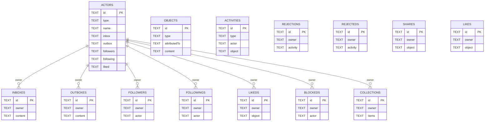

# ActivityPub Integration - Comprehensive Diagrams

## ⚠️ IMPLEMENTATION STATUS: EXPERIMENTAL / LEGACY CODE

**CRITICAL**: This documentation describes **experimental code that is NOT actively used** in the blockchain. The ActivityPub integration code exists but has **0 imports** in production code and approximately **70% of documented features are unimplemented**.

### Implementation Status:
- **Data Types & Interfaces**: ✅ **IMPLEMENTED** - TypeScript interfaces in `feditypes.ts`
- **SQLite Storage Class**: ✅ **IMPLEMENTED** - Basic FediStore class in `fedistore.ts`
- **Express Server Skeleton**: ✅ **IMPLEMENTED** - Basic server setup in `fediverse.ts`
- **REST API**: ❌ **NOT IMPLEMENTED** - GET/PUT endpoints documented but not coded
- **Federation Protocol**: ❌ **NOT IMPLEMENTED** - WebFinger, HTTP signatures missing
- **Actor Discovery**: ❌ **NOT IMPLEMENTED** - WebFinger lookup not implemented
- **Inbox/Outbox Delivery**: ❌ **NOT IMPLEMENTED** - Message federation missing
- **HTTP Signatures**: ❌ **NOT IMPLEMENTED** - Request signing/verification missing
- **Collection Management**: ⚠️ **PARTIAL** - Some basic operations, getAllItems() missing
- **Follow Workflow**: ❌ **NOT IMPLEMENTED** - Accept/Reject flow missing
- **Social Interactions**: ❌ **NOT IMPLEMENTED** - Like, Announce, Reply missing

### What's Actually Implemented:
Located in `src/features/activitypub/`:
- ✅ `feditypes.ts` - TypeScript interfaces for ActivityPub objects (Actor, Activity, Object, Collection types)
- ✅ `fedistore.ts` - SQLite storage class with table creation and basic CRUD operations
- ✅ `fediverse.ts` - Express.js server skeleton with port 3000 listener
- ❌ Missing: getAllItems() method
- ❌ Missing: Federation protocol implementation
- ❌ Missing: HTTP signature verification
- ❌ Missing: WebFinger actor discovery
- ❌ Missing: Inbox/Outbox delivery logic

### Integration Status:
**NOT INTEGRATED**: These files are **not imported or used** by any production blockchain code. This is standalone experimental code for future ActivityPub federation exploration.

---

This document provides comprehensive Mermaid diagrams for the ActivityPub Integration **planned features** in Demos blockchain.

## Table of Contents
1. [ActivityPub Architecture Overview](#1-activitypub-architecture-overview)
2. [Actor Model & Collections](#2-actor-model--collections)
3. [SQLite Storage Schema](#3-sqlite-storage-schema)
4. [REST API Endpoints](#4-rest-api-endpoints)
5. [ActivityStreams Object Model](#5-activitystreams-object-model)
6. [Inbox/Outbox Message Flow](#6-inboxoutbox-message-flow)
7. [Federation Protocol](#7-federation-protocol)
8. [Collection Management Operations](#8-collection-management-operations)
9. [Data Persistence & Retrieval](#9-data-persistence--retrieval)
10. [Complete ActivityPub Lifecycle](#10-complete-activitypub-lifecycle)

---

## 1. ActivityPub Architecture Overview

```mermaid
graph TB
    subgraph "ActivityPub Integration Layer"
        AP[ActivityPub Server]
        FS[FediStore SQLite]
        FT[FediTypes Interfaces]
    end

    subgraph "Express.js Server"
        Router[Express Router]
        GET[GET /:collection/:id]
        PUT[PUT /:collection/:id]
        GETALL[GET /:collection]
    end

    subgraph "Storage Layer"
        DB[(SQLite Database)]
        Tables[Collections Tables]
        Indices[Indexes & Keys]
    end

    subgraph "ActivityStreams Protocol"
        Context[@context: activitystreams]
        Objects[ActivityPub Objects]
        Activities[Activities]
    end

    subgraph "Collections"
        Actors[Actors]
        Objects2[Objects]
        Activities2[Activities]
        Inboxes[Inboxes]
        Outboxes[Outboxes]
        Followers[Followers]
        Following[Following]
        Liked[Liked]
        Collections2[Collections]
        Blocked[Blocked]
        Rejections[Rejections]
        Rejecteds[Rejecteds]
        Shares[Shares]
        Likes[Likes]
    end

    AP --> Router
    Router --> GET
    Router --> PUT
    Router --> GETALL

    AP --> FS
    FS --> DB
    DB --> Tables
    Tables --> Actors
    Tables --> Objects2
    Tables --> Activities2
    Tables --> Inboxes
    Tables --> Outboxes
    Tables --> Followers
    Tables --> Following
    Tables --> Liked
    Tables --> Collections2
    Tables --> Blocked
    Tables --> Rejections
    Tables --> Rejecteds
    Tables --> Shares
    Tables --> Likes

    FT --> Context
    Context --> Objects
    Context --> Activities

    GET --> FS
    PUT --> FS
    GETALL --> FS

    style AP fill:#e1f5ff
    style FS fill:#fff4e1
    style DB fill:#e8f5e9
    style Context fill:#f3e5f5
```

---

## 2. Actor Model & Collections


---

## 3. SQLite Storage Schema



---

## 4. REST API Endpoints


---

## 5. ActivityStreams Object Model


---

## 6. Inbox/Outbox Message Flow


---

## 7. Federation Protocol


---

## 8. Collection Management Operations


---

## 9. Data Persistence & Retrieval


---

## 10. Complete ActivityPub Lifecycle


---

## Summary

These diagrams provide comprehensive coverage of the ActivityPub Integration **planned architecture**. Note that approximately **70% of these features are NOT YET IMPLEMENTED**.

1. **Architecture Overview** - 📋 **PLANNED** - Complete system architecture with Express.js, SQLite, and 14 collections
2. **Actor Model** - ✅ **IMPLEMENTED** - TypeScript class hierarchy for ActivityPub objects (interfaces defined)
3. **Storage Schema** - ✅ **IMPLEMENTED** - Complete SQLite database schema with all 14 tables (table creation code exists)
4. **REST API** - ❌ **NOT IMPLEMENTED** - GET/PUT endpoints documented but not coded
5. **Object Model** - ✅ **IMPLEMENTED** - ActivityStreams vocabulary and object types (TypeScript interfaces)
6. **Message Flow** - ❌ **NOT IMPLEMENTED** - Inbox/Outbox message delivery sequences
7. **Federation Protocol** - ❌ **NOT IMPLEMENTED** - State machine for federated actor discovery and activity delivery
8. **Collection Management** - ⚠️ **PARTIAL** - Flowchart for all 8 collection types, getAllItems() missing
9. **Data Persistence** - ⚠️ **PARTIAL** - Basic CRUD operations with SQLite, getAllItems() missing
10. **Complete Lifecycle** - ❌ **NOT IMPLEMENTED** - End-to-end state machine from initialization to shutdown

---

### 🧪 Experimental Features Status

#### ✅ Currently Implemented (30%):
- **TypeScript Interfaces** (`feditypes.ts`):
  - Actor, Activity, Object, Collection type definitions
  - ActivityStreams vocabulary types
  - Full type safety for ActivityPub objects

- **SQLite Storage** (`fedistore.ts`):
  - FediStore class with database initialization
  - Table creation for all 14 collections
  - Basic CRUD operations: getItem(), saveItem(), deleteItem()
  - Database schema with proper relationships

- **Express Server Skeleton** (`fediverse.ts`):
  - Basic Express.js server setup
  - Port 3000 listener
  - Server initialization code

#### ❌ Not Yet Implemented (70%):
- **REST API Endpoints**:
  - GET /:collection/:id (documented but not coded)
  - PUT /:collection/:id (documented but not coded)
  - GET /:collection - getAllItems() method missing

- **Federation Protocol**:
  - WebFinger actor discovery
  - HTTP signature generation and verification
  - Remote inbox delivery
  - Remote outbox fetching

- **ActivityPub Core Features**:
  - Inbox/Outbox message handling
  - Follow/Accept/Reject workflow
  - Actor profile discovery
  - Remote activity federation

- **Social Interactions**:
  - Like activity handling
  - Announce/Share functionality
  - Reply threading
  - Collection updates (followers, following, etc.)

---

### Files Reference

**Actual Source Files** (experimental, not integrated):
- ✅ `src/features/activitypub/feditypes.ts` - TypeScript interfaces (~400 lines)
- ✅ `src/features/activitypub/fedistore.ts` - SQLite storage class (~300 lines, missing getAllItems())
- ✅ `src/features/activitypub/fediverse.ts` - Express.js server skeleton (~100 lines)

**Integration Status**: ⚠️ **ZERO IMPORTS** - These files are not used by any production blockchain code.

---

### Future Development Path

To complete this implementation, the following work is required:

1. **Priority 1 - API Completion**:
   - Implement getAllItems() method in FediStore
   - Add REST API endpoint handlers in fediverse.ts
   - Connect Express routes to FediStore operations

2. **Priority 2 - Federation Protocol**:
   - Implement WebFinger discovery
   - Add HTTP signature signing/verification
   - Build remote inbox delivery mechanism

3. **Priority 3 - Integration**:
   - Connect ActivityPub to blockchain events
   - Add actor management to validator nodes
   - Implement blockchain-to-ActivityPub bridges

4. **Priority 4 - Social Features**:
   - Complete Follow/Accept/Reject workflow
   - Implement Like, Announce, Reply activities
   - Build notification system

---

This documentation describes the **planned architecture** for full ActivityPub federation support. Current implementation is experimental foundation code representing approximately 30% of the documented features.
