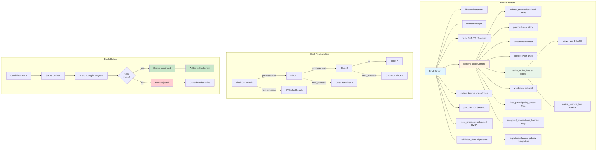
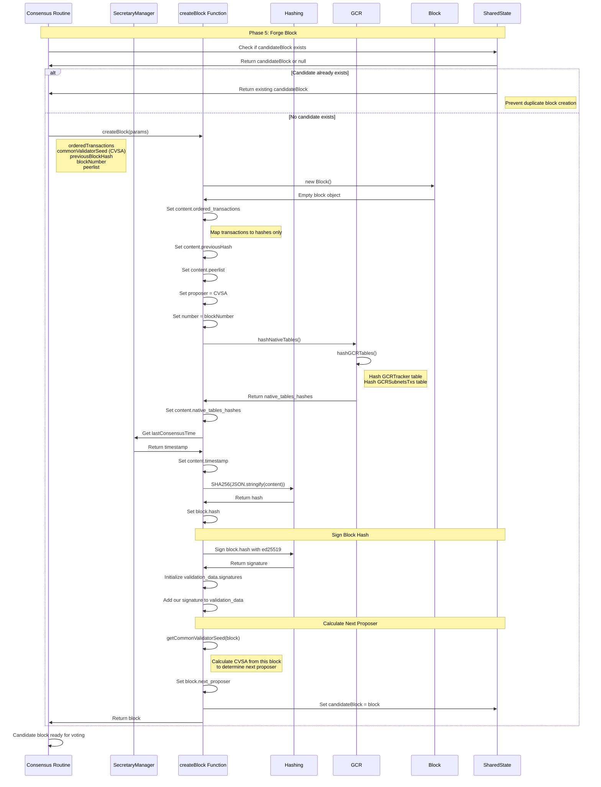
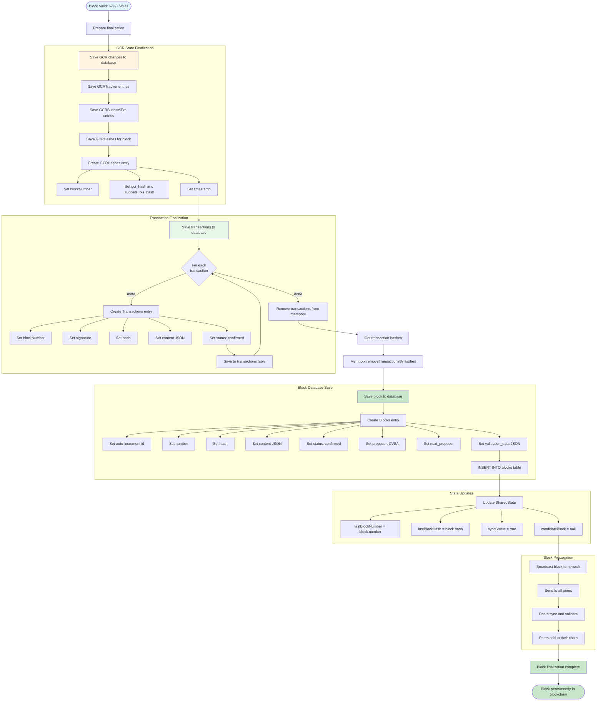
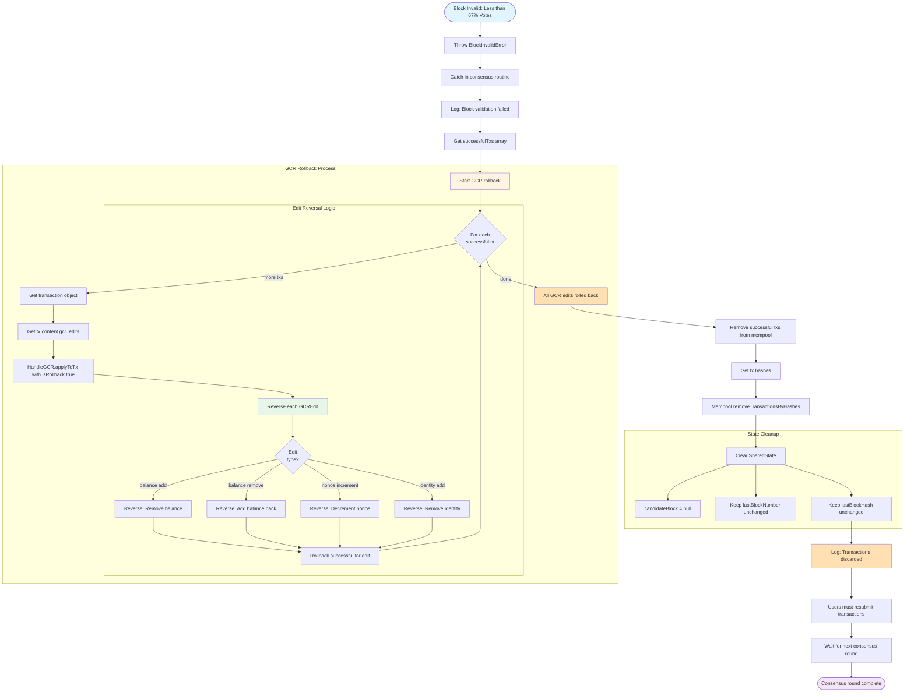
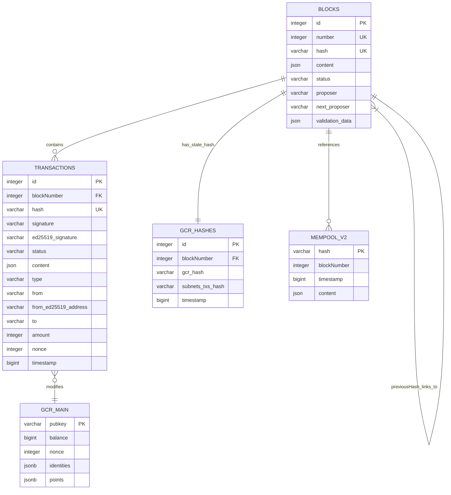
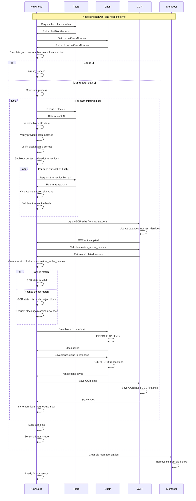

# Block Creation & Validation - Mermaid Diagrams

## Overview

Blocks in Demos blockchain are created through the PoRBFT consensus mechanism. Each block contains ordered transactions, native table hashes (GCR state), signatures from shard validators, and references to previous blocks forming an immutable chain.

**Key Features:**
- **Consensus-Driven Creation**: Blocks forged during Phase 5 of consensus
- **Native Table Hashing**: GCR state integrity via cryptographic hashes
- **Multi-Signature Validation**: 67% shard agreement required
- **Chain Continuity**: previousHash links to maintain integrity
- **CVSA-Based Proposer**: Deterministic next proposer calculation
- **Timestamp Consistency**: Secretary-coordinated block timestamp
- **GCR Integration**: Native tables hashed and included

## 1. Block Structure & Architecture



## 2. Block Creation Process (Consensus Phase 5)



## 3. Block Validation & Voting (Consensus Phase 6)

```mermaid
flowchart TD
    START([Phase 6: Vote On Block])

    START --> GETCANDIDATE[Get candidateBlock from sharedState]
    GETCANDIDATE --> BROADCAST[broadcastBlockHash to shard members]

    subgraph "Broadcast Process"
        BROADCAST --> CREATEREQ[Create RPC request: proposeBlockHash]
        CREATEREQ --> REQPARAMS[params: block.hash, validation_data, our identity]

        REQPARAMS --> LOOPPEERS{For each<br/>shard member}
        LOOPPEERS -->|more| SENDREQ[Send RPC with retry: 3 times]
        LOOPPEERS -->|done| WAITALL

        SENDREQ --> LOOPPEERS
    end

    WAITALL[Wait for all RPC responses]
    WAITALL --> PROCESSRESP{For each<br/>response}

    PROCESSRESP -->|more| CHECKSTATUS{Response<br/>status 200?}
    PROCESSRESP -->|done| COUNTRESULT

    subgraph "Member Response Processing"
        CHECKSTATUS -->|yes| VERIFYSIG[Verify signature with ed25519]
        CHECKSTATUS -->|no| CONERROR[Increment con vote]

        VERIFYSIG --> SIGVALID{Signature<br/>valid?}
        SIGVALID -->|yes| ADDSIG[Add signature to block.validation_data]
        SIGVALID -->|no| SIGERROR[Log error, increment con vote]

        ADDSIG --> PROVOTE[Increment pro vote]
    end

    CONERROR --> PROCESSRESP
    SIGERROR --> PROCESSRESP
    PROVOTE --> PROCESSRESP

    COUNTRESULT[Count total valid signatures]
    COUNTRESULT --> CALCULATE[Calculate: signatures div shard size]

    CALCULATE --> THRESHOLD{Ratio greater or equal<br/>0.67 (67%)?}

    THRESHOLD -->|yes| BLOCKVALID[Block is valid]
    THRESHOLD -->|no| BLOCKINVALID[Block is invalid]

    subgraph "Shard Member Vote Logic"
        SENDREQ -.-> MEMBERRECEIVE[Member receives proposeBlockHash]
        MEMBERRECEIVE --> MEMBERCHECK1{In consensus<br/>mode?}
        MEMBERCHECK1 -->|no| MEMBERERROR1[Return error]

        MEMBERCHECK1 -->|yes| MEMBERCHECK2{In same<br/>shard?}
        MEMBERCHECK2 -->|no| MEMBERERROR2[Return error]

        MEMBERCHECK2 -->|yes| GETOURBLOCK[Get our candidateBlock]
        GETOURBLOCK --> COMPAREHASH{Our hash equals<br/>proposed hash?}

        COMPAREHASH -->|yes| SIGNHASH[Sign proposed hash]
        COMPAREHASH -->|no| MEMBERERROR3[Return hash mismatch]

        SIGNHASH --> MEMBERRETURN[Return 200 with signature]
        MEMBERERROR1 -.-> CHECKSTATUS
        MEMBERERROR2 -.-> CHECKSTATUS
        MEMBERERROR3 -.-> CHECKSTATUS
        MEMBERRETURN -.-> CHECKSTATUS
    end

    BLOCKVALID --> PROCEED[Proceed to Phase 7: Finalize]
    BLOCKINVALID --> ROLLBACK[Trigger BlockInvalidError]

    style START fill:#e1f5ff
    style BLOCKVALID fill:#c8e6c9
    style BLOCKINVALID fill:#ffcdd2
    style PROCEED fill:#c8e6c9
    style ROLLBACK fill:#ffcdd2
    style VERIFYSIG fill:#fff4e1
```

## 4. Block Finalization & Chain Addition



## 5. Block Rollback on Validation Failure



## 6. Native Tables Hashing (GCR State Integrity)

```mermaid
flowchart TD
    START([hashNativeTables called])

    START --> PROXY[Proxy to hashGCRTables]
    PROXY --> GETDB[Get database connection]

    GETDB --> TRACKERHASH[Hash GCRTracker table]

    subgraph "GCRTracker Hashing"
        TRACKERHASH --> QUERYTRACKER[Query all GCRTracker entries]
        QUERYTRACKER --> ORDERTRACKER[Order by pubkey ASC]
        ORDERTRACKER --> SERIALIZETRACKER[Serialize to JSON string]
        SERIALIZETRACKER --> SHA256TRACKER[Calculate SHA256]
        SHA256TRACKER --> GCRHASH[native_gcr hash result]
    end

    GCRHASH --> SUBNETSHASH[Hash GCRSubnetsTxs table]

    subgraph "GCRSubnetsTxs Hashing"
        SUBNETSHASH --> QUERYSUBNETS[Query all GCRSubnetsTxs entries]
        QUERYSUBNETS --> ORDERSUBNETS[Order by id ASC]
        ORDERSUBNETS --> SERIALIZESUBNETS[Serialize to JSON string]
        SERIALIZESUBNETS --> SHA256SUBNETS[Calculate SHA256]
        SHA256SUBNETS --> SUBNETSHASHRESULT[native_subnets_txs hash result]
    end

    SUBNETSHASHRESULT --> CREATEOBJ[Create NativeTablesHashes object]
    CREATEOBJ --> SETGCR[Set native_gcr field]
    CREATEOBJ --> SETSUBNETS[Set native_subnets_txs field]

    SETSUBNETS --> RETURN[Return hashes object]
    RETURN --> ADDTOBLOCK[Add to block.content.native_tables_hashes]

    subgraph "Hash Purpose"
        ADDTOBLOCK --> PURPOSE1[Verify GCR state consistency]
        PURPOSE1 --> PURPOSE2[Detect state tampering]
        PURPOSE2 --> PURPOSE3[Enable state sync verification]
        PURPOSE3 --> PURPOSE4[Audit trail for state changes]
    end

    PURPOSE4 --> VERIFYLATER[Peers verify hashes when syncing]

    subgraph "Hash Verification"
        VERIFYLATER --> PEERRECV[Peer receives block]
        PEERRECV --> PEERHASH[Peer calculates own hashes]
        PEERHASH --> PEERCOMPARE{Hashes<br/>match?}

        PEERCOMPARE -->|yes| STATEVALID[GCR state is valid]
        PEERCOMPARE -->|no| STATEINVALID[State mismatch - reject block]
    end

    STATEVALID --> END([Hash verification complete])
    STATEINVALID --> END

    style START fill:#e1f5ff
    style SHA256TRACKER fill:#fff4e1
    style SHA256SUBNETS fill:#fff4e1
    style STATEVALID fill:#c8e6c9
    style STATEINVALID fill:#ffcdd2
```



## 7. Block Header & Chain Continuity

```mermaid
graph TB
    subgraph "Block Header Structure"
        HEADER[Block Header]
        HEADER --> HEADERNUMBER[number: integer]
        HEADER --> HEADERHASH[hash: string]
        HEADER --> HEADERSTATUS[status: confirmed or derived]
        HEADER --> HEADERPREV[previousHash: string]
        HEADER --> HEADERTIMESTAMP[timestamp: number]
    end

    subgraph "Chain Continuity Verification"
        VERIFY[Verify Block N]
        VERIFY --> GETPREV[Get Block N minus 1]
        GETPREV --> COMPAREHASH{Block N previousHash<br/>equals Block N minus 1 hash?}

        COMPAREHASH -->|yes| CONTINUOUS[Chain is continuous]
        COMPAREHASH -->|no| BROKEN[Chain is broken]

        CONTINUOUS --> CHECKNUMBER{Block N number<br/>equals N minus 1 number plus 1?}
        CHECKNUMBER -->|yes| VALIDCHAIN[Valid chain continuity]
        CHECKNUMBER -->|no| NUMBERMISMATCH[Number sequence broken]
    end

    subgraph "Genesis Block Special Case"
        GENESIS[Block 0: Genesis]
        GENESIS --> GENESISNUMBER[number: 0]
        GENESIS --> GENESISHASH[hash: calculated from content]
        GENESIS --> GENESISPREV[previousHash: null or placeholder]
        GENESIS --> GENESISTIMESTAMP[timestamp: network start time]

        GENESIS -.-> HARDCODED[Genesis block hardcoded in code]
        GENESIS -.-> CHECKSUM[Genesis hash verified on startup]
    end

    subgraph "Block Retrieval Operations"
        GETOPS[Chain Retrieval Operations]

        GETOPS --> GETLAST[getLastBlock]
        GETOPS --> GETBYNUMBER[getBlockByNumber n]
        GETOPS --> GETBYHASH[getBlockByHash hash]
        GETOPS --> GETGENESIS[getGenesisBlock]
        GETOPS --> GETRANGE[getBlocks start, limit]

        GETLAST --> QUERYLAST[ORDER BY number DESC LIMIT 1]
        GETBYNUMBER --> QUERYNUMBER[WHERE number equals n]
        GETBYHASH --> QUERYHASH[WHERE hash equals hash]
        GETGENESIS --> QUERYGENESIS[WHERE number equals 0]
        GETRANGE --> QUERYRANGE[WHERE number less than start, LIMIT]
    end

    subgraph "Block Hash Calculation"
        HASHCALC[Hash Calculation]
        HASHCALC --> GETCONTENT[Get block.content object]
        GETCONTENT --> STRINGIFY[JSON.stringify content]
        STRINGIFY --> SHA256[Calculate SHA256]
        SHA256 --> BLOCKHASH[block.hash]

        BLOCKHASH -.-> INCLUDES[Includes all content fields]
        INCLUDES -.-> ORDEREDTXS[ordered_transactions]
        INCLUDES -.-> PREVHASH[previousHash]
        INCLUDES -.-> TIMESTAMP[timestamp]
        INCLUDES -.-> PEERLIST[peerlist]
        INCLUDES -.-> NATIVEHASHES[native_tables_hashes]
    end

    style HEADER fill:#e1f5ff
    style CONTINUOUS fill:#c8e6c9
    style VALIDCHAIN fill:#c8e6c9
    style BROKEN fill:#ffcdd2
    style NUMBERMISMATCH fill:#ffcdd2
    style GENESIS fill:#fff4e1
    style SHA256 fill:#e8f5e9
```



## 8. Block Database Schema & Indexing



**Database Indexes:**
- **BLOCKS table indexes:** idx_blocks_number, idx_blocks_hash
- **TRANSACTIONS table indexes:** idx_transactions_hash, idx_transactions_blockNumber, idx_transactions_from_ed25519_address, idx_transactions_to

```

## 9. Block Sync & Propagation



## 10. Complete Block Lifecycle State Machine

```mermaid
stateDiagram-v2
    [*] --> NotCreated: Consensus round begins

    state "Block Not Created" as NotCreated {
        [*] --> WaitingPhases
        WaitingPhases: Phases 1-4 executing
        WaitingPhases --> ReadyToForge: Phase 5 begins
        ReadyToForge --> [*]
    }

    NotCreated --> Creating: Phase 5 starts

    state "Block Creation" as Creating {
        [*] --> InitializeBlock
        InitializeBlock: new Block()
        InitializeBlock --> FillContent: Set content fields
        FillContent --> HashNativeTables: Hash GCR state
        HashNativeTables --> CalculateHash: SHA256 of content
        CalculateHash --> SignHash: Sign with ed25519
        SignHash --> CalculateNextProposer: Determine next CVSA
        CalculateNextProposer --> [*]: Candidate block ready
    }

    Creating --> Candidate: Block created

    state "Candidate Block" as Candidate {
        [*] --> Stored
        Stored: Stored in sharedState.candidateBlock
        Stored --> Broadcasting: Phase 6 begins
        Broadcasting --> [*]
    }

    Candidate --> Voting: Phase 6 in progress

    state "Block Voting" as Voting {
        [*] --> BroadcastHash
        BroadcastHash: Send hash to all shard members
        BroadcastHash --> CollectSignatures: Wait for responses
        CollectSignatures --> VerifySignatures: Validate ed25519 signatures
        VerifySignatures --> CountVotes: Tally pro and con votes
        CountVotes --> [*]: Voting complete
    }

    Voting --> Validated: 67%+ votes
    Voting --> Invalid: Less than 67% votes

    state "Block Validated" as Validated {
        [*] --> SaveGCR
        SaveGCR: Persist GCR state changes
        SaveGCR --> SaveTransactions: Write txs to database
        SaveTransactions --> RemoveFromMempool: Clear mempool
        RemoveFromMempool --> SaveBlock: Write block to database
        SaveBlock --> UpdateState: Update sharedState
        UpdateState --> [*]: Finalization complete
    }

    state "Block Invalid" as Invalid {
        [*] --> RollbackGCR
        RollbackGCR: Reverse all GCR edits
        RollbackGCR --> RemoveTxs: Clear mempool
        RemoveTxs --> ClearCandidate: Remove from sharedState
        ClearCandidate --> [*]: Cleanup complete
    }

    Validated --> Finalized: Block added to chain

    state "Block Finalized" as Finalized {
        [*] --> InChain
        InChain: Permanently in blockchain
        InChain --> Confirmed: Status = confirmed
        Confirmed --> Immutable: Cannot be modified
        Immutable --> [*]
    }

    Invalid --> Discarded: Block discarded

    state "Block Discarded" as Discarded {
        [*] --> NotInChain
        NotInChain: Not added to blockchain
        NotInChain --> UsersResubmit: Transactions must be resubmitted
        UsersResubmit --> [*]
    }

    Finalized --> [*]: Consensus round complete
    Discarded --> [*]: Consensus round complete

    note right of Creating
        Block Creation Requirements:
        - Ordered transactions from mempool
        - CVSA seed for proposer
        - Previous block hash
        - Current block number
        - Peer list
        - Native tables hashes
        - Secretary timestamp
    end note

    note right of Voting
        Voting Rules:
        - Each shard member votes independently
        - Vote = signature if hash matches
        - 67% threshold for Byzantine fault tolerance
        - Invalid blocks trigger GCR rollback
    end note

    note right of Finalized
        Finalization Steps:
        1. Save GCR state
        2. Save transactions
        3. Remove from mempool
        4. Save block to database
        5. Update sharedState
        6. Broadcast to network
    end note
```



---

## Key File References

### Block Management Files
- **Block**: `src/libs/blockchain/block.ts` (73 lines - block structure)
- **Blocks Entity**: `src/model/entities/Blocks.ts` (32 lines - database schema)
- **Chain**: `src/libs/blockchain/chain.ts` (400+ lines - blockchain operations)

### Block Creation Files
- **Create Block**: `src/libs/consensus/v2/routines/createBlock.ts` (74 lines - block forging)
- **Hash GCR**: `src/libs/blockchain/gcr/gcr_routines/hashGCR.ts` (native tables hashing)
- **CVSA**: `src/libs/consensus/v2/routines/getCommonValidatorSeed.ts` (next proposer calculation)

### Consensus Integration
- **PoRBFT**: `src/libs/consensus/v2/PoRBFT.ts` (Phase 5-7 block operations)
- **Broadcast Block Hash**: `src/libs/consensus/v2/routines/broadcastBlockHash.ts` (voting)

---

## Block Creation & Validation Principles

1. **Consensus-Driven**: Blocks only created during consensus Phase 5 by shard members

2. **Content Hash Integrity**: Block hash is SHA256 of stringified content

3. **Previous Hash Linking**: Each block references previous block hash for chain continuity

4. **Native Tables Hashing**: GCR state hashed and included for state verification

5. **Multi-Signature Validation**: 67% of shard must sign block for finalization

6. **CVSA-Based Proposer**: Deterministic next proposer calculation from block content

7. **Timestamp Consistency**: All shard members use secretary-coordinated timestamp

8. **GCR Rollback Support**: Failed blocks trigger automatic state reversal

9. **Immutable Once Finalized**: Blocks in chain cannot be modified or deleted

10. **Database Persistence**: Blocks, transactions, and GCR hashes stored with indexing
