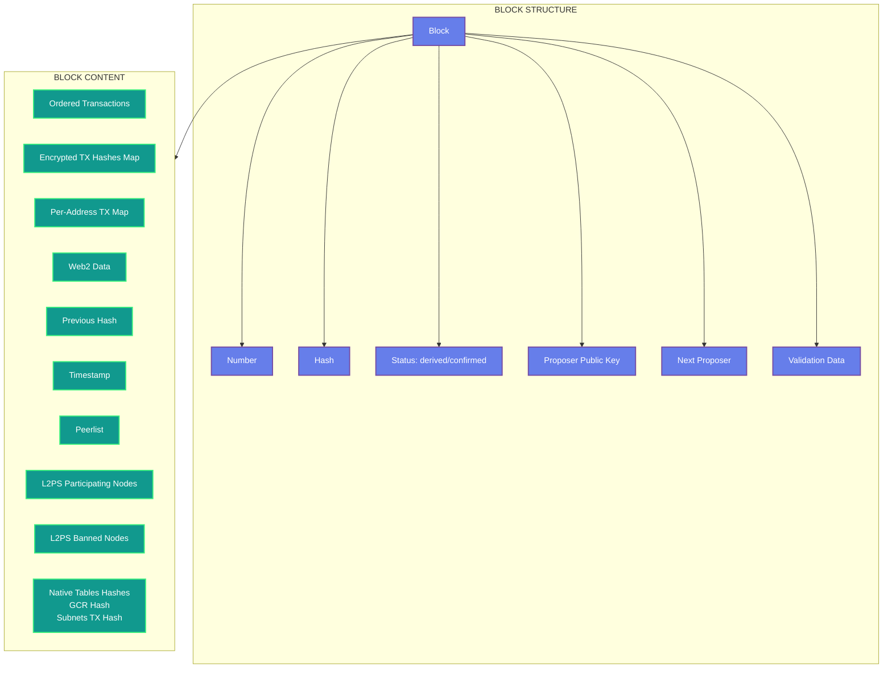
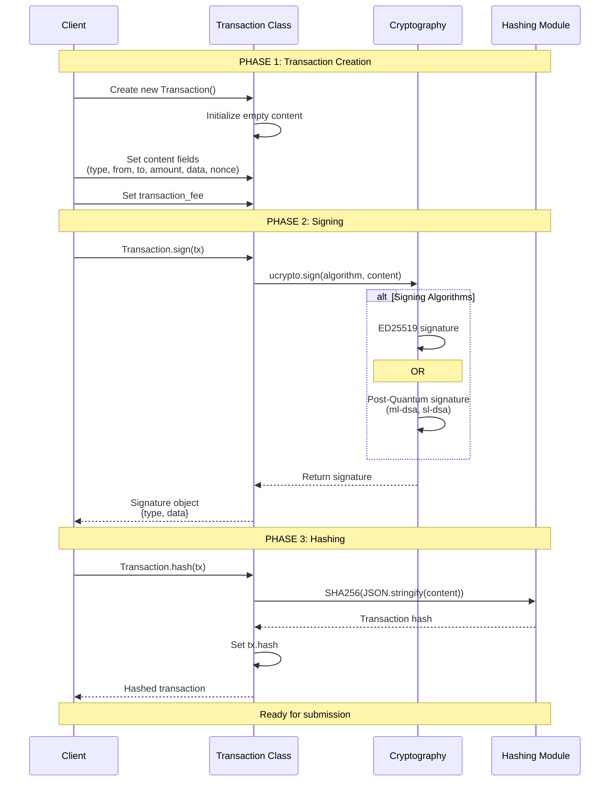
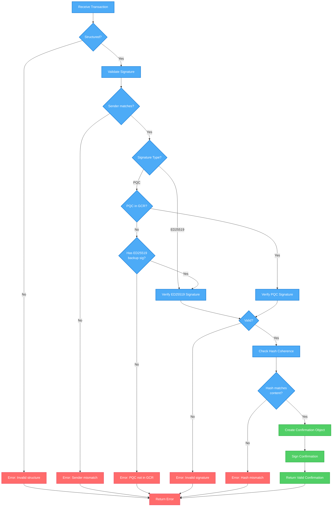
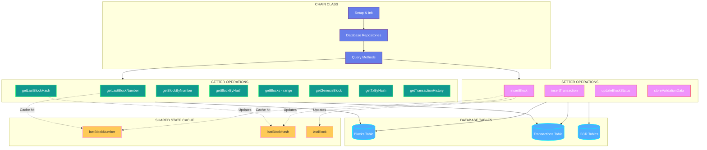
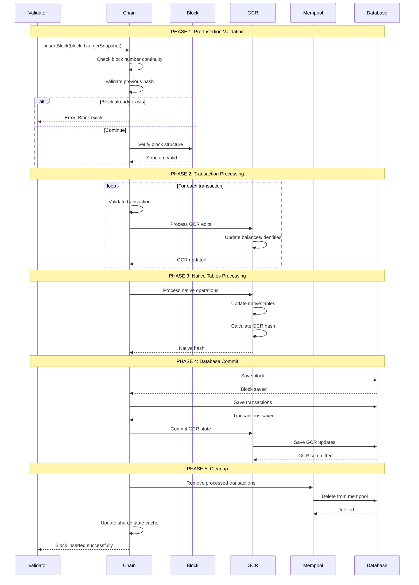
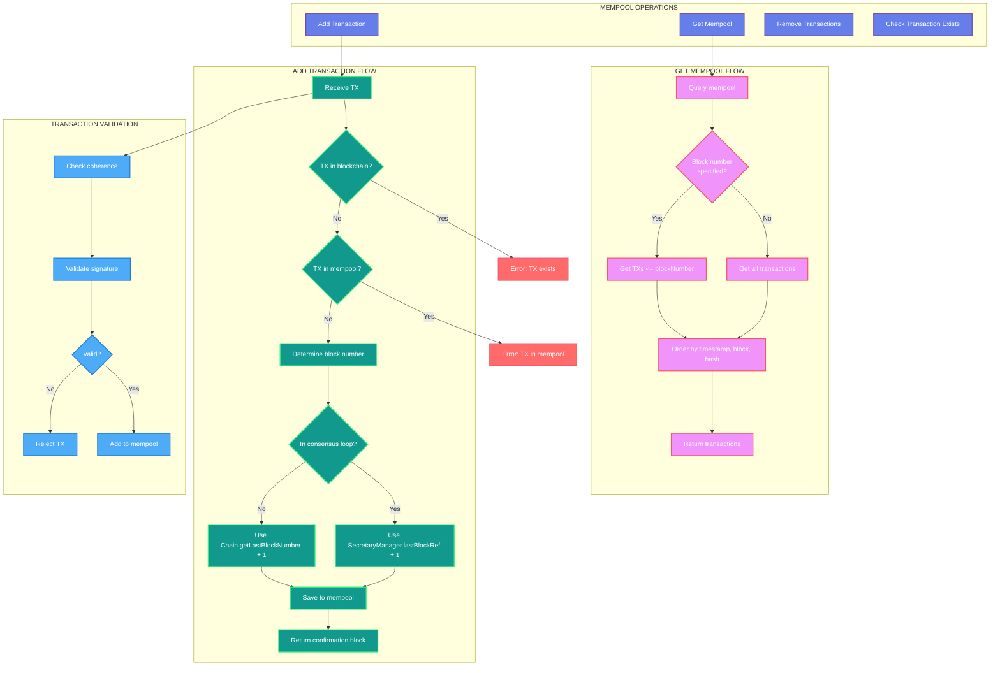
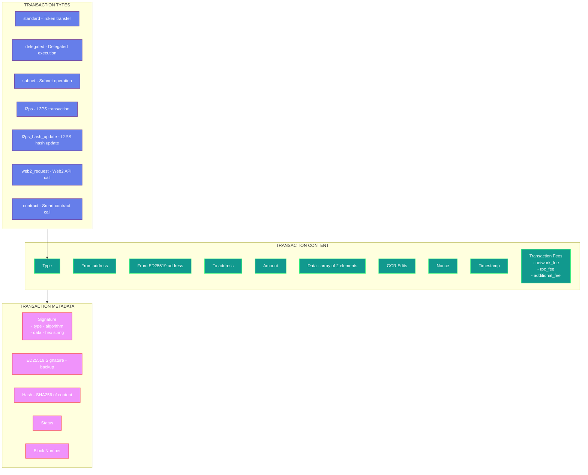
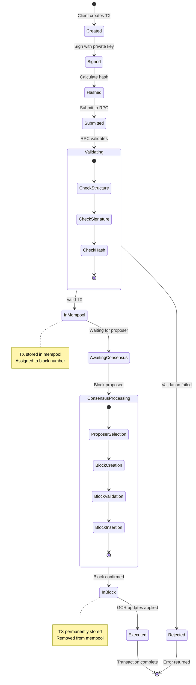
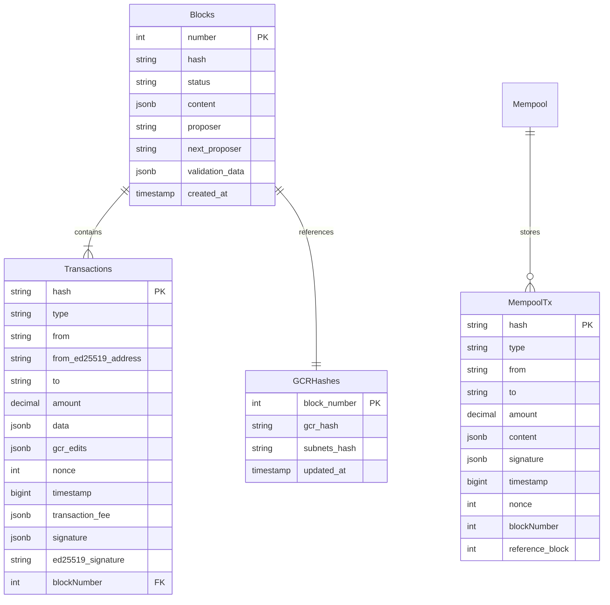
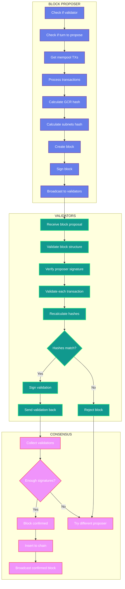

# Blockchain Core - Mermaid Diagrams

## Overview

The Blockchain Core consists of three main components:
- **Block**: Block structure and management
- **Transaction**: Transaction creation, signing, and validation
- **Chain**: Blockchain storage and retrieval
- **Mempool**: Pending transaction pool management

---

## 1. Block Structure & Lifecycle

## 2. Transaction Creation & Signing Flow

## 3. Transaction Validation Flow

## 4. Chain Operations Architecture

## 5. Block Insertion Flow

## 6. Mempool Management

## 7. Transaction Types & Structure

## 8. Complete Transaction Lifecycle

## 9. Database Schema

## 10. Block Proposal & Validation

---

## Key Concepts

### Block Status
- **derived**: Block proposed but not yet confirmed by validators
- **confirmed**: Block validated by consensus and permanently stored

### Transaction Fees
- **network_fee**: Fee paid to network validators
- **rpc_fee**: Fee paid to RPC node that processed transaction
- **additional_fee**: Optional additional fees

### Signature Types
- **ed25519**: Standard elliptic curve signature
- **ml-dsa**: Post-quantum ML-DSA (Dilithium)
- **sl-dsa**: Post-quantum SL-DSA (Sphincs+)

### GCR Edits
Transactions can carry GCR (Global Consensus Registry) edits that modify:
- Account balances
- Identity information
- Token metadata
- NFT ownership
- Native subnet states

### Mempool Block Assignment
Transactions are assigned to specific block numbers:
- During consensus: Uses `SecretaryManager.lastBlockRef + 1`
- Outside consensus: Uses `Chain.getLastBlockNumber() + 1`
