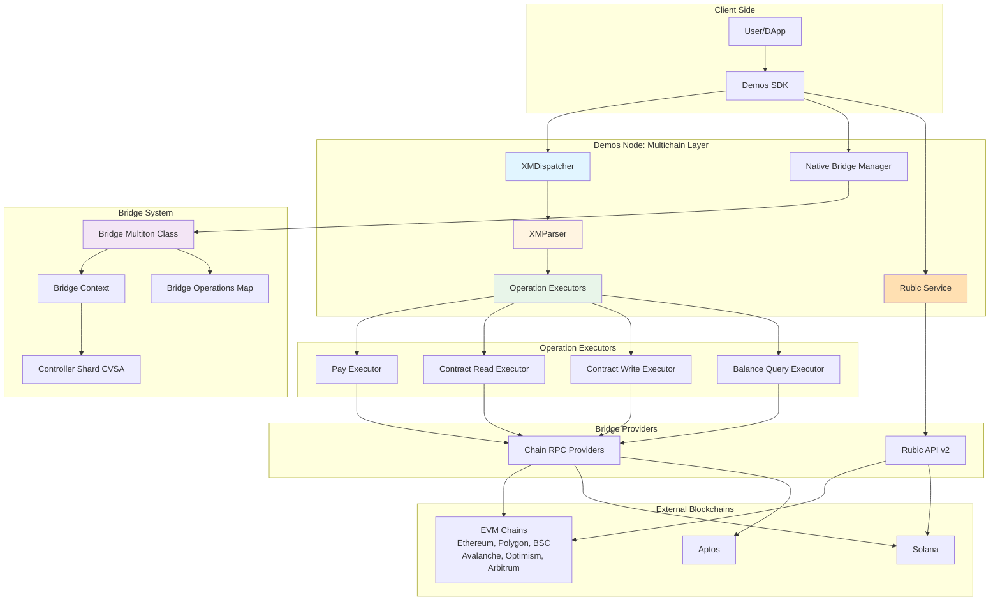
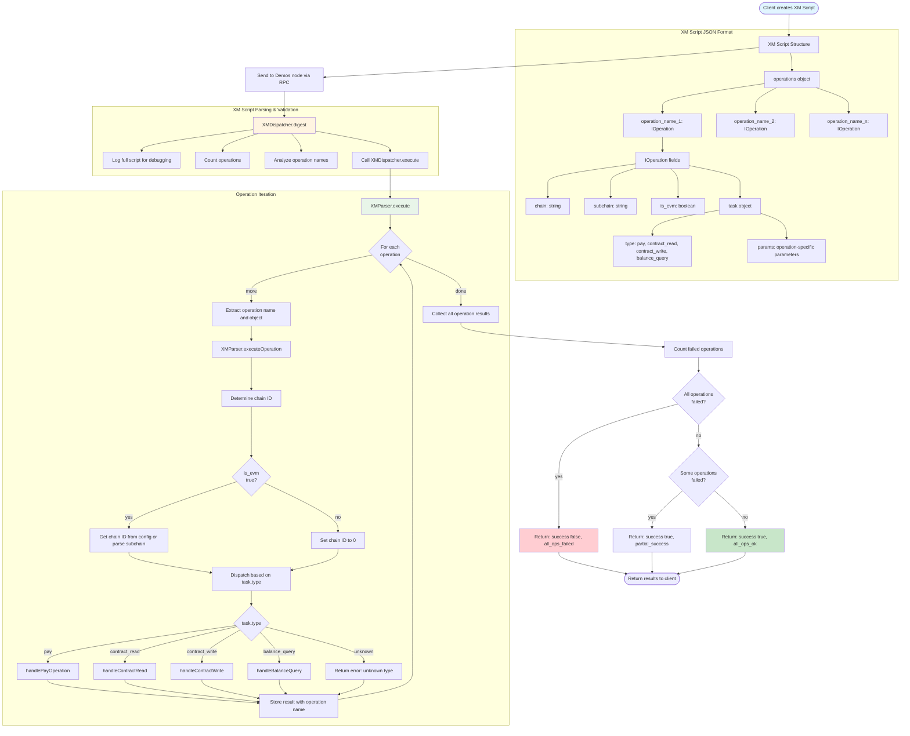
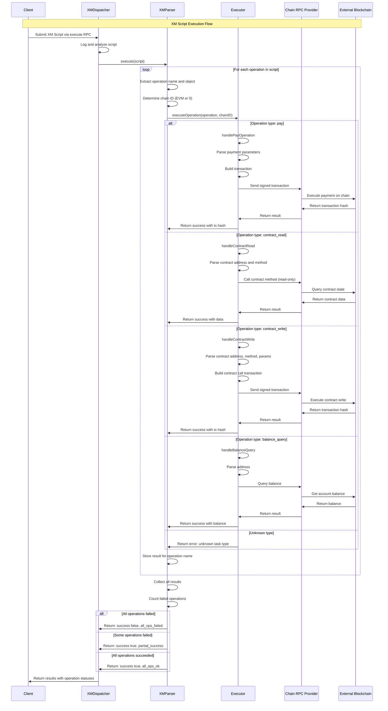
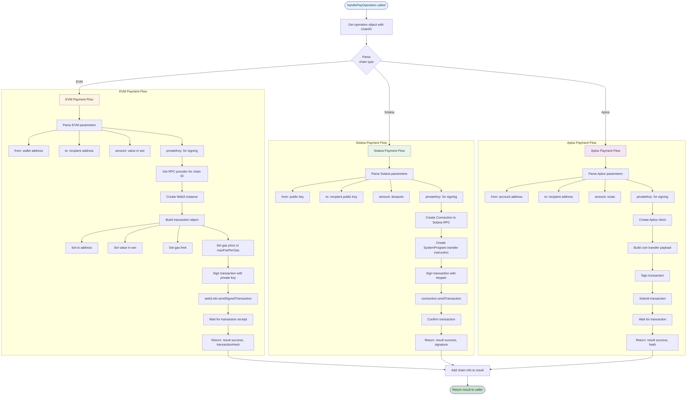
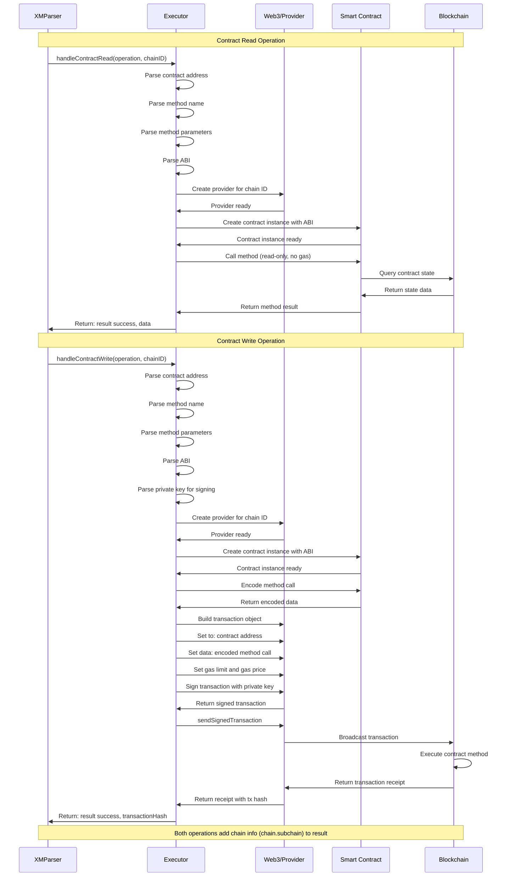
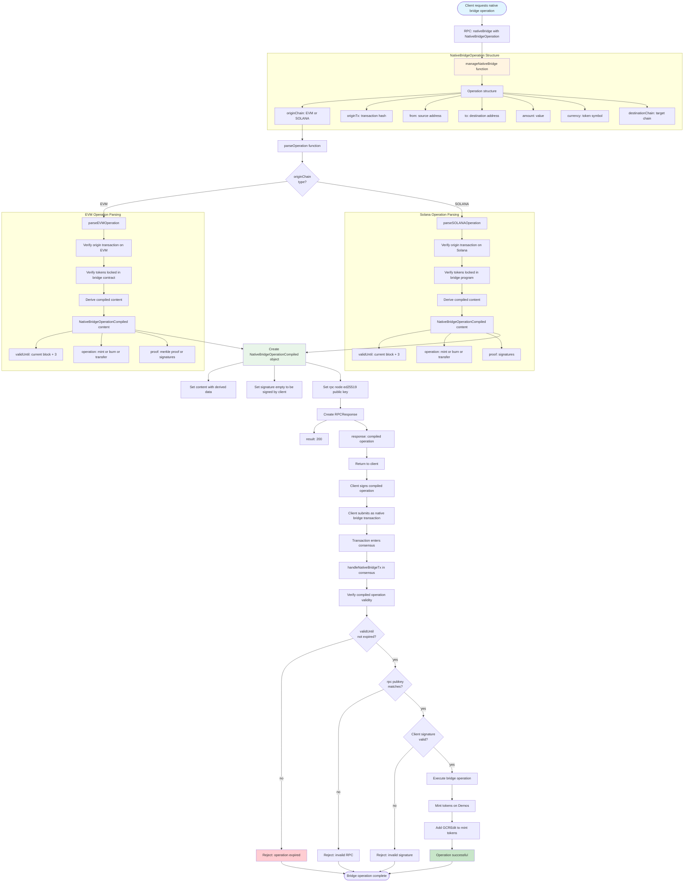
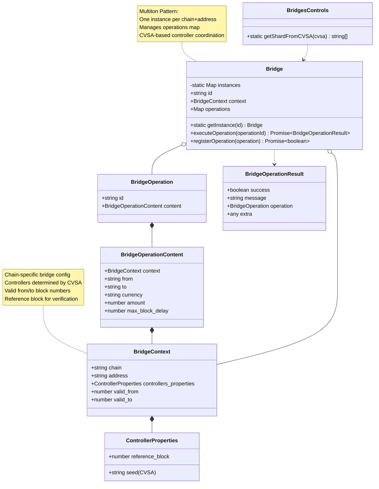
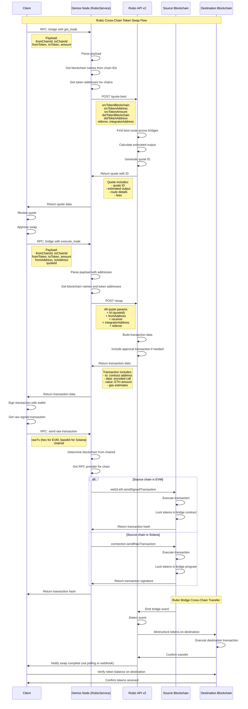
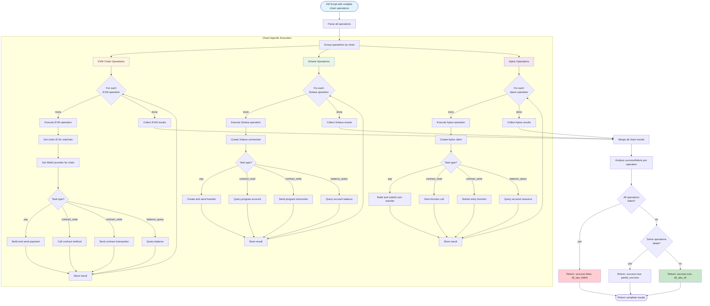

# Bridges & Multichain Integration - Mermaid Diagrams

## Overview

Demos blockchain provides comprehensive cross-chain and multichain capabilities through XM (Cross-chain/Multichain) Scripts, Native Bridges, and integration with Rubic SDK for token swaps. The system supports operations across multiple blockchains including EVM chains (Ethereum, Polygon, BSC, etc.), Solana, and Aptos.

**Key Features:**
- **XM Scripts**: JSON-based multichain operation scripts with multiple operation types
- **Cross-Chain Operations**: Pay, contract read/write, balance queries across chains
- **Native Bridge**: Controlled bridge system with CVSA-based controller coordination
- **Rubic Integration**: Cross-chain token swaps via Rubic API v2
- **Multi-Chain Support**: EVM chains, Solana, Aptos with unified interface
- **Operation Executors**: Specialized handlers for each chain and operation type
- **Transaction Compilation**: Client-side signing flow for bridge operations

## 1. Bridges & Multichain Architecture Overview

## 2. XM Script Structure & Parsing

## 3. XM Operation Execution Flow

## 4. Cross-Chain Payment (Pay Operation)

## 5. Contract Read/Write Operations

## 6. Native Bridge Operation Compilation

### ⚠️ Implementation Status: 🚧 IN DEVELOPMENT (Incomplete)

**NOTE**: The Native Bridge feature is **partially implemented**:

**✅ Implemented**:
- Basic operation structure (NativeBridgeOperation interface)
- RPC endpoint for compilation (`nativeBridge`)
- manageNativeBridge.ts scaffold (60 lines)
- Transaction flow structure

**❌ NOT Implemented**:
- `parseEVMOperation` - EVM transaction verification and parsing (TODO in code)
- `parseSOLANAOperation` - Solana transaction verification and parsing (TODO in code)
- Bridge contract interaction (lock/unlock verification)
- Merkle proof generation
- CVSA-based controller coordination
- handleNativeBridgeTx execution in consensus

**Status**: The Native Bridge architecture is designed but core verification logic is not yet implemented. XM Scripts provide full cross-chain functionality as an alternative.

See `src/libs/network/manageNativeBridge.ts` for current implementation.

---

## 7. Bridge Context & Multiton Pattern

## 8. Rubic Cross-Chain Swap Flow

## 9. Multi-Chain Transaction Execution

## 10. Complete Multichain Lifecycle State Machine

```mermaid
stateDiagram-v2
    [*] --> ScriptCreation: Client creates XM Script

    state "Script Creation" as ScriptCreation {
        [*] --> DefineOperations
        DefineOperations: Define operations with chains
        DefineOperations --> SetParams: Set task types and params
        SetParams --> ValidateJSON: Validate JSON structure
        ValidateJSON --> [*]: Script ready
    }

    ScriptCreation --> Submission: Submit via RPC

    state "Script Submission" as Submission {
        [*] --> RPCCall
        RPCCall: execute method with XM Script
        RPCCall --> Authentication: Verify signature headers
        Authentication --> Dispatch: Route to XMDispatcher
        Dispatch --> [*]
    }

    Submission --> Parsing: XMDispatcher.digest

    state "Script Parsing" as Parsing {
        [*] --> LogScript
        LogScript: Log full script for debugging
        LogScript --> AnalyzeOps: Count and analyze operations
        AnalyzeOps --> PrepareExec: Prepare for execution
        PrepareExec --> [*]
    }

    Parsing --> Execution: XMParser.execute

    state "Operation Execution" as Execution {
        [*] --> IterateOps
        IterateOps: Loop through operations

        IterateOps --> DetermineChain: Determine chain and ID
        DetermineChain --> DispatchTask: Dispatch by task type

        DispatchTask --> PayExecution: Pay task
        DispatchTask --> ReadExecution: Contract read
        DispatchTask --> WriteExecution: Contract write
        DispatchTask --> BalanceExecution: Balance query

        PayExecution --> StoreResult: Store operation result
        ReadExecution --> StoreResult
        WriteExecution --> StoreResult
        BalanceExecution --> StoreResult

        StoreResult --> MoreOps: Check for more operations
        MoreOps --> IterateOps: Yes
        MoreOps --> [*]: No, all executed
    }

    Execution --> ResultAnalysis: Collect results

    state "Result Analysis" as ResultAnalysis {
        [*] --> CountFailures
        CountFailures: Count failed operations
        CountFailures --> CheckFailures: Analyze failure rate

        CheckFailures --> AllFailed: 100% failed
        CheckFailures --> SomeFailed: Partial failure
        CheckFailures --> AllSucceeded: 0% failed

        AllFailed --> [*]: success false
        SomeFailed --> [*]: success true, partial
        AllSucceeded --> [*]: success true, all ok
    }

    ResultAnalysis --> Response: Format response

    state "Response Formation" as Response {
        [*] --> BuildResponse
        BuildResponse: Create RPCResponse object
        BuildResponse --> SetSuccess: Set success flag
        SetSuccess --> SetMessage: Set message (all_ops_failed, partial_success, all_ops_ok)
        SetMessage --> SetResults: Set results object with all operation outcomes
        SetResults --> [*]
    }

    Response --> [*]: Return to client

    note right of ScriptCreation
        Script Structure:
        - operations: object with named operations
        - Each operation: chain, subchain, is_evm, task
        - Task: type and params
    end note

    note right of Execution
        Execution Features:
        - Chain-specific executors
        - EVM chain ID resolution
        - RPC provider selection
        - Transaction signing
        - Error handling per operation
    end note

    note right of ResultAnalysis
        Result Handling:
        - Individual operation success/failure
        - Overall script success determination
        - Partial success supported
        - Detailed error messages
    end note
```

---

## Key File References

### Multichain Core Files
- **XM Dispatcher**: `src/features/multichain/XMDispatcher.ts` (71 lines - entry point, digest, execute)
- **XM Parser**: `src/features/multichain/routines/XMParser.ts` (153 lines - load, execute, executeOperation)
- **Pay Executor**: `src/features/multichain/routines/executors/pay.ts` (handles payment operations)
- **Contract Read Executor**: `src/features/multichain/routines/executors/contract_read.ts`
- **Contract Write Executor**: `src/features/multichain/routines/executors/contract_write.ts`
- **Balance Query Executor**: `src/features/multichain/routines/executors/balance_query.ts`

### Bridge System Files
- **Bridges**: `src/features/bridges/bridges.ts` (114 lines - Bridge class, BridgeContext, multiton pattern) ✅ **PRODUCTION**
- **Bridge Utils**: `src/features/bridges/bridgeUtils.ts` (utility functions) ✅ **PRODUCTION**
- **Manage Native Bridge**: `src/libs/network/manageNativeBridge.ts` (60 lines - operation compilation scaffold) 🚧 **IN DEVELOPMENT** - parseEVMOperation and parseSOLANAOperation not implemented
- **Manage Bridges**: `src/libs/network/manageBridge.ts` (44 lines - Rubic integration routing) ✅ **PRODUCTION**

### Rubic Integration Files
- **Rubic Service**: `src/features/bridges/rubic.ts` (200+ lines - Rubic API v2 integration)
- **Get Quote From API**: rubic.ts:35 (quote-best endpoint)
- **Get Swap Data From API**: rubic.ts:86 (swap endpoint with quote ID)
- **Send Raw Transaction**: rubic.ts:157 (execute signed tx on chain)

---

## Bridges & Multichain Integration Principles

1. **Multi-Chain Support**: Unified interface for EVM chains, Solana, and Aptos operations

2. **XM Script Flexibility**: JSON-based scripts with named operations and task types

3. **Partial Success Model**: Scripts can partially succeed if some operations fail

4. **Chain ID Resolution**: Automatic chain ID lookup for EVM networks from subchain names

5. **RPC Provider Selection**: Dynamic provider selection based on chain and operation type

6. **Bridge Multiton Pattern**: One Bridge instance per chain+address combination

7. **CVSA-Based Controllers**: Bridge controllers determined by CVSA seed

8. **Native Bridge Compilation**: Two-step flow (compile operation → client signs → submit)

9. **Rubic Quote-Based Flow**: Get quote with ID → Get swap data → Client signs → Execute

10. **Operation Executors**: Specialized handlers per chain and operation type (pay, read, write, query)
