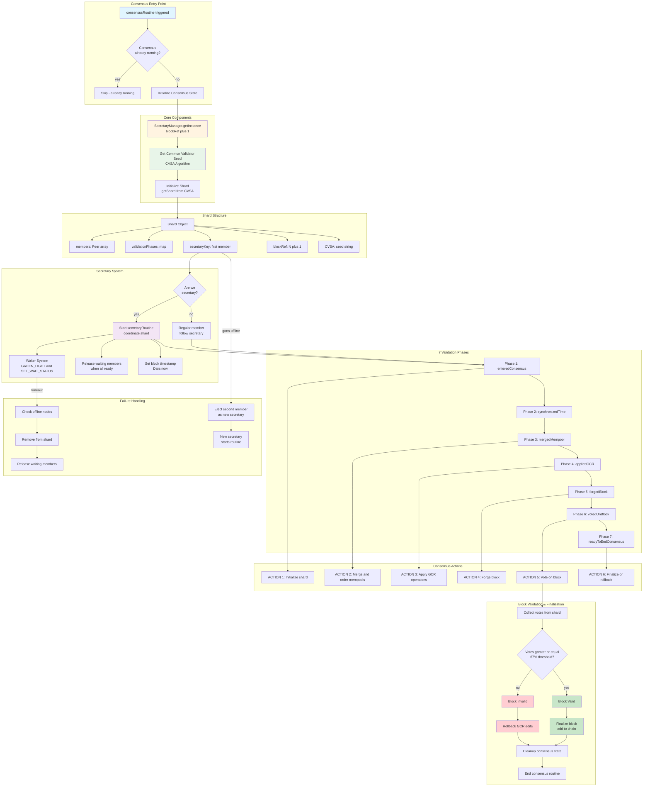
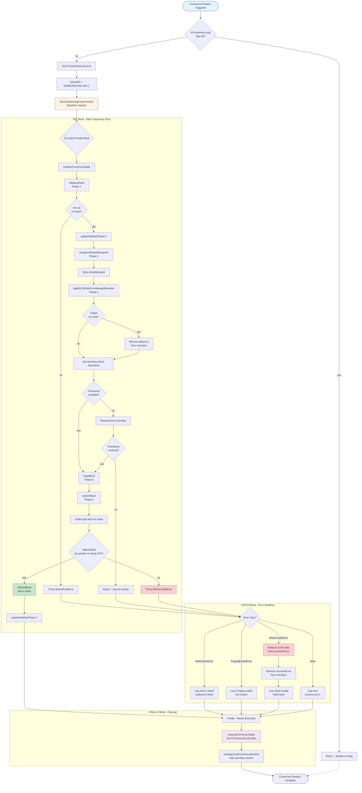
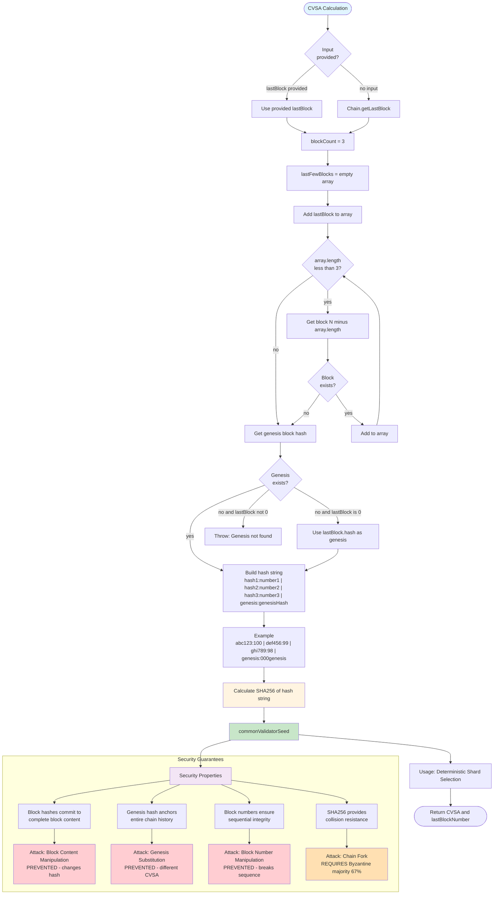
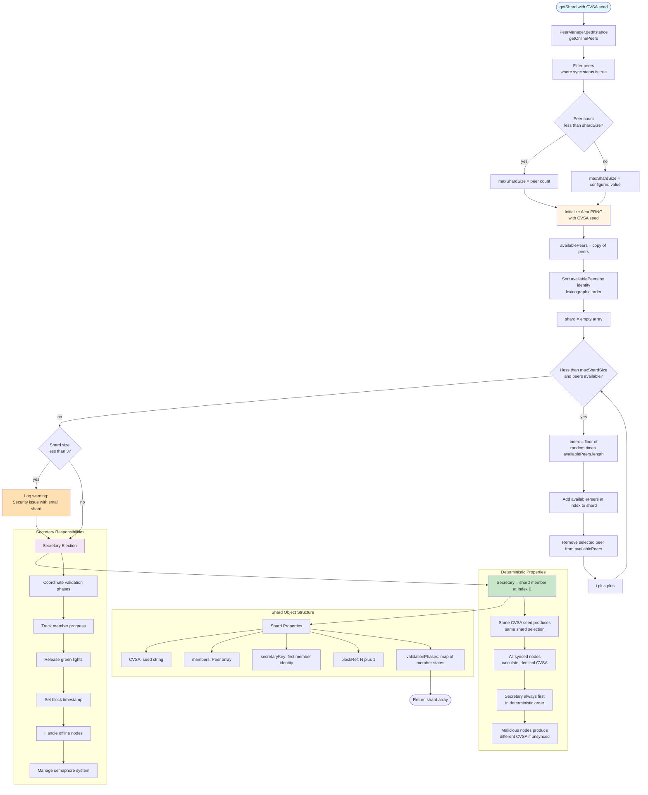
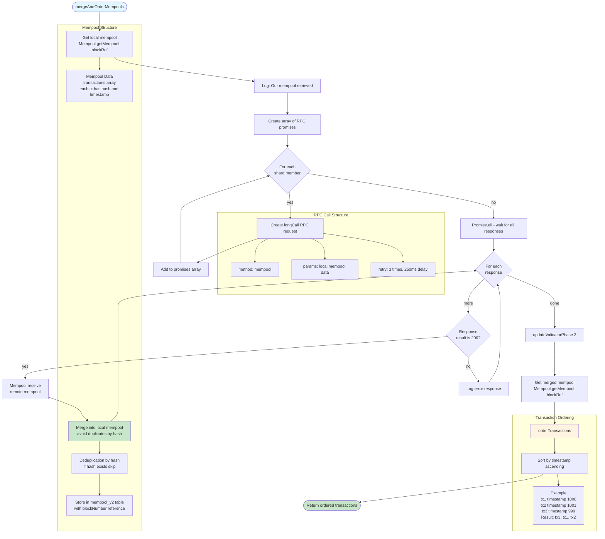
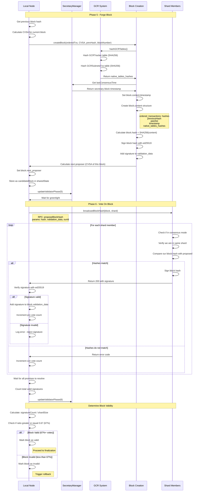
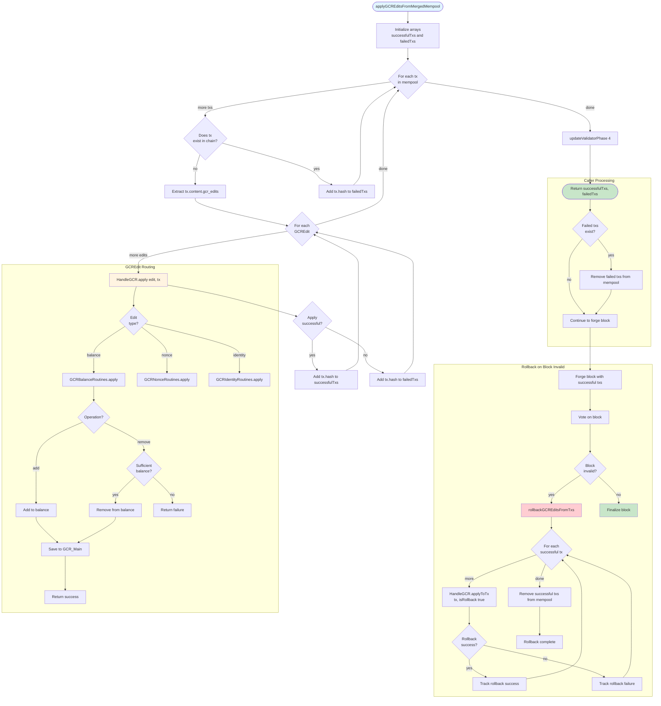

# Consensus Mechanism v2 (PoRBFT) - Mermaid Diagrams

## Overview

Consensus v2 implements **PoRBFT** (Proof of Reputation Byzantine Fault Tolerant) consensus. The system uses deterministic shard selection, coordinated validation phases, and Byzantine fault tolerance to achieve secure decentralized consensus.

**Key Features:**
- **7 synchronized validation phases** for all shard members
- **Secretary-based coordination** using green light system
- **CVSA** (Common Validator Seed Algorithm) for deterministic shard selection
- **Byzantine fault tolerance** with 67% threshold
- **Integrated GCR operations** during consensus
- **Automatic failure recovery** and secretary failover

## 1. PoRBFT Consensus Architecture Overview



## 2. Complete Consensus Routine Lifecycle



## 3. 7 Validation Phases Synchronization

```mermaid
sequenceDiagram
    participant Node as Local Node
    participant Secretary
    participant Shard as Other Shard Members

    Note over Node,Shard: All nodes start consensus routine concurrently

    rect rgb(200, 230, 255)
        Note over Node,Shard: Phase 1: Entered Consensus
        Node->>Node: Initialize shard and manager
        Node->>Secretary: setValidatorPhase 1
        Secretary->>Secretary: Update phase tracking
        Secretary->>Secretary: Check if all members at phase 1
        alt All members ready
            Secretary->>Node: greenlight phase 1
            Secretary->>Shard: greenlight phase 1
        else Some members not ready
            Secretary->>Secretary: Wait for SET_WAIT_STATUS
        end
        Node->>Node: Proceed to next phase
    end

    rect rgb(230, 255, 230)
        Note over Node,Shard: Phase 2: Synchronized Time (skipped in v2)
        Node->>Secretary: setValidatorPhase 2
        Secretary->>Node: greenlight phase 2
    end

    rect rgb(255, 245, 230)
        Note over Node,Shard: Phase 3: Merged Mempool
        Node->>Shard: Send local mempool
        Shard->>Node: Receive remote mempools
        Node->>Node: Merge all mempools
        Node->>Node: Order transactions by timestamp
        Node->>Secretary: setValidatorPhase 3
        Secretary->>Secretary: Wait for all members
        Secretary->>Node: greenlight phase 3
        Secretary->>Shard: greenlight phase 3
    end

    rect rgb(245, 230, 255)
        Note over Node,Shard: Phase 4: Applied GCR
        Node->>Node: Apply GCR edits from mempool
        Node->>Node: Track successful and failed txs
        Node->>Node: Prune failed txs from mempool
        Node->>Secretary: setValidatorPhase 4
        Secretary->>Node: greenlight phase 4
    end

    rect rgb(255, 235, 245)
        Note over Node,Shard: Phase 5: Forged Block
        Node->>Node: Create block with ordered txs
        Node->>Node: Hash native tables (GCR)
        Node->>Node: Sign block hash
        Node->>Node: Calculate next proposer (CVSA)
        Node->>Secretary: setValidatorPhase 5
        Secretary->>Node: greenlight phase 5
    end

    rect rgb(230, 245, 255)
        Note over Node,Shard: Phase 6: Voted On Block
        Node->>Shard: Broadcast block hash and signature
        Shard->>Node: Return signatures if hash matches
        Node->>Node: Verify all incoming signatures
        Node->>Node: Add valid signatures to block
        Node->>Node: Count pro and con votes
        Node->>Secretary: setValidatorPhase 6
        Secretary->>Node: greenlight phase 6
    end

    rect rgb(200, 255, 230)
        Note over Node,Shard: Phase 7: Ready to End Consensus
        Node->>Node: Check if block valid (67% votes)
        alt Block Valid
            Node->>Node: Finalize block - add to chain
        else Block Invalid
            Node->>Node: Rollback GCR edits
            Node->>Node: Remove txs from mempool
        end
        Node->>Secretary: setValidatorPhase 7
        Secretary->>Secretary: Stop secretary routine
        Secretary->>Node: greenlight phase 7
        Note over Node,Shard: End consensus routine
    end
```



## 4. CVSA - Common Validator Seed Algorithm



## 5. Shard Selection & Secretary Election



## 6. Secretary-Member Coordination (Green Light System)

```mermaid
stateDiagram-v2
    [*] --> Member_WaitPhase: Member completes phase work

    state "Member State" as Member {
        Member_WaitPhase: Member sets waitStatus = true
        Member_SendPhase: Send setValidatorPhase to secretary
        Member_CreateWaiter: Create GREEN_LIGHT waiter with timeout
        Member_WaitGreenLight: Wait for green light or timeout

        Member_WaitPhase --> Member_SendPhase
        Member_SendPhase --> Member_CreateWaiter
        Member_CreateWaiter --> Member_WaitGreenLight

        state Member_WaitGreenLight {
            [*] --> Waiting
            Waiting --> Resolved: Secretary sends greenlight
            Waiting --> Timeout: 30s timeout expires
            Waiting --> PreHeld: Greenlight arrived early
        }
    end

    state "Secretary State" as Secretary {
        Sec_ReceivePhase: Receive setValidatorPhase from member
        Sec_UpdateTracking: Update validationPhases map
        Sec_CheckBehind: Check if member behind us
        Sec_ReleaseBehind: Release if behind
        Sec_CheckAllReady: Check if all members ready
        Sec_ReleaseAll: Release all waiting members
        Sec_WaitMore: Wait for more members

        Sec_ReceivePhase --> Sec_UpdateTracking
        Sec_UpdateTracking --> Sec_CheckBehind

        state Sec_CheckBehind {
            [*] --> Check
            Check --> Behind: Member phase less than ours
            Check --> SameOrAhead: Member phase greater or equal
            Behind --> [*]: Release member immediately
            SameOrAhead --> CheckReady
        }

        Sec_CheckBehind --> Sec_CheckAllReady
        Sec_CheckAllReady --> Sec_ReleaseAll: All at same phase
        Sec_CheckAllReady --> Sec_WaitMore: Some not ready

        state Sec_ReleaseAll {
            [*] --> ResolveWaiter
            ResolveWaiter: Resolve SET_WAIT_STATUS waiter
            ResolveWaiter --> SendGreenlights
            SendGreenlights: Send greenlight RPC to all members
            SendGreenlights --> UpdateWaitStatus
            UpdateWaitStatus: Set waitStatus = false for all
            UpdateWaitStatus --> [*]
        }

        state Sec_WaitMore {
            [*] --> WaitSETWAIT
            WaitSETWAIT: Wait for SET_WAIT_STATUS
            WaitSETWAIT --> TimeoutCheck: 15s timeout
            WaitSETWAIT --> NextMember: Another member updates

            state TimeoutCheck {
                [*] --> PingOffline
                PingOffline: Ping missing members
                PingOffline --> RemoveOffline: Remove offline nodes
                RemoveOffline --> ReleaseRemaining: Release online members
                ReleaseRemaining --> [*]
            }
        }
    end

    state "Greenlight Received" as Received {
        Recv_CheckPhase: Check if phase matches
        Recv_UpdateTimestamp: Update blockTimestamp if newer
        Recv_ResolveWaiter: Resolve GREEN_LIGHT waiter
        Recv_SetWaitFalse: Set waitStatus = false

        [*] --> Recv_CheckPhase
        Recv_CheckPhase --> Recv_UpdateTimestamp: Phase matches
        Recv_CheckPhase --> Recv_PreHold: Phase higher than ours
        Recv_CheckPhase --> Recv_Ignore: Phase lower than ours
        Recv_UpdateTimestamp --> Recv_ResolveWaiter
        Recv_ResolveWaiter --> Recv_SetWaitFalse
        Recv_SetWaitFalse --> [*]

        Recv_PreHold: PreHold for future phase
        Recv_Ignore: Ignore stale greenlight
    }

    state "Secretary Failover" as Failover {
        Detect_Offline: Member timeout waiting for greenlight
        Ping_Secretary: Ping secretary twice
        Check_Response: Check if online
        Elect_New: Elect second member as secretary
        Start_New_Routine: New secretary starts routine
        Sync_Phases: New secretary requests all member phases

        [*] --> Detect_Offline
        Detect_Offline --> Ping_Secretary
        Ping_Secretary --> Check_Response
        Check_Response --> Elect_New: Both pings fail
        Check_Response --> [*]: Secretary responds
        Elect_New --> Start_New_Routine
        Start_New_Routine --> Sync_Phases
        Sync_Phases --> [*]
    }

    Member_WaitGreenLight --> Received: Greenlight arrives
    Member_WaitGreenLight --> Failover: Timeout expires
    Sec_ReleaseAll --> Received: Members receive
    Failover --> Secretary: New secretary elected

    Received --> [*]: Proceed to next phase

    note right of Secretary
        Secretary Routine Loop:
        1. Wait for SET_WAIT_STATUS
        2. Check if all members ready
        3. Release if ready, else timeout
        4. Handle offline nodes
        5. Repeat until phase 7
    end note

    note right of Member
        Member Coordination:
        1. Complete phase work
        2. Send phase to secretary
        3. Wait for greenlight
        4. Proceed or handle timeout
    end note
```

## 7. Mempool Merging & Transaction Ordering



## 8. Block Forging & Voting



## 9. GCR Integration in Consensus



## 10. Failure Handling & Recovery

```mermaid
stateDiagram-v2
    [*] --> Normal: Consensus running normally

    state "Normal Operation" as Normal {
        [*] --> AllOnline
        AllOnline: All shard members online
        AllOnline --> PhaseSync: Members progress through phases
        PhaseSync --> GreenLight: Secretary releases green lights
        GreenLight --> NextPhase: All proceed together
        NextPhase --> AllOnline
    }

    Normal --> MemberOffline: Member timeout detected
    Normal --> SecretaryOffline: Secretary timeout detected
    Normal --> MemberLate: Member slow or stuck
    Normal --> NetworkIssue: Network partition

    state "Member Offline Detection" as MemberOffline {
        [*] --> SecretaryWait
        SecretaryWait: Secretary waits for SET_WAIT_STATUS
        SecretaryWait --> Timeout: 15s timeout expires
        Timeout --> IdentifyMissing: Get list of non-waiting members
        IdentifyMissing --> PingMissing: Ping each missing member

        state PingMissing {
            [*] --> SendPing
            SendPing: member.connect()
            SendPing --> CheckResponse: Wait for response
            CheckResponse --> Online: Response received
            CheckResponse --> Offline: No response
        }

        PingMissing --> ProcessResults: Collect ping results
        ProcessResults --> RemoveOffline: Remove offline members from shard
        RemoveOffline --> UpdatePhases: Delete validationPhases for offline
        UpdatePhases --> ReleaseOnline: Release remaining online members
        ReleaseOnline --> [*]: Continue consensus
    }

    state "Secretary Offline Detection" as SecretaryOffline {
        [*] --> MemberTimeout
        MemberTimeout: Member timeout waiting for greenlight
        MemberTimeout --> PingSecretary: Ping secretary
        PingSecretary --> FirstPing: First attempt
        FirstPing --> SecondPing: Retry for false negative

        state SecondPing {
            [*] --> Check
            Check --> StillOffline: Both pings fail
            Check --> FalseAlarm: Second ping succeeds
            FalseAlarm --> [*]: Continue waiting
        }

        SecondPing --> ElectNew: Secretary confirmed offline
        ElectNew: Elect second member as new secretary
        ElectNew --> CheckIfUs: Are we the new secretary?

        state CheckIfUs {
            [*] --> WeAreSecretary
            [*] --> WeAreNotSecretary

            WeAreSecretary --> StartRoutine: Start secretaryRoutine
            StartRoutine --> SyncState: Request phases from all members
            SyncState --> InheritTimestamp: Use original secretary timestamp
            InheritTimestamp --> [*]: Resume coordination

            WeAreNotSecretary --> UpdateSecretary: Update secretary reference
            UpdateSecretary --> ResendPhase: Send phase to new secretary
            ResendPhase --> [*]: Wait for new greenlight
        }
    end

    state "Member Late or Stuck" as MemberLate {
        [*] --> Behind
        Behind: Member phase less than current phase
        Behind --> SecretaryReceives: Secretary receives old phase
        SecretaryReceives --> ImmediateRelease: Release member immediately
        ImmediateRelease --> MemberCatchesUp: Member proceeds to current phase
        MemberCatchesUp --> [*]: Rejoins at current phase
    }

    state "Network Partition" as NetworkIssue {
        [*] --> PartitionDetected
        PartitionDetected: Members cannot reach each other
        PartitionDetected --> SplitShard: Shard splits into partitions

        state SplitShard {
            [*] --> Partition1
            [*] --> Partition2

            Partition1: Partition with secretary
            Partition1 --> RemoveUnreachable1: Remove unreachable members
            RemoveUnreachable1 --> ContinueIfQuorum1: Check if 67% threshold met
            ContinueIfQuorum1 --> Success1: Continue consensus
            ContinueIfQuorum1 --> Fail1: Abort - insufficient members

            Partition2: Partition without secretary
            Partition2 --> ElectNewSecretary: Elect new secretary from partition
            ElectNewSecretary --> RemoveUnreachable2: Remove unreachable members
            RemoveUnreachable2 --> ContinueIfQuorum2: Check if 67% threshold met
            ContinueIfQuorum2 --> Success2: Continue consensus
            ContinueIfQuorum2 --> Fail2: Abort - insufficient members
        }

        SplitShard --> Rejoin: Network heals
        Rejoin --> Resync: Nodes resync blockchain state
        Resync --> [*]: Return to normal
    }

    state "Block Invalid Rollback" as BlockInvalid {
        [*] --> VotingComplete
        VotingComplete: Less than 67% votes for block
        VotingComplete --> RollbackGCR: Rollback all successful GCR edits
        RollbackGCR --> ReverseEdits: Apply edits with isRollback true
        ReverseEdits --> RemoveTxs: Remove txs from mempool
        RemoveTxs --> CleanupState: Cleanup consensus state
        CleanupState --> [*]: Wait for next consensus round
    }

    MemberOffline --> Normal: Members removed, continue
    SecretaryOffline --> Normal: New secretary elected
    MemberLate --> Normal: Member catches up
    NetworkIssue --> Normal: Network heals

    Normal --> BlockInvalid: Block voting fails
    BlockInvalid --> [*]: Consensus complete

    note right of MemberOffline
        Timeout Detection:
        - Secretary waits 15s for SET_WAIT_STATUS
        - Members wait 30s for GREEN_LIGHT
        - Double ping for false negatives
    end note

    note right of SecretaryOffline
        Secretary Failover:
        - Second member becomes secretary
        - Inherits block timestamp
        - Syncs member phases
        - Continues coordination
    end note

    note right of BlockInvalid
        Byzantine Fault Tolerance:
        - Requires 67% agreement
        - Rollback on failure
        - All or nothing semantics
    end note
```

---

## Key File References

### Core Consensus Files
- **PoRBFT Main**: `src/libs/consensus/v2/PoRBFT.ts` (consensus routine entry point)
- **Secretary Manager**: `src/libs/consensus/v2/types/secretaryManager.ts` (1,005 lines - coordination logic)

### Consensus Routines
- **CVSA**: `src/libs/consensus/v2/routines/getCommonValidatorSeed.ts` (133 lines)
- **Shard Selection**: `src/libs/consensus/v2/routines/getShard.ts` (58 lines - deterministic member selection)
- **Block Creation**: `src/libs/consensus/v2/routines/createBlock.ts` (74 lines)
- **Mempool Merge**: `src/libs/consensus/v2/routines/mergeMempools.ts` (35 lines)
- **Transaction Ordering**: `src/libs/consensus/v2/routines/orderTransactions.ts` (28 lines)
- **Block Voting**: `src/libs/consensus/v2/routines/broadcastBlockHash.ts` (130 lines)

### Type Definitions
- **Interfaces**: `src/libs/consensus/v2/interfaces.ts` (validation data, consensus responses)
- **Validation Phases**: `src/libs/consensus/v2/types/validationStatusTypes.ts` (55 lines - 7 phases)
- **Shard Types**: `src/libs/consensus/v2/types/shardTypes.ts` (shard structure definition)

---

## PoRBFT Architecture Principles

1. **Deterministic Shard Selection**: CVSA algorithm ensures all synced nodes calculate identical shard membership

2. **Byzantine Fault Tolerance**: 67% vote threshold provides resistance to up to 33% malicious validators

3. **Secretary Coordination**: First shard member coordinates phases using green light semaphore system

4. **7 Phase Synchronization**: All validators proceed through phases together, preventing desynchronization

5. **Automatic Failure Recovery**: System handles offline validators, secretary failover, and network partitions

6. **GCR Integration**: State changes applied during consensus, rolled back on block invalidity

7. **Cryptographic Security**: Block hashes, signatures, and CVSA provide tamper-proof coordination

8. **Waiter System**: Semaphore-based coordination (GREEN_LIGHT, SET_WAIT_STATUS) enables async coordination

9. **Block Timestamp Consistency**: Secretary sets canonical timestamp, all members use same value

10. **Next Proposer Calculation**: Each block calculates CVSA for next block, enabling smooth rotation
