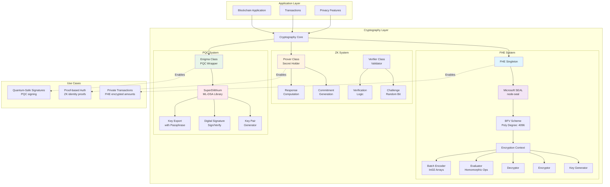
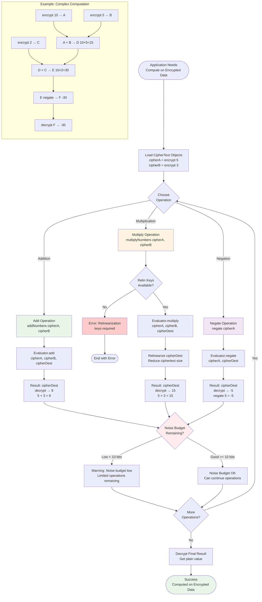
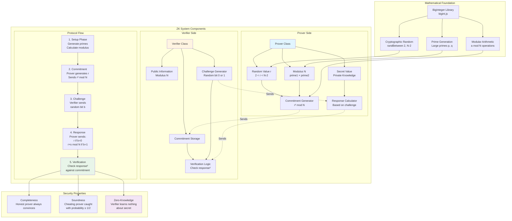
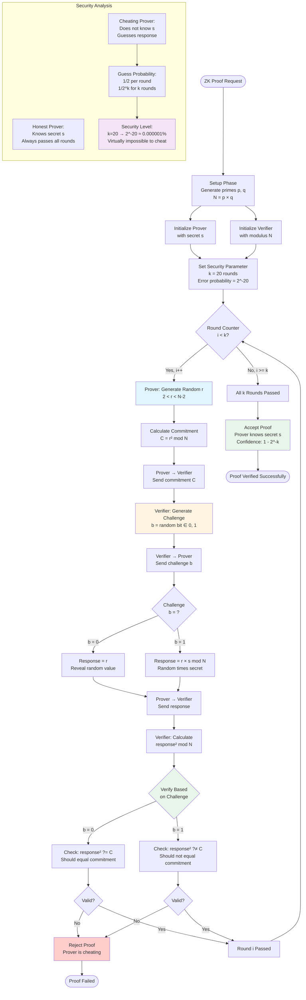
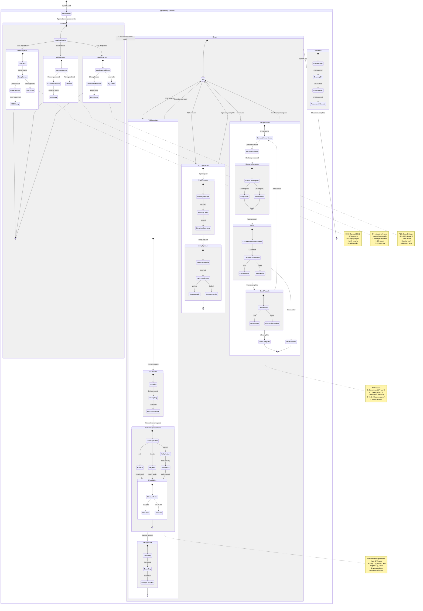

# Cryptography Systems: FHE, ZK, and PQC

## Overview

The Demos blockchain implements three advanced cryptography systems providing privacy, integrity, and post-quantum security:

1. **FHE (Fully Homomorphic Encryption)**: Enables computation on encrypted data using Microsoft SEAL with BFV scheme
2. **ZK (Zero-Knowledge Proofs)**: Interactive proof system allowing verification without revealing secrets
3. **PQC (Post-Quantum Cryptography)**: Quantum-resistant signatures using SuperDilithium (ML-DSA)

---

## Diagram 1: Cryptography Systems Architecture Overview



**Description**: Complete cryptography systems architecture showing FHE (Microsoft SEAL with BFV), ZK (interactive proof system), and PQC (SuperDilithium) components and their integration into the blockchain application layer.

---

## Diagram 2: FHE Architecture & Components

```mermaid
graph TD
    subgraph "FHE Singleton Pattern"
        GetInstance[FHE.getInstance<br/>Lazy Initialization]
        Instance[FHE Instance<br/>Singleton]
        InitFlag{Initialized?}
    end

    subgraph "SEAL Library Initialization"
        LoadSEAL[Load SEAL Library<br/>await SEAL]
        SetScheme[Set Scheme Type<br/>SchemeType.bfv]
        SetSecurity[Set Security Level<br/>SecurityLevel.tc128]
        SetPolyDegree[Set Polynomial Degree<br/>polyModulusDegree: 4096]
        SetCoeffModulus[Set Coefficient Modulus<br/>bitSizes: 36, 36, 37]
        SetPlainModulus[Set Plain Modulus<br/>PlainModulusDegree: 1032193]
    end

    subgraph "Encryption Parameters"
        EncParams[EncryptionParameters<br/>BFV Scheme]
        PolyMod[Polynomial Modulus<br/>Degree 4096]
        CoeffMod[Coefficient Modulus<br/>3 primes]
        PlainMod[Plain Modulus<br/>1032193]
    end

    subgraph "Context Creation"
        CreateContext[Create SEALContext<br/>from parameters]
        ValidateContext{Context<br/>Valid?}
        ContextReady[Context Ready<br/>Security: tc128]
    end

    subgraph "Component Initialization"
        InitKeyGen[Initialize KeyGenerator<br/>from context]
        GenSecretKey[Generate Secret Key]
        GenPublicKey[Generate Public Key]
        GenRelinKeys[Generate Relin Keys<br/>for multiplication]

        InitEncryptor[Initialize Encryptor<br/>context + publicKey]
        InitDecryptor[Initialize Decryptor<br/>context + secretKey]
        InitEvaluator[Initialize Evaluator<br/>context only]
        InitEncoder[Initialize BatchEncoder<br/>context for Int32]
    end

    subgraph "Ready State"
        FHEReady[FHE System Ready]
        EncryptAPI[Encryption API<br/>encryptNumber]
        DecryptAPI[Decryption API<br/>decryptNumber]
        MathAPI[Math API<br/>add, multiply, negate]
    end

    GetInstance --> InitFlag
    InitFlag -->|No| Instance
    Instance --> LoadSEAL

    LoadSEAL --> SetScheme
    SetScheme --> SetSecurity
    SetSecurity --> SetPolyDegree
    SetPolyDegree --> SetCoeffModulus
    SetCoeffModulus --> SetPlainModulus

    SetPlainModulus --> EncParams
    EncParams --> PolyMod
    EncParams --> CoeffMod
    EncParams --> PlainMod

    PolyMod --> CreateContext
    CoeffMod --> CreateContext
    PlainMod --> CreateContext

    CreateContext --> ValidateContext
    ValidateContext -->|Valid| ContextReady
    ValidateContext -->|Invalid| Error[Error: Invalid params]

    ContextReady --> InitKeyGen
    InitKeyGen --> GenSecretKey
    GenSecretKey --> GenPublicKey
    GenPublicKey --> GenRelinKeys

    GenRelinKeys --> InitEncryptor
    InitEncryptor --> InitDecryptor
    InitDecryptor --> InitEvaluator
    InitEvaluator --> InitEncoder

    InitEncoder --> FHEReady

    FHEReady --> EncryptAPI
    FHEReady --> DecryptAPI
    FHEReady --> MathAPI

    InitFlag -->|Yes| FHEReady

    style Instance fill:#e1f5ff
    style EncParams fill:#fff4e1
    style ContextReady fill:#e8f5e9
    style FHEReady fill:#e8f5e9
    style Error fill:#ffcccc
```



**Description**: Detailed FHE architecture showing singleton pattern, Microsoft SEAL library initialization with BFV scheme parameters (4096 poly degree, tc128 security), component setup (KeyGenerator, Encryptor, Decryptor, Evaluator, BatchEncoder), and API exposure.

---

## Diagram 3: FHE Encryption & Decryption Flow

```mermaid
sequenceDiagram
    participant App as Application
    participant FHE as FHE Instance
    participant Encoder as BatchEncoder
    participant Encryptor as Encryptor
    participant Decryptor as Decryptor
    participant Storage as Encrypted Storage

    rect rgb(230, 245, 255)
        Note over App,Storage: Encryption Flow
        App->>FHE: encryptNumber(42)
        activate FHE

        FHE->>FHE: Check initialized
        alt Not Initialized
            FHE->>FHE: await getInstance()
            Note over FHE: Lazy initialization<br/>Load SEAL, setup context
        end

        FHE->>Encoder: encode(Int32Array.from([42]))
        activate Encoder
        Note over Encoder: Convert integer to<br/>polynomial representation
        Encoder-->>FHE: PlainText object
        deactivate Encoder

        alt Encoding Failed
            FHE-->>App: Error: Encoding failed
        else Encoding Success
            FHE->>Encryptor: encrypt(plainText)
            activate Encryptor
            Note over Encryptor: Encrypt using<br/>public key + BFV scheme
            Encryptor->>Encryptor: Apply noise budget
            Encryptor->>Encryptor: Polynomial multiplication
            Encryptor-->>FHE: CipherText object
            deactivate Encryptor

            FHE-->>App: CipherText (encrypted 42)
            deactivate FHE

            App->>Storage: Store CipherText
            Note over Storage: Encrypted data at rest<br/>No one can read value
        end
    end

    rect rgb(255, 245, 230)
        Note over App,Storage: Decryption Flow
        App->>Storage: Retrieve CipherText
        Storage-->>App: CipherText object

        App->>FHE: decryptNumber(cipherText)
        activate FHE

        FHE->>Decryptor: decrypt(cipherText)
        activate Decryptor
        Note over Decryptor: Decrypt using<br/>secret key
        Decryptor->>Decryptor: Polynomial operations
        Decryptor->>Decryptor: Remove noise
        Decryptor-->>FHE: PlainText object
        deactivate Decryptor

        alt Decryption Failed
            FHE-->>App: Error: Decryption failed
        else Decryption Success
            FHE->>Encoder: decode(plainText)
            activate Encoder
            Note over Encoder: Convert polynomial<br/>back to integer
            Encoder-->>FHE: Int32Array([42])
            deactivate Encoder

            FHE->>FHE: Extract first element
            FHE-->>App: 42 (original value)
            deactivate FHE

            Note over App: Application can now<br/>use the decrypted value
        end
    end

    style FHE fill:#e1f5ff
    style Encoder fill:#fff4e1
    style Encryptor fill:#e8f5e9
    style Decryptor fill:#f3e5f5
    style Storage fill:#ffebee
```

**Description**: Complete encryption and decryption flow showing how integers are encoded to polynomials, encrypted with BFV scheme using public key, stored securely, and later decrypted with secret key and decoded back to integers.

---

## Diagram 4: FHE Homomorphic Operations



**Description**: Complete homomorphic operations flowchart showing how to perform addition, multiplication, and negation on encrypted data without decryption, including noise budget management, relinearization for multiplication, and operation chaining.

---

## Diagram 5: ZK Proof System Architecture



**Description**: Complete ZK proof system architecture showing Prover and Verifier components, protocol flow (setup, commitment, challenge, response, verification), security properties (completeness, soundness, zero-knowledge), and mathematical foundation using modular arithmetic.

---

## Diagram 6: ZK Prover/Verifier Interactive Protocol

```mermaid
sequenceDiagram
    participant App as Application
    participant Prover as Prover<br/>(Has Secret)
    participant Verifier as Verifier<br/>(Validates)
    participant Random as Random Generator
    participant Math as Modular Arithmetic

    Note over App,Math: Setup Phase

    App->>Random: Generate prime1, prime2
    Random-->>App: Large primes (e.g., 2048-bit)

    App->>Prover: new Prover(prime1, prime2, secret)
    activate Prover
    Prover->>Math: Calculate N = prime1 × prime2
    Math-->>Prover: Modulus N
    Note over Prover: Secret s is stored privately
    deactivate Prover

    App->>Verifier: new Verifier(prime1, prime2)
    activate Verifier
    Verifier->>Math: Calculate N = prime1 × prime2
    Math-->>Verifier: Modulus N (public)
    deactivate Verifier

    Note over App,Math: Proof Iteration (Repeat k times for security)

    loop Each Proof Round (k=20 for 2^-20 error)
        rect rgb(230, 245, 255)
            Note over Prover,Math: Phase 1: Commitment
            App->>Prover: generateCommitment()
            activate Prover
            Prover->>Random: randBetween(2, N-2)
            Random-->>Prover: Random value r
            Prover->>Math: Calculate r² mod N
            Math-->>Prover: commitment
            Prover-->>App: commitment
            deactivate Prover

            App->>Verifier: Send commitment
            Verifier->>Verifier: Store commitment
        end

        rect rgb(255, 245, 230)
            Note over Verifier,Random: Phase 2: Challenge
            App->>Verifier: generateChallenge(commitment)
            activate Verifier
            Verifier->>Random: Math.random()
            Random-->>Verifier: Random float [0,1)
            Verifier->>Verifier: Round to bit (0 or 1)
            Note over Verifier: Challenge b ∈ {0, 1}
            Verifier-->>App: challenge (0 or 1)
            deactivate Verifier

            App->>Prover: Send challenge
        end

        rect rgb(230, 255, 230)
            Note over Prover,Math: Phase 3: Response
            App->>Prover: respondToChallenge(challenge)
            activate Prover

            alt Challenge = 0
                Note over Prover: Response = r<br/>(reveal random value)
                Prover-->>App: response = r
            else Challenge = 1
                Prover->>Math: Calculate r × s mod N
                Math-->>Prover: response
                Note over Prover: Response = r × s mod N<br/>(random × secret)
                Prover-->>App: response = r × s mod N
            end
            deactivate Prover

            App->>Verifier: Send response
        end

        rect rgb(245, 230, 255)
            Note over Verifier,Math: Phase 4: Verification
            App->>Verifier: verifyResponse(response, challenge)
            activate Verifier

            Verifier->>Math: Calculate response² mod N
            Math-->>Verifier: responseSquared

            alt Challenge = 0
                Verifier->>Verifier: Check: response² == commitment
                Note over Verifier: If r² == commitment<br/>Proof valid for this round
            else Challenge = 1
                Verifier->>Verifier: Check: response² != commitment
                Note over Verifier: If (r×s)² != r²<br/>Proof valid for this round
            end

            alt Verification Passed
                Verifier-->>App: true (round passed)
            else Verification Failed
                Verifier-->>App: false (proof rejected)
                Note over App: Abort: Prover is lying<br/>or incorrect secret
            end
            deactivate Verifier
        end
    end

    Note over App,Math: All Rounds Complete

    App->>App: Accumulate results
    alt All k rounds passed
        App->>App: Accept proof<br/>Prover knows secret<br/>Confidence: 1 - 2^-k
    else Any round failed
        App->>App: Reject proof<br/>Prover does not know secret
    end

    style Prover fill:#e1f5ff
    style Verifier fill:#fff4e1
    style Math fill:#e8f5e9
```

**Description**: Detailed interactive protocol sequence showing setup with large primes, repeated proof rounds (commitment, challenge, response, verification), and how soundness probability increases exponentially with iterations (k=20 rounds → 2^-20 error rate).

---

## Diagram 7: ZK Challenge-Response Flow & Security



**Description**: Complete challenge-response flow showing how security is achieved through repeated rounds, with detailed verification logic for both challenge cases (b=0 and b=1), and security analysis showing exponential decrease in cheating probability.

---

## Diagram 8: PQC Enigma Architecture & SuperDilithium

```mermaid
graph TB
    subgraph "Enigma PQC Wrapper"
        EnigmaClass[Enigma Class<br/>PQC Interface]
        KeyPairField[Private Field:<br/>keyPair Object]
        InitMethod[init Method<br/>Generate or Import]
        SignMethod[sign Method<br/>Create Signature]
        VerifyMethod[verify Method<br/>Validate Signature]
        ExportMethod[exportKeys Method<br/>Export with Passphrase]
    end

    subgraph "SuperDilithium Library"
        SuperDil[SuperDilithium<br/>ML-DSA Implementation]
        KeyPairGen[keyPair Function<br/>Generate quantum-safe keys]
        ImportKeys[importKeys Function<br/>Load existing keys]
        SignFunc[sign Function<br/>Lattice-based signing]
        VerifyFunc[verifyDetached Function<br/>Signature verification]
        ExportFunc[exportKeys Function<br/>Secure key export]
    end

    subgraph "Key Pair Structure"
        KeyPair{KeyPair Object}
        PrivateKey[privateKey: Uint8Array<br/>Secret signing key]
        PublicKey[publicKey: Uint8Array<br/>Verification key]
    end

    subgraph "Cryptographic Operations"
        direction TB

        subgraph "Key Generation"
            NewKeys[Generate New Keys]
            RandomGen[Quantum Random<br/>Entropy Source]
            LatticeGen[Lattice-based<br/>Key Generation]
            KeysReady[Keys Ready<br/>Private + Public]
        end

        subgraph "Signing"
            Message[Message Input<br/>string or Uint8Array]
            HashMsg[Hash Message]
            LatticeSig[Lattice-based<br/>Signature Algorithm]
            Signature[Signature Output<br/>Uint8Array]
        end

        subgraph "Verification"
            SigInput[Signature Input]
            MsgInput[Message Input]
            PubKeyInput[Public Key Input]
            VerifyAlgo[Verification Algorithm<br/>Lattice operations]
            VerifyResult{Valid?}
        end
    end

    subgraph "Security Properties"
        QuantumSafe[Quantum-Safe<br/>Resistant to Shor's algorithm]
        MLDSA[ML-DSA Standard<br/>NIST Post-Quantum]
        LatticeSecurity[Lattice-based<br/>Hard mathematical problems]
    end

    EnigmaClass --> KeyPairField
    EnigmaClass --> InitMethod
    EnigmaClass --> SignMethod
    EnigmaClass --> VerifyMethod
    EnigmaClass --> ExportMethod

    InitMethod -->|New Keys| KeyPairGen
    InitMethod -->|Import Existing| ImportKeys

    KeyPairGen --> SuperDil
    ImportKeys --> SuperDil
    SignFunc --> SuperDil
    VerifyFunc --> SuperDil
    ExportFunc --> SuperDil

    KeyPairGen --> KeyPair
    ImportKeys --> KeyPair
    KeyPair --> PrivateKey
    KeyPair --> PublicKey

    SignMethod --> SignFunc
    VerifyMethod --> VerifyFunc
    ExportMethod --> ExportFunc

    NewKeys --> RandomGen
    RandomGen --> LatticeGen
    LatticeGen --> KeysReady

    Message --> HashMsg
    HashMsg --> LatticeSig
    LatticeSig --> Signature

    SigInput --> VerifyAlgo
    MsgInput --> VerifyAlgo
    PubKeyInput --> VerifyAlgo
    VerifyAlgo --> VerifyResult

    VerifyResult -->|True| Accept[Signature Valid]
    VerifyResult -->|False| Reject[Signature Invalid]

    SuperDil -.->|Implements| QuantumSafe
    SuperDil -.->|Follows| MLDSA
    SuperDil -.->|Based on| LatticeSecurity

    style EnigmaClass fill:#e8f5e9
    style SuperDil fill:#e1f5ff
    style KeyPair fill:#fff4e1
    style QuantumSafe fill:#f3e5f5
    style Accept fill:#e8f5e9
    style Reject fill:#ffcccc
```



**Description**: Complete PQC Enigma architecture showing the wrapper class around SuperDilithium library, key pair structure with Uint8Arrays, cryptographic operations (key generation, signing, verification), and quantum-safe security properties based on lattice problems.

---

## Diagram 9: PQC Key Generation, Signing & Verification

```mermaid
sequenceDiagram
    participant App as Application
    participant Enigma as Enigma Instance
    participant SuperDil as SuperDilithium
    participant Random as Quantum Random
    participant Lattice as Lattice Operations

    rect rgb(230, 245, 255)
        Note over App,Lattice: Key Generation Phase
        App->>Enigma: new Enigma()
        activate Enigma
        Note over Enigma: Create instance<br/>No keys yet

        App->>Enigma: init() - no privateKey arg
        Enigma->>SuperDil: keyPair()
        activate SuperDil

        SuperDil->>Random: Generate entropy
        Random-->>SuperDil: Quantum random bytes

        SuperDil->>Lattice: Generate lattice keys
        activate Lattice
        Note over Lattice: ML-DSA algorithm<br/>Lattice-based crypto<br/>Quantum-resistant
        Lattice-->>SuperDil: Private key (secret)
        Lattice-->>SuperDil: Public key (verification)
        deactivate Lattice

        SuperDil-->>Enigma: {privateKey: Uint8Array, publicKey: Uint8Array}
        deactivate SuperDil

        Enigma->>Enigma: Store keyPair internally
        Enigma-->>App: Initialization complete
        deactivate Enigma
    end

    rect rgb(255, 245, 230)
        Note over App,Lattice: Alternative: Import Existing Keys
        App->>Enigma: init(existingPrivateKey)
        activate Enigma
        Enigma->>SuperDil: importKeys({private: {combined: privateKey}})
        activate SuperDil
        SuperDil->>SuperDil: Parse private key
        SuperDil->>SuperDil: Derive public key from private
        SuperDil-->>Enigma: {privateKey, publicKey}
        deactivate SuperDil
        Enigma-->>App: Keys imported
        deactivate Enigma
    end

    rect rgb(230, 255, 230)
        Note over App,Lattice: Signing Phase
        App->>Enigma: sign("Hello, quantum world!")
        activate Enigma

        Enigma->>Enigma: Retrieve privateKey
        Enigma->>SuperDil: sign(message, privateKey)
        activate SuperDil

        SuperDil->>Lattice: Apply ML-DSA signing
        activate Lattice
        Note over Lattice: 1. Hash message<br/>2. Lattice operations<br/>3. Generate signature
        Lattice-->>SuperDil: Signature (Uint8Array)
        deactivate Lattice

        SuperDil-->>Enigma: signature
        deactivate SuperDil

        Enigma-->>App: signature (Uint8Array)
        deactivate Enigma

        Note over App: Store signature<br/>for later verification
    end

    rect rgb(245, 230, 255)
        Note over App,Lattice: Verification Phase
        App->>Enigma: verify(signature, message, publicKey)
        activate Enigma

        Enigma->>Enigma: Convert publicKey if string
        Note over Enigma: Handle format:<br/>string → Uint8Array

        Enigma->>SuperDil: verifyDetached(signature, message, publicKey)
        activate SuperDil

        SuperDil->>Lattice: Apply ML-DSA verification
        activate Lattice
        Note over Lattice: 1. Hash message<br/>2. Lattice verification<br/>3. Check signature validity
        Lattice-->>SuperDil: Boolean result
        deactivate Lattice

        alt Signature Valid
            SuperDil-->>Enigma: true
            Enigma-->>App: true (signature valid)
            Note over App: Message authenticated<br/>Sender verified
        else Signature Invalid
            SuperDil-->>Enigma: false
            Enigma-->>App: false (signature invalid)
            Note over App: Message tampered<br/>or wrong key
        end

        deactivate SuperDil
        deactivate Enigma
    end

    rect rgb(255, 245, 245)
        Note over App,SuperDil: Key Export (Optional)
        App->>Enigma: exportKeys("my-passphrase")
        activate Enigma
        Enigma->>SuperDil: exportKeys(keyPair, passphrase)
        activate SuperDil
        Note over SuperDil: Encrypt keys with<br/>passphrase for storage
        SuperDil-->>Enigma: Encrypted key bundle
        deactivate SuperDil
        Enigma-->>App: Encrypted keys (secure storage)
        deactivate Enigma
    end

    style Enigma fill:#e8f5e9
    style SuperDil fill:#e1f5ff
    style Lattice fill:#fff4e1
    style Random fill:#f3e5f5
```

**Description**: Complete sequence showing PQC key lifecycle including quantum-random key generation with lattice operations, signing messages with ML-DSA algorithm, verifying signatures with public keys, and optional secure key export with passphrase encryption.

---

## Diagram 10: Complete Cryptography Lifecycle State Machine



**Description**: Complete state machine covering the entire cryptography lifecycle for all three systems (FHE, ZK, PQC) from initialization through operational states (encrypt/decrypt, proof generation/verification, sign/verify) to shutdown, with detailed substates for each operation type and error handling.

---

## Summary

The Demos blockchain cryptography systems provide comprehensive privacy, verification, and post-quantum security:

### FHE (Fully Homomorphic Encryption)
- **Library**: Microsoft SEAL with BFV scheme
- **Security**: tc128 (128-bit security level)
- **Parameters**: 4096 polynomial modulus degree, coefficient modulus with 3 primes
- **Operations**: Homomorphic addition, multiplication, negation on encrypted data
- **Use Cases**: Private transactions, confidential computations, encrypted data analysis
- **Components**: Context, KeyGenerator, Encryptor, Decryptor, Evaluator, BatchEncoder

### ZK (Zero-Knowledge Proofs)
- **Type**: Interactive proof system with Fiat-Shamir heuristic
- **Protocol**: Commitment → Challenge → Response → Verification
- **Security**: k=20 rounds → 2^-20 cheating probability (~0.0001%)
- **Properties**: Completeness, soundness, zero-knowledge
- **Use Cases**: Authentication without revealing secrets, proof of knowledge, privacy-preserving verification
- **Foundation**: Modular arithmetic with large prime modulus, BigInteger operations

### PQC (Post-Quantum Cryptography)
- **Library**: SuperDilithium (ML-DSA)
- **Standard**: NIST post-quantum cryptography
- **Foundation**: Lattice-based cryptography (hard mathematical problems)
- **Security**: Resistant to quantum attacks (Shor's algorithm)
- **Operations**: Key generation, digital signatures (sign/verify), secure key export
- **Use Cases**: Quantum-safe transaction signing, future-proof authentication, long-term security

### Integration
All three systems integrate seamlessly into the blockchain:
- FHE enables private transactions with encrypted amounts
- ZK provides proof-based authentication without revealing credentials
- PQC ensures long-term security against quantum computing threats

### Related Documentation
- **Transaction Processing**: ML-DSA and SL-DSA signature integration
- **Blockchain Core**: Block structure and validation
- **Web2 Integration**: DAHR with cryptographic integrity
