# Post-Quantum Cryptography in Demos Blockchain

## ✅ PRODUCTION SYSTEM

This document describes the **production post-quantum cryptography** system actively used in Demos blockchain for all transaction signatures, block validation, and consensus operations.

### Production Status:
- **ucrypto SDK Integration**: ✅ **PRODUCTION** - All signatures use `@demoslabs/mlkp-sdk`
- **ML-DSA (Dilithium)**: ✅ **PRODUCTION** - NIST FIPS 204 lattice-based signatures
- **SL-DSA (Sphincs+)**: ✅ **PRODUCTION** - NIST FIPS 205 hash-based signatures
- **Falcon**: ✅ **PRODUCTION** - Compact lattice-based signatures
- **ED25519**: ✅ **PRODUCTION** - Classical elliptic curve (default, PQC optional)

### Source Files (Production):
- **Transaction Signing**: `src/libs/blockchain/transaction.ts:75-95` (ucrypto.sign)
- **Signature Verification**: `src/libs/blockchain/transaction.ts:164-260` (ucrypto.verify)
- **PQC Identity Management**: `src/libs/blockchain/gcr/gcr_routines/identityManager.ts`
- **ucrypto SDK**: `@kynesyslabs/demosdk/encryption` (sign, verify, key generation)
- **Supported Algorithms**: `src/libs/network/server_rpc.ts:98` (ed25519, falcon, ml-dsa)

---

## Overview

The Demos blockchain uses **NIST-approved post-quantum cryptography** via the ucrypto SDK to protect against quantum computing attacks. All transactions can be signed with quantum-resistant algorithms including ML-DSA (Dilithium), SL-DSA (Sphincs+), and Falcon, in addition to classical ED25519.

### Key Features:
- **Algorithm Flexibility**: Support for multiple signature algorithms (ED25519, Falcon, ML-DSA, SL-DSA)
- **PQC Identity Bootstrapping**: Link PQC public keys to ED25519 addresses via GCR
- **Dual Signature System**: Optional ED25519 + PQC signatures for identity verification
- **SDK Integration**: All cryptography via `@demoslabs/mlkp-sdk` ucrypto interface
- **Seamless Migration**: Classical ED25519 (default) with opt-in PQC

---

## Diagram 1: Production ucrypto PQC Architecture


**Description**: Complete production PQC architecture showing ucrypto SDK integration with support for ED25519 (classical), Falcon, ML-DSA (Dilithium), and SL-DSA (Sphincs+). All transaction signatures use this system via `@demoslabs/mlkp-sdk`.

---

## Diagram 2: Transaction Signing with ucrypto PQC


**Description**: Complete transaction signing flow showing how ucrypto SDK handles multiple PQC algorithms (ML-DSA, SL-DSA, Falcon) and classical ED25519. Used in `transaction.ts:75-95`.

---

## Diagram 3: Signature Verification with Dual Signature System

```mermaid
flowchart TD
    Start([Receive Transaction]) --> ExtractSig[Extract signature and hash<br/>from transaction]

    ExtractSig --> CheckType{Signature<br/>type?}

    CheckType -->|ED25519| SkipBootstrap[Skip PQC identity check<br/>Use ED25519 directly]
    CheckType -->|PQC: falcon, ml-dsa, sl-dsa| CheckEd25519Sig{Has<br/>ed25519_signature<br/>field?}

    subgraph "PQC Identity Bootstrapping"
        CheckEd25519Sig -->|No - First time PQC use| LookupGCR[Query GCR PQC Identities<br/>IdentityManager.getIdentities]
        LookupGCR --> FilterType[Filter by signature type<br/>falcon, ml-dsa, or sl-dsa]
        FilterType --> FindPubKey{PQC pubkey<br/>found in GCR?}

        FindPubKey -->|No| RejectNotRegistered[❌ REJECT<br/>PQC pubkey not registered<br/>Must provide ed25519_signature]
        FindPubKey -->|Yes| VerifyIdentityLink[Verify identity link signature<br/>ucrypto.verify ed25519 on PQC address]
        VerifyIdentityLink --> IdentityValid{Valid?}
        IdentityValid -->|No| RejectIdentity[❌ REJECT<br/>Invalid identity link]
        IdentityValid -->|Yes| Ed25519Verified1[✅ ED25519 verified via identity]

        CheckEd25519Sig -->|Yes - Bootstrapping PQC| VerifyEd25519Sig[Verify ed25519_signature<br/>ucrypto.verify ed25519 on tx.hash]
        VerifyEd25519Sig --> Ed25519Valid{Valid?}
        Ed25519Valid -->|No| RejectEd25519[❌ REJECT<br/>Invalid ed25519_signature]
        Ed25519Valid -->|Yes| Ed25519Verified2[✅ ED25519 verified<br/>via signature field]
    end

    SkipBootstrap --> Ed25519Verified3[✅ ED25519 primary signature]
    Ed25519Verified1 --> VerifyMainSig
    Ed25519Verified2 --> VerifyMainSig
    Ed25519Verified3 --> VerifyMainSig

    subgraph "Main Signature Verification"
        VerifyMainSig[Verify main signature<br/>ucrypto.verify algorithm, message, pubkey, sig]
        VerifyMainSig --> AlgoVerify{ucrypto.verify<br/>result?}

        AlgoVerify -->|ML-DSA| VerifyMLDSA[Verify ML-DSA signature<br/>NIST FIPS 204 verification]
        AlgoVerify -->|SL-DSA| VerifySLDSA[Verify SL-DSA signature<br/>NIST FIPS 205 verification]
        AlgoVerify -->|Falcon| VerifyFalcon[Verify Falcon signature<br/>Lattice-based verification]
        AlgoVerify -->|ED25519| VerifyED25519[Verify ED25519 signature<br/>Classical ECDSA verification]

        VerifyMLDSA --> MainSigValid{Valid?}
        VerifySLDSA --> MainSigValid
        VerifyFalcon --> MainSigValid
        VerifyED25519 --> MainSigValid
    end

    MainSigValid -->|No| RejectMainSig[❌ REJECT<br/>Main signature verification failed]
    MainSigValid -->|Yes| Success[✅ ACCEPT<br/>Transaction signature verified]

    RejectNotRegistered --> End([End: Rejected])
    RejectIdentity --> End
    RejectEd25519 --> End
    RejectMainSig --> End
    Success --> End2([End: Verified])

    style Success fill:#c8e6c9
    style Ed25519Verified1 fill:#c8e6c9
    style Ed25519Verified2 fill:#c8e6c9
    style Ed25519Verified3 fill:#c8e6c9
    style RejectNotRegistered fill:#ffcdd2
    style RejectIdentity fill:#ffcdd2
    style RejectEd25519 fill:#ffcdd2
    style RejectMainSig fill:#ffcdd2
```



**Description**: Complete signature verification flow showing the dual signature system for PQC identity bootstrapping. PQC signatures require either a registered identity in GCR or an ED25519 signature to link the PQC key to an ED25519 address. Implemented in `transaction.ts:164-260`.

---

## Diagram 4: PQC Identity Management in GCR

```mermaid
graph TB
    subgraph "User Workflow"
        User[User with ED25519 wallet]
        GenPQC[Generate PQC keypair<br/>via ucrypto SDK]
        LinkIdentity[Link PQC pubkey to ED25519 address]
        UsePQC[Use PQC for transactions]
    end

    subgraph "GCR PQC Identities Storage"
        GCRMain[(GCR Main Table)]
        IdentitiesField[identities: jsonb<br/> pqc: object<br/>  falcon: []<br/>  ml-dsa: []<br/>  sl-dsa: []]

        SavedIdentity[SavedPqcIdentity<br/> address: PQC pubkey<br/> signature: ED25519 sig<br/> timestamp: added date]
    end

    subgraph "IdentityManager Operations"
        GetIdentities[getIdentities<br/>pubkey, type]
        AddIdentity[addIdentity<br/>ED25519 address, PQC pubkey, signature]
        VerifyLink[verifyIdentityLink<br/>Check ED25519 signature on PQC address]
    end

    subgraph "Identity Link Verification"
        Step1[1. Sign PQC pubkey with ED25519 private key]
        Step2[2. Store: address, PQC pubkey, ED25519 signature]
        Step3[3. Verify: ucrypto.verify ed25519 signature]
        Step4[4. If valid: PQC pubkey trusted for this ED25519 address]
    end

    User --> GenPQC
    GenPQC --> LinkIdentity
    LinkIdentity --> Step1
    Step1 --> Step2
    Step2 --> AddIdentity
    AddIdentity --> GCRMain
    GCRMain --> IdentitiesField
    IdentitiesField --> SavedIdentity

    UsePQC --> GetIdentities
    GetIdentities --> IdentitiesField
    IdentitiesField --> VerifyLink
    VerifyLink --> Step3
    Step3 --> Step4

    style GCRMain fill:#fff4e1
    style SavedIdentity fill:#e1f5ff
    style Step4 fill:#c8e6c9
```

**Description**: PQC identity management system in GCR showing how PQC public keys are linked to ED25519 addresses. Users sign their PQC pubkey with their ED25519 private key, storing the link in GCR for future verification. Implemented in `identityManager.ts`.

---

## Diagram 5: Algorithm Comparison & Key Sizes

```mermaid
graph TB
    subgraph "ED25519 - Classical (Default)"
        ED1[Algorithm: Elliptic Curve DSA]
        ED2[Security: 128-bit classical]
        ED3[Public Key: 32 bytes]
        ED4[Signature: 64 bytes]
        ED5[Speed: Very Fast]
        ED6[Quantum Resistance: ❌ None]
        ED7[Use Case: Default, fast transactions]
    end

    subgraph "Falcon - PQC"
        F1[Algorithm: Lattice-based NTRU]
        F2[Security: 128-bit post-quantum]
        F3[Public Key: 897 bytes]
        F4[Signature: ~660 bytes]
        F5[Speed: Fast]
        F6[Quantum Resistance: ✅ Strong]
        F7[Use Case: Compact PQC signatures]
    end

    subgraph "ML-DSA Dilithium - PQC"
        ML1[Algorithm: Module Lattice DSA]
        ML2[Security: 128-bit post-quantum]
        ML3[Public Key: 1312 bytes]
        ML4[Signature: ~2420 bytes]
        ML5[Speed: Medium]
        ML6[Quantum Resistance: ✅ Strong]
        ML7[Use Case: NIST standard FIPS 204]
        ML8[Standard: NIST approved]
    end

    subgraph "SL-DSA Sphincs+ - PQC"
        SL1[Algorithm: Hash-based signatures]
        SL2[Security: 128-bit post-quantum]
        SL3[Public Key: 32 bytes]
        SL4[Signature: ~8000 bytes]
        SL5[Speed: Slow]
        SL6[Quantum Resistance: ✅ Very Strong]
        SL7[Use Case: Conservative PQC choice]
        SL8[Standard: NIST approved FIPS 205]
        SL9[Note: Minimal assumptions]
    end

    subgraph "Selection Criteria"
        Default[Default: ED25519<br/>Fast, small, but no PQC]
        Compact[Compact PQC: Falcon<br/>Best size/performance for PQC]
        Standard[NIST Standard: ML-DSA<br/>Government/enterprise use]
        Conservative[Maximum Security: SL-DSA<br/>Minimal crypto assumptions]
    end

    style ED1 fill:#e8f5e9
    style F1 fill:#e1f5ff
    style ML1 fill:#e1f5ff
    style SL1 fill:#e1f5ff
    style ML8 fill:#c8e6c9
    style SL8 fill:#c8e6c9
```



**Description**: Comparison of all supported signature algorithms showing key sizes, signature sizes, performance characteristics, and quantum resistance. Users choose based on security requirements vs transaction size/speed tradeoffs.

---

## Diagram 6: Block Validation with PQC Signatures


**Description**: Block validation flow showing how validators verify all transaction signatures in a block using ucrypto SDK, including PQC signature verification and identity link checks via GCR.

---

## Diagram 7: Complete Signature Lifecycle State Machine


**Description**: Complete state machine showing the entire signature lifecycle from key generation through identity registration, transaction signing, verification, and block inclusion, covering all supported algorithms and PQC identity bootstrapping.

---

## Diagram 8: POC Systems - FHE Architecture (Research Only)

### 🧪 PROOF-OF-CONCEPT - NOT IN PRODUCTION

**Note**: The following diagrams (8-10) show **research proof-of-concept** systems that are NOT integrated into production blockchain operations. These are standalone demonstrations in `src/crypto/` for future exploration.


**Description**: FHE proof-of-concept using Microsoft SEAL with BFV scheme. Enables computation on encrypted data. Located in `src/crypto/fhe.ts`. **Status**: Demo only, not used in production transactions.

---

## Diagram 9: POC Systems - ZK Proofs (Research Only)

### 🧪 PROOF-OF-CONCEPT - NOT IN PRODUCTION

```mermaid
graph TB
    subgraph "ZK Prover (POC)"
        ProverClass[Prover Class]
        Secret[Secret Value s]
        GenerateCommitment[generateCommitment<br/>C = r² mod N]
        RespondToChallenge[respondToChallenge<br/>if b=0: r<br/>if b=1: r×s mod N]
    end

    subgraph "ZK Verifier (POC)"
        VerifierClass[Verifier Class]
        GenerateChallenge[generateChallenge<br/>b ∈ {0,1}]
        VerifyResponse[verifyResponse<br/>Check response² matches]
    end

    subgraph "Protocol Flow (POC)"
        Setup[Setup: Generate primes p, q<br/>N = p × q]
        Commitment[Prover → Verifier: C]
        Challenge[Verifier → Prover: b]
        Response[Prover → Verifier: response]
        Verify[Verifier: Check validity]
    end

    ProverClass --> Secret
    ProverClass --> GenerateCommitment
    ProverClass --> RespondToChallenge
    VerifierClass --> GenerateChallenge
    VerifierClass --> VerifyResponse

    Setup --> Commitment
    Commitment --> Challenge
    Challenge --> Response
    Response --> Verify

    style ProverClass fill:#ffe0b2
    style VerifierClass fill:#ffe0b2
```

**Description**: ZK proof-of-concept showing interactive proof system. Demonstrates zero-knowledge authentication. Located in `src/crypto/zkProof.ts`. **Status**: Demo only, not used in production transactions.

---

## Diagram 10: Production vs POC Comparison

```mermaid
graph TB
    subgraph "✅ PRODUCTION - In Active Use"
        ProdUCrypto[ucrypto SDK<br/>@demoslabs/mlkp-sdk]
        ProdED25519[ED25519 Signatures<br/>Default, 64 bytes]
        ProdFalcon[Falcon Signatures<br/>PQC, ~660 bytes]
        ProdMLDSA[ML-DSA Dilithium<br/>NIST FIPS 204, ~2420 bytes]
        ProdSLDSA[SL-DSA Sphincs+<br/>NIST FIPS 205, ~8000 bytes]
        ProdIdentity[GCR Identity Management<br/>PQC pubkey linking]
        ProdTx[All Transaction Signatures]
        ProdBlock[Block Validation]
        ProdConsensus[Consensus Operations]
    end

    subgraph "🧪 POC - Research Demonstrations"
        POCEnigma[Enigma Wrapper<br/>SuperDilithium wrapper]
        POCFHE[FHE System<br/>Microsoft SEAL BFV]
        POCZK[ZK Proofs<br/>Interactive proof system]
        POCTests[Test Files Only<br/>*.test.ts]
        POCNotIntegrated[NOT integrated into<br/>blockchain operations]
    end

    subgraph "Files & Integration"
        FileTx[src/libs/blockchain/transaction.ts]
        FileIdentity[src/libs/blockchain/gcr/gcr_routines/identityManager.ts]
        FileSDK[@kynesyslabs/demosdk/encryption]

        FilePOCFHE[src/crypto/fhe.ts]
        FilePOCZK[src/crypto/zkProof.ts]
        FilePOCEnigma[src/crypto/enigma.ts]
    end

    ProdUCrypto --> ProdED25519
    ProdUCrypto --> ProdFalcon
    ProdUCrypto --> ProdMLDSA
    ProdUCrypto --> ProdSLDSA
    ProdIdentity --> ProdUCrypto

    ProdED25519 --> ProdTx
    ProdFalcon --> ProdTx
    ProdMLDSA --> ProdTx
    ProdSLDSA --> ProdTx
    ProdTx --> ProdBlock
    ProdBlock --> ProdConsensus

    FileTx --> ProdUCrypto
    FileIdentity --> ProdIdentity
    FileSDK --> ProdUCrypto

    POCEnigma --> POCTests
    POCFHE --> POCTests
    POCZK --> POCTests
    POCTests --> POCNotIntegrated

    FilePOCFHE --> POCFHE
    FilePOCZK --> POCZK
    FilePOCEnigma --> POCEnigma

    style ProdUCrypto fill:#c8e6c9
    style ProdTx fill:#c8e6c9
    style ProdBlock fill:#c8e6c9
    style ProdConsensus fill:#c8e6c9
    style POCEnigma fill:#ffe0b2
    style POCFHE fill:#ffe0b2
    style POCZK fill:#ffe0b2
    style POCNotIntegrated fill:#ffcdd2
```

**Description**: Comparison showing production ucrypto PQC system (actively used in all transactions) vs POC systems (FHE, ZK, Enigma wrapper for research). Production system uses SDK integration for ML-DSA, SL-DSA, Falcon, and ED25519.

---

## Summary

### ✅ Production Post-Quantum Cryptography

The Demos blockchain uses **production-grade NIST-approved PQC** via the ucrypto SDK:

#### Supported Algorithms (All Production-Ready):
- **ED25519**: ✅ Default classical ECDSA (32-byte pubkey, 64-byte signature)
- **Falcon**: ✅ Compact lattice-based PQC (897-byte pubkey, ~660-byte signature)
- **ML-DSA (Dilithium)**: ✅ NIST FIPS 204 lattice-based PQC (1312-byte pubkey, ~2420-byte signature)
- **SL-DSA (Sphincs+)**: ✅ NIST FIPS 205 hash-based PQC (32-byte pubkey, ~8000-byte signature)

#### Key Features:
- **ucrypto SDK Integration**: All cryptography via `@demoslabs/mlkp-sdk` with unified sign/verify interface
- **Algorithm Flexibility**: Users choose signing algorithm based on security/performance needs
- **PQC Identity Bootstrapping**: Link PQC public keys to ED25519 addresses via GCR for seamless migration
- **Dual Signature System**: First-time PQC users include ED25519 signature; registered users rely on GCR identity
- **Zero-Trust Verification**: All signatures verified using ucrypto.verify with algorithm-specific validation
- **NIST Compliance**: ML-DSA and SL-DSA follow NIST FIPS 204 and 205 standards

#### Implementation Locations:
- **Transaction Signing**: `src/libs/blockchain/transaction.ts:75-95` (ucrypto.sign)
- **Signature Verification**: `src/libs/blockchain/transaction.ts:164-260` (ucrypto.verify + identity checks)
- **PQC Identity Management**: `src/libs/blockchain/gcr/gcr_routines/identityManager.ts`
- **ucrypto SDK**: `@kynesyslabs/demosdk/encryption` (sign, verify, generateKeyPair)
- **Supported Algorithms**: `src/libs/network/server_rpc.ts:98` (ed25519, falcon, ml-dsa)

### 🧪 Proof-of-Concept Systems (Research Only)

The following are **standalone research demonstrations** NOT integrated into production:

- **FHE (Fully Homomorphic Encryption)**: `src/crypto/fhe.ts` - Microsoft SEAL with BFV scheme for computing on encrypted data
- **ZK (Zero-Knowledge Proofs)**: `src/crypto/zkProof.ts` - Interactive proof system for zero-knowledge authentication
- **Enigma Wrapper**: `src/crypto/enigma.ts` - SuperDilithium wrapper (superseded by ucrypto SDK)

**Status**: These POC systems are only imported by test files and serve as research demonstrations for future cryptographic features.

### Migration Path

1. **Default**: All transactions use ED25519 (fast, small, quantum-vulnerable)
2. **Opt-in PQC**: Users generate PQC keypair via ucrypto SDK
3. **Identity Registration**: Link PQC pubkey to ED25519 address in GCR
4. **PQC Transactions**: Use PQC signatures with automatic identity verification
5. **Quantum Safety**: Network transitions to PQC as quantum threats increase

### Related Documentation
- **Transaction Processing**: See `diagrams/transactions-mempool/TRANSACTIONS_MEMPOOL.md` for transaction lifecycle
- **GCR System**: See `diagrams/gcr/GCR.md` for identity management details
- **Blockchain Core**: See `diagrams/blockchain-core/BLOCKCHAIN_CORE.md` for block structure
