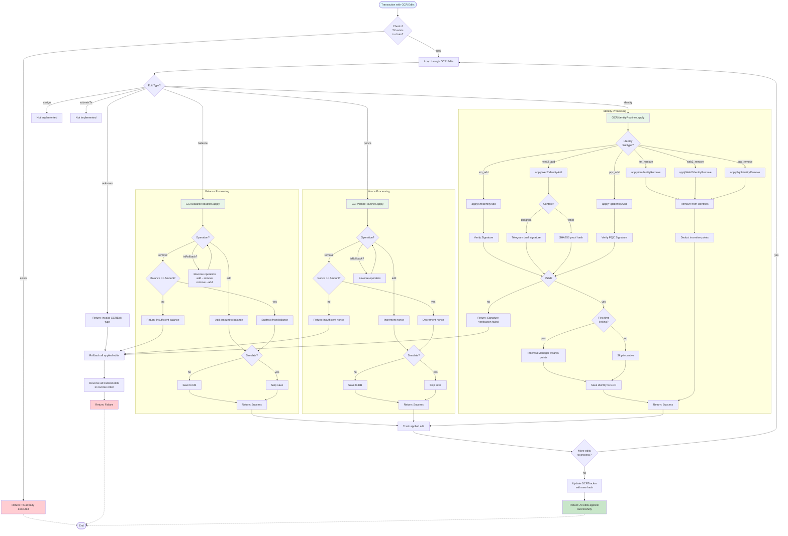
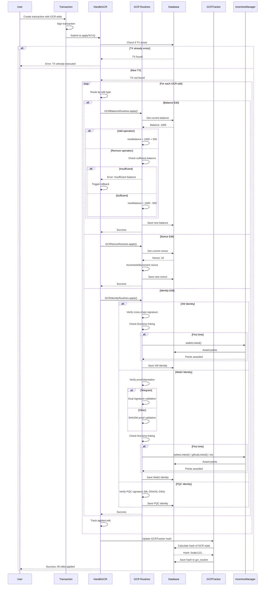
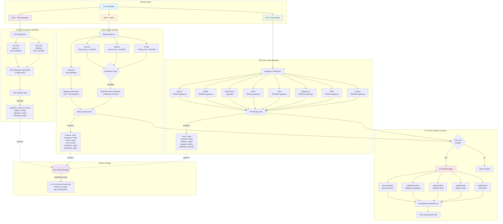
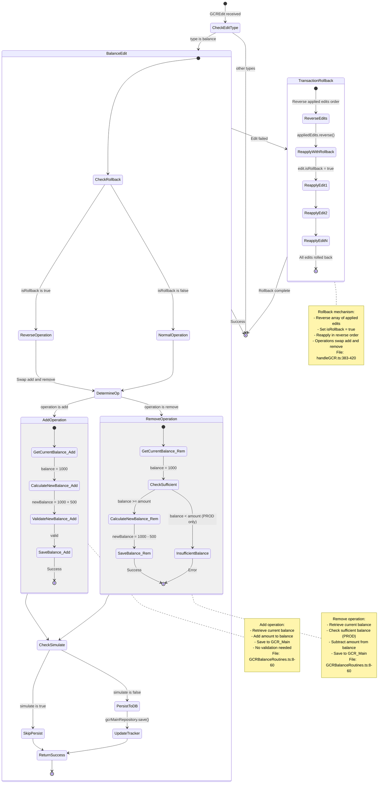
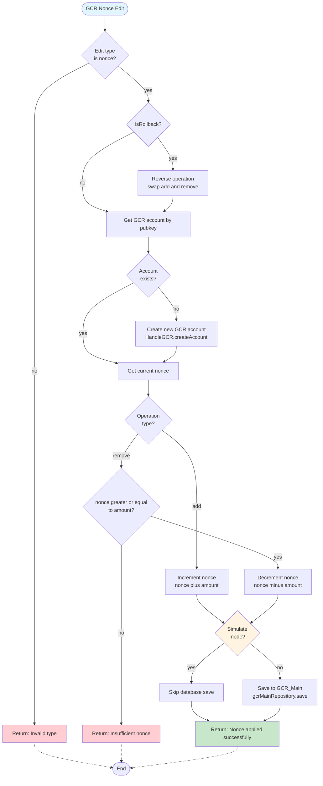
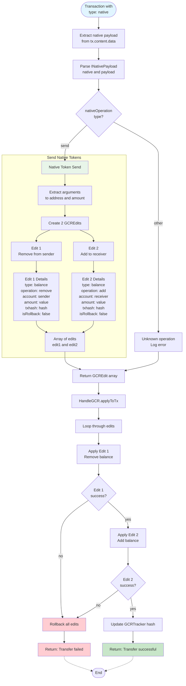
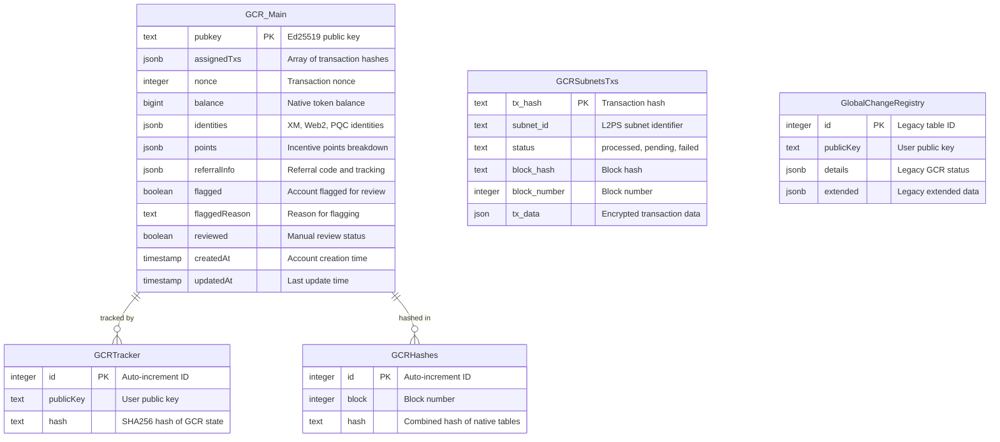

# Global Change Registry (GCR) - Mermaid Diagrams

## Overview

The Global Change Registry (GCR) is a critical component of the Demos blockchain that manages mutable global state including balances, identities, nonces, and incentives. While not stored directly in blocks, every GCR modification is cryptographically traceable through Operations derived from Transactions.

## 1. GCR Architecture & Components

```mermaid
graph TB
    subgraph "Transaction Layer"
        TX[Transaction]
        GCREDIT[GCR Edits Array]
        TX -->|contains| GCREDIT
    end

    subgraph "GCR Core - handleGCR.ts"
        HANDLER[HandleGCR Class]
        APPLY[apply method]
        APPLYTOTX[applyToTx method]
        ROLLBACK[rollback method]

        HANDLER --> APPLY
        HANDLER --> APPLYTOTX
        HANDLER --> ROLLBACK
    end

    subgraph "GCR Routines"
        BALANCE[GCRBalanceRoutines<br/>src/libs/blockchain/gcr/gcr_routines/GCRBalanceRoutines.ts]
        NONCE[GCRNonceRoutines<br/>src/libs/blockchain/gcr/gcr_routines/GCRNonceRoutines.ts]
        IDENTITY[GCRIdentityRoutines<br/>src/libs/blockchain/gcr/gcr_routines/GCRIdentityRoutines.ts]

        BALANCE -->|add/remove/rollback| BALANCEDB[(GCR_Main)]
        NONCE -->|increment/decrement| BALANCEDB
        IDENTITY -->|XM/Web2/PQC| BALANCEDB
    end

    subgraph "Identity Management"
        IDMGR[IdentityManager<br/>src/libs/blockchain/gcr/gcr_routines/identityManager.ts]
        CHAINS[Supported Chains]

        IDMGR --> CHAINS

        CHAINS --> SOLANA[Solana]
        CHAINS --> EVM[EVM]
        CHAINS --> EGLD[MultiversX]
        CHAINS --> TON[TON]
        CHAINS --> XRPL[XRPL]
        CHAINS --> IBC[IBC]
        CHAINS --> NEAR[NEAR]
        CHAINS --> BTC[Bitcoin]
    end

    subgraph "Incentive System"
        INCENTIVE[IncentiveManager<br/>src/libs/blockchain/gcr/gcr_routines/IncentiveManager.ts]
        POINTS[PointSystem]

        INCENTIVE -->|awards points| POINTS
        POINTS -->|Web3 Wallets| BALANCEDB
        POINTS -->|Twitter/GitHub/Telegram/Discord| BALANCEDB
        POINTS -->|Referral Code| BALANCEDB
    end

    subgraph "Database Tables"
        GCRDB[(GCR_Main<br/>pubkey, balance, nonce, identities)]
        TRACKER[(GCRTracker<br/>publicKey, hash)]
        HASHES[(GCRHashes<br/>block, hash)]
        SUBNETS[(GCRSubnetsTxs<br/>tx_hash, subnet_id)]
    end

    subgraph "State Management"
        ENSURE[ensureGCRForUser<br/>src/libs/blockchain/gcr/gcr_routines/ensureGCRForUser.ts]
        STATESAVE[GCRStateSaverHelper<br/>src/libs/blockchain/gcr/gcr_routines/gcrStateSaverHelper.ts]
        HASH[hashGCR<br/>src/libs/blockchain/gcr/gcr_routines/hashGCR.ts]
        JSONB[GCRJsonbHandler<br/>src/libs/blockchain/gcr/gcr_routines/gcrJSONBHandler.ts]

        ENSURE -->|create if missing| GCRDB
        STATESAVE -->|updateGCRTracker| TRACKER
        HASH -->|hashGCRTables| HASHES
        JSONB -->|JSONB operations| GCRDB
    end

    GCREDIT -->|routed by type| APPLY
    APPLY -->|balance edit| BALANCE
    APPLY -->|nonce edit| NONCE
    APPLY -->|identity edit| IDENTITY

    IDENTITY -->|verify signatures| IDMGR
    IDENTITY -->|award points| INCENTIVE

    BALANCE -.->|persist| GCRDB
    NONCE -.->|persist| GCRDB
    IDENTITY -.->|persist| GCRDB

    GCRDB -->|track changes| TRACKER
    TRACKER -->|hash history| HASHES

    style TX fill:#e1f5ff
    style HANDLER fill:#fff4e1
    style BALANCE fill:#e8f5e9
    style NONCE fill:#e8f5e9
    style IDENTITY fill:#e8f5e9
    style GCRDB fill:#f3e5f5
    style IDMGR fill:#fff3e0
    style INCENTIVE fill:#fce4ec
```



## 2. GCREdit Processing Flow



## 3. Transaction to GCR Operations Lifecycle



## 4. Identity Management Architecture



## 5. Balance Operations with Rollback



## 6. Nonce Management Flow



**Key Nonce Concepts:**

1. **Nonce Purpose**: Prevents replay attacks by ensuring transactions are processed in order
2. **Operations**:
   - `add`: Increment nonce (typically after successful transaction)
   - `remove`: Decrement nonce (rare, used in rollbacks)
3. **Rollback Support**: Operations are reversed when `isRollback = true`
4. **Validation**: Ensures sufficient nonce before decrementing (production only)
5. **Simulation**: Allows testing without persisting changes

**File References:**
- Implementation: `src/libs/blockchain/gcr/gcr_routines/GCRNonceRoutines.ts`
- Database Entity: `src/model/entities/GCRv2/GCR_Main.ts` (nonce field)

## 7. Native Operations Handling



**Native Operations Explanation:**

1. **Purpose**: Handle native token transfers (DEMOS token)
2. **Transaction Type**: `type: "native"`
3. **Payload Structure**:
   ```typescript
   {
     nativeOperation: "send",
     args: [to_address, amount]
   }
   ```
4. **Atomic Transfer**: Creates 2 GCREdits:
   - Remove from sender (must succeed first)
   - Add to receiver (only if removal succeeds)
5. **Rollback Safety**: If any edit fails, all previous edits are rolled back

**File References:**
- Implementation: `src/libs/blockchain/gcr/gcr_routines/handleNativeOperations.ts`
- Type definitions: `@kynesyslabs/demosdk/types` (INativePayload)

## 8. GCR Database Schema



**JSONB Field Structures:**

### GCR_Main.identities
```typescript
{
  xm: {
    [chain: string]: {
      [subchain: string]: Array<{
        address: string,
        signature: string,
        publicKey?: string,
        timestamp: Date
      }>
    }
  },
  web2: {
    [context: string]: Array<{
      username: string,
      userId: string,
      proof: string | TelegramSignedAttestation,
      proofHash: string,
      timestamp: Date
    }>
  },
  pqc: {
    [algorithm: string]: Array<{
      address: string,
      signature: string,
      timestamp: Date
    }>
  }
}
```

### GCR_Main.points
```typescript
{
  totalPoints: number,
  breakdown: {
    web3Wallets: { [chain: string]: number },
    socialAccounts: {
      twitter: number,
      github: number,
      discord: number,
      telegram: number
    },
    referrals: number,
    demosFollow: number,
    weeklyChallenge: Array<{
      date: string,
      points: number
    }>
  },
  lastUpdated: Date
}
```

### GCR_Main.referralInfo
```typescript
{
  totalReferrals: number,
  referredBy?: string,
  referralCode: string,
  referrals: Array<{
    referredUserId: string,
    referredAt: string,
    pointsAwarded: number
  }>
}
```

**Table Purposes:**

1. **GCR_Main**: Primary account state (balances, identities, points)
2. **GCRTracker**: Per-user state hashing for change detection
3. **GCRHashes**: Per-block combined hash of all native tables
4. **GCRSubnetsTxs**: L2PS subnet transaction storage (synced with chain)
5. **GlobalChangeRegistry**: Legacy table (being phased out)

## 9. GCR State Tracking & Hashing

```mermaid
flowchart TD
    subgraph "Hash Generation Flow"
        START([GCR State Change])

        START --> UPDATEUSER[Update GCR_Main record]
        UPDATEUSER --> TRIGGER[Trigger GCRStateSaverHelper]

        TRIGGER --> HASHUSER[Hash user's GCR state]
        HASHUSER --> STRINGIFY[JSON.stringify(userData)]
        STRINGIFY --> SHA256USER[SHA256 hash]

        SHA256USER --> UPSERT[Upsert to GCRTracker<br/>publicKey, hash]
        UPSERT --> USERTRACKED[User state tracked]
    end

    subgraph "Block-Level Hashing"
        BLOCKEND[Block consensus complete]

        BLOCKEND --> HASHTABLES[Hash all native tables]

        HASHTABLES --> HASHGCR[Hash GCRTracker table]
        HASHTABLES --> HASHSUBNETS[Hash GCRSubnetsTxs table]

        HASHGCR --> ORDERGCR[Order by publicKey ASC]
        ORDERGCR --> STRINGIFYGCR[JSON.stringify all records]
        STRINGIFYGCR --> SHA256GCR[SHA256 hash]

        HASHSUBNETS --> ORDERSUBNETS[Order by tx_hash ASC]
        ORDERSUBNETS --> STRINGIFYSUBNETS[JSON.stringify all records]
        STRINGIFYSUBNETS --> SHA256SUBNETS[SHA256 hash]

        SHA256GCR --> COMBINE[Combine hashes]
        SHA256SUBNETS --> COMBINE

        COMBINE --> NATIVEHASH["Combined Hash Object<br/>native_gcr: hash1<br/>native_subnets_txs: hash2"]

        NATIVEHASH --> INSERTGCRHASH[Insert to GCRHashes<br/>block, hash]
        INSERTGCRHASH --> BLOCKTRACKED[Block state tracked]
    end

    subgraph "Hash Verification"
        VERIFY[Node syncing/<br/>Validator checking]

        VERIFY --> FETCHHASH[Fetch GCRHashes for block N]
        FETCHHASH --> RECALCULATE[Recalculate hashes from tables]

        RECALCULATE --> COMPARE{Hashes<br/>match?}

        COMPARE -->|yes| VALID[State is valid]
        COMPARE -->|no| INVALID[State mismatch!<br/>Resync needed]
    end

    USERTRACKED -.->|contributes to| BLOCKEND
    BLOCKTRACKED --> VERIFY

    VALID --> END([End])
    INVALID --> RESYNC[Trigger state resync]
    RESYNC --> END

    style START fill:#e1f5ff
    style BLOCKEND fill:#fff4e1
    style VALID fill:#c8e6c9
    style INVALID fill:#ffcdd2
    style NATIVEHASH fill:#f3e5f5
```

**Key Hashing Concepts:**

1. **User-Level Tracking** (`GCRTracker`):
   - Every GCR_Main change triggers hash update
   - SHA256 of entire user record
   - Fast change detection per user
   - File: `gcrStateSaverHelper.ts:25-51`

2. **Block-Level Tracking** (`GCRHashes`):
   - Snapshot of all native tables at block N
   - Deterministic ordering (ASC by primary key)
   - Combined hash of:
     - `native_gcr`: GCRTracker table hash
     - `native_subnets_txs`: GCRSubnetsTxs table hash
   - File: `hashGCR.ts:70-103`

3. **Hash Structure** (`NativeTablesHashes`):
   ```typescript
   {
     native_gcr: string,       // SHA256 of GCRTracker
     native_subnets_txs: string // SHA256 of GCRSubnetsTxs
   }
   ```

4. **Cryptographic Security**:
   - Every GCR property traces back to Operations
   - Operations derive from Transactions
   - Transactions are in blocks with consensus
   - **Result**: GCR is cryptographically secure despite being mutable

5. **Use Cases**:
   - **Sync validation**: Verify node state matches network
   - **Consensus verification**: Validators check state agreement
   - **Rollback detection**: Identify unauthorized state changes
   - **State snapshots**: Quick state export/import

## 10. Complete GCR Update Lifecycle

```mermaid
stateDiagram-v2
    [*] --> TxCreated: User creates transaction

    state TxCreated {
        [*] --> DefineGCREdits
        DefineGCREdits --> SignTx
        SignTx --> BroadcastTx
        BroadcastTx --> [*]
    }

    TxCreated --> TxReceived: Network receives TX

    state TxReceived {
        [*] --> ValidateSignature
        ValidateSignature --> CheckNonce
        CheckNonce --> AddToMempool
        AddToMempool --> [*]
    }

    TxReceived --> TxInBlock: Proposer includes in block

    state TxInBlock {
        [*] --> BlockProposed
        BlockProposed --> ValidatorValidation
        ValidatorValidation --> ConsensusReached
        ConsensusReached --> [*]
    }

    TxInBlock --> GCRProcessing: Block confirmed

    state GCRProcessing {
        [*] --> ExtractGCREdits

        ExtractGCREdits --> CheckTxExists
        CheckTxExists --> AlreadyExecuted: TX found
        CheckTxExists --> NewTransaction: TX not found

        AlreadyExecuted --> [*]: Reject

        state NewTransaction {
            [*] --> ProcessEdits

            state ProcessEdits {
                [*] --> ProcessEdit

                state ProcessEdit {
                    [*] --> RouteByType
                    RouteByType --> BalanceRoutine: type balance
                    RouteByType --> NonceRoutine: type nonce
                    RouteByType --> IdentityRoutine: type identity

                    state BalanceRoutine {
                        [*] --> CheckRollback_B
                        CheckRollback_B --> ReverseOp_B: isRollback
                        CheckRollback_B --> NormalOp_B: !isRollback
                        ReverseOp_B --> ExecuteBalance
                        NormalOp_B --> ExecuteBalance
                        ExecuteBalance --> ValidateBalance
                        ValidateBalance --> Success_B: valid
                        ValidateBalance --> Failed_B: invalid
                        Success_B --> [*]
                        Failed_B --> [*]
                    }

                    state NonceRoutine {
                        [*] --> CheckRollback_N
                        CheckRollback_N --> ReverseOp_N: isRollback
                        CheckRollback_N --> NormalOp_N: !isRollback
                        ReverseOp_N --> ExecuteNonce
                        NormalOp_N --> ExecuteNonce
                        ExecuteNonce --> Success_N
                        Success_N --> [*]
                    }

                    state IdentityRoutine {
                        [*] --> DetermineSubtype
                        DetermineSubtype --> XMIdentity: xm add or remove
                        DetermineSubtype --> Web2Identity: web2 add or remove
                        DetermineSubtype --> PQCIdentity: pqc add or remove

                        XMIdentity --> VerifyXMSignature
                        Web2Identity --> VerifyWeb2Proof
                        PQCIdentity --> VerifyPQCSignature

                        VerifyXMSignature --> CheckFirstLink
                        VerifyWeb2Proof --> CheckFirstLink
                        VerifyPQCSignature --> CheckFirstLink

                        CheckFirstLink --> AwardIncentive: first time
                        CheckFirstLink --> SkipIncentive: already linked

                        AwardIncentive --> SaveIdentity
                        SkipIncentive --> SaveIdentity

                        SaveIdentity --> Success_I
                        Success_I --> [*]
                    }

                    BalanceRoutine --> CheckResult
                    NonceRoutine --> CheckResult
                    IdentityRoutine --> CheckResult

                    CheckResult --> TrackApplied: success
                    CheckResult --> TriggerRollback: failure

                    TrackApplied --> [*]
                    TriggerRollback --> [*]
                }

                ProcessEdit --> MoreEdits: edit processed

                MoreEdits --> ProcessEdit: yes
                MoreEdits --> AllEditsApplied: no

                AllEditsApplied --> [*]
            }

            ProcessEdits --> EditsFailed: any edit failed
            ProcessEdits --> EditsSuccess: all succeeded

            state EditsFailed {
                [*] --> ReverseAppliedEdits
                ReverseAppliedEdits --> ReapplyWithRollback
                ReapplyWithRollback --> RollbackComplete
                RollbackComplete --> [*]
            }

            EditsFailed --> [*]: TX rejected
            EditsSuccess --> UpdateState
        }

        UpdateState --> PersistGCRMain
        PersistGCRMain --> HashUserState
        HashUserState --> UpdateGCRTracker
        UpdateGCRTracker --> [*]
    }

    GCRProcessing --> StateTracked: GCR updated

    state StateTracked {
        [*] --> UserHashUpdated
        UserHashUpdated --> BlockComplete
        BlockComplete --> [*]
    }

    StateTracked --> BlockHashing: Block finalized

    state BlockHashing {
        [*] --> HashAllTables
        HashAllTables --> CombineHashes
        CombineHashes --> InsertGCRHash
        InsertGCRHash --> [*]
    }

    BlockHashing --> [*]: State finalized

    note right of GCRProcessing
        Core GCR processing:
        - Extract GCR edits from TX
        - Route each edit by type
        - Apply with rollback support
        - Track applied edits
        - Rollback on any failure

        Files:
        - handleGCR.ts:240-420
        - GCRBalanceRoutines.ts
        - GCRNonceRoutines.ts
        - GCRIdentityRoutines.ts
    end note

    note right of StateTracked
        State tracking:
        - User hash: SHA256 of GCR_Main record
        - Stored in GCRTracker table
        - Block hash: Combined native table hashes
        - Stored in GCRHashes table

        Files:
        - gcrStateSaverHelper.ts:25-51
        - hashGCR.ts:70-103
    end note

    note right of IdentityRoutine
        Identity incentives:
        - XM: walletLinked (per chain)
        - Web2: twitterLinked, githubLinked,
          telegramLinked, discordLinked
        - Only awarded on first-time link
        - Points stored in GCR_Main.points

        File: IncentiveManager.ts
    end note
```



---

## Key File References

### Core GCR Files
- **GCR Main Class**: `src/libs/blockchain/gcr/gcr.ts` (40,673 bytes)
- **HandleGCR**: `src/libs/blockchain/gcr/handleGCR.ts` (18,809 bytes)

### GCR Routines
- **Balance**: `src/libs/blockchain/gcr/gcr_routines/GCRBalanceRoutines.ts` (3,216 bytes)
- **Nonce**: `src/libs/blockchain/gcr/gcr_routines/GCRNonceRoutines.ts` (2,204 bytes)
- **Identity**: `src/libs/blockchain/gcr/gcr_routines/GCRIdentityRoutines.ts` (27,607 bytes)
- **Incentives**: `src/libs/blockchain/gcr/gcr_routines/IncentiveManager.ts` (3,729 bytes)
- **Identity Manager**: `src/libs/blockchain/gcr/gcr_routines/identityManager.ts` (10,599 bytes)
- **Hashing**: `src/libs/blockchain/gcr/gcr_routines/hashGCR.ts` (3,830 bytes)
- **State Saver**: `src/libs/blockchain/gcr/gcr_routines/gcrStateSaverHelper.ts` (2,160 bytes)
- **JSONB Handler**: `src/libs/blockchain/gcr/gcr_routines/gcrJSONBHandler.ts` (2,505 bytes)
- **Ensure User**: `src/libs/blockchain/gcr/gcr_routines/ensureGCRForUser.ts` (1,031 bytes)
- **Native Operations**: `src/libs/blockchain/gcr/gcr_routines/handleNativeOperations.ts` (2,541 bytes)
- **Manage Native**: `src/libs/blockchain/gcr/gcr_routines/manageNative.ts` (2,775 bytes)
- **Apply Operation**: `src/libs/blockchain/gcr/gcr_routines/applyGCROperation.ts` (1,587 bytes)

### Database Entities
- **GCR_Main**: `src/model/entities/GCRv2/GCR_Main.ts` (75 lines)
- **GCRTracker**: `src/model/entities/GCR/GCRTracker.ts` (23 lines)
- **GCRHashes**: `src/model/entities/GCRv2/GCRHashes.ts` (17 lines)
- **GCRSubnetsTxs**: `src/model/entities/GCRv2/GCRSubnetsTxs.ts` (29 lines)
- **GlobalChangeRegistry**: `src/model/entities/GCR/GlobalChangeRegistry.ts` (43 lines - legacy)

### Type Definitions
- **GCROperations**: `src/libs/blockchain/gcr/types/GCROperations.ts`
- **GCREdit**: `@kynesyslabs/demosdk/types` (balance, nonce, identity, assign, subnetsTx)
- **Transaction**: `@kynesyslabs/demosdk/types` (content.gcr_edits field)

---

## GCR Architecture Principles

1. **Cryptographic Security**: Every GCR property traces back to Operations, which derive from Transactions in consensus-validated blocks

2. **Atomic Operations**: All GCR edits in a transaction must succeed together or all fail together (rollback support)

3. **Idempotency**: Transactions are checked for existence before processing to prevent duplicate execution

4. **State Tracking**: User-level and block-level hashing enables efficient sync validation and rollback detection

5. **Incentive Integration**: First-time identity linking automatically awards points through IncentiveManager

6. **Multi-Chain Support**: Cross-chain (XM) identities support 8 chains: Solana, EVM, MultiversX, TON, XRPL, IBC, NEAR, Bitcoin

7. **Post-Quantum Ready**: PQC identity support for ML-DSA (Dilithium) and SL-DSA (Sphincs+) algorithms

8. **JSONB Flexibility**: Complex nested data structures stored efficiently in PostgreSQL JSONB fields

9. **Rollback Safety**: Every operation can be reversed if needed, maintaining consistency

10. **Simulation Mode**: Test GCR edits without persisting to database (used in pre-consensus validation)
