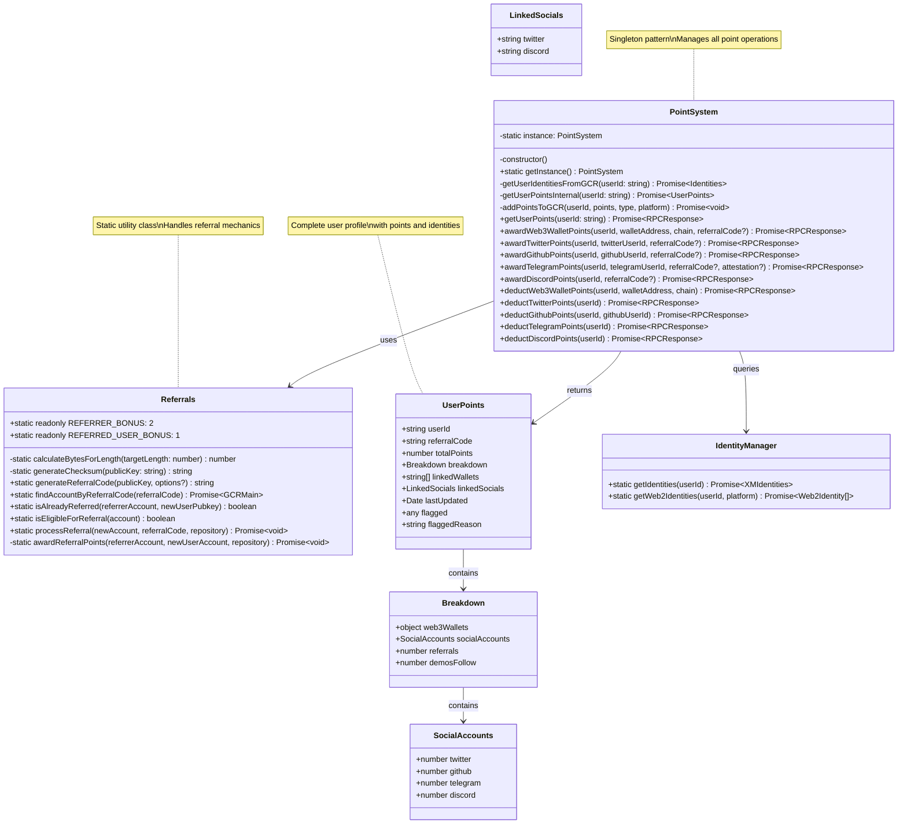
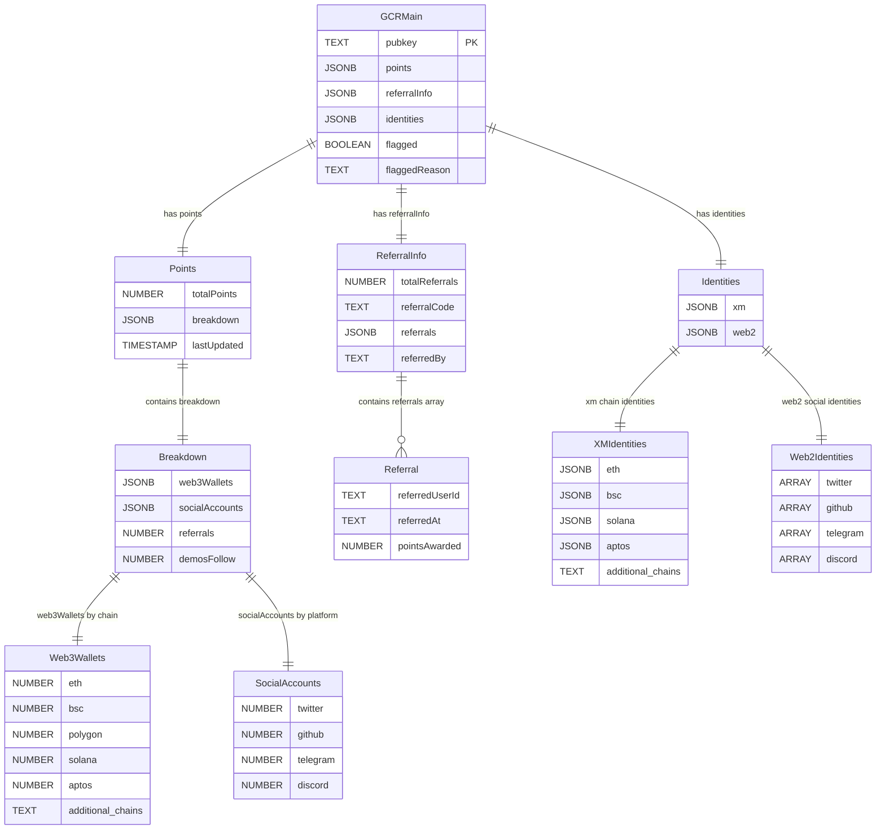
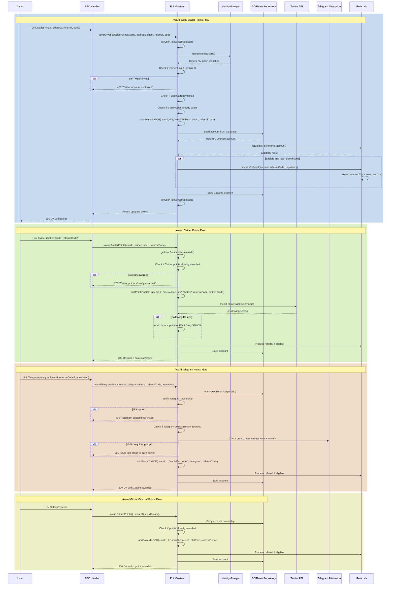
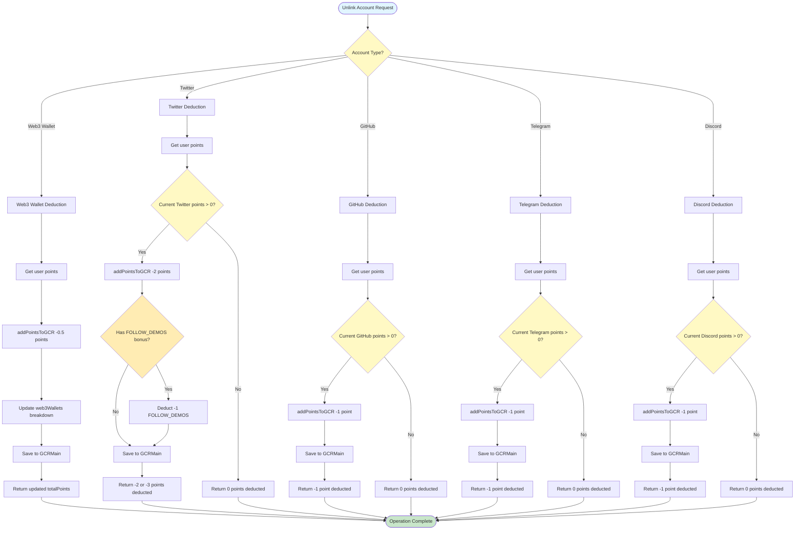
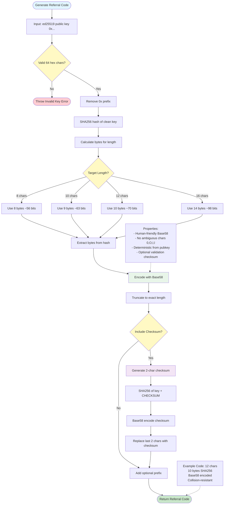
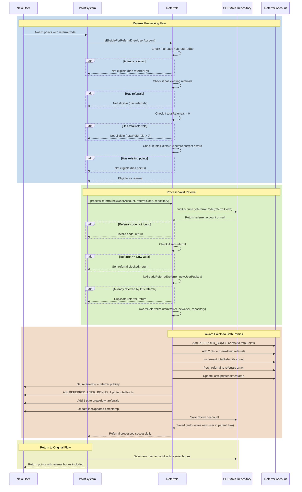
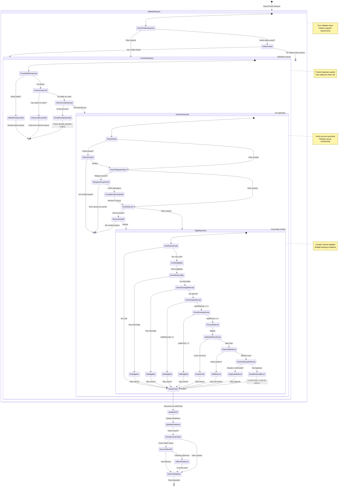
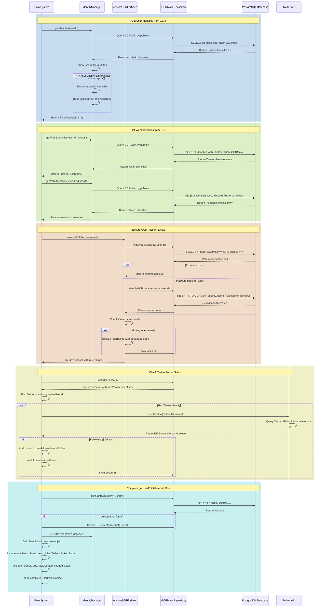

# Incentive Management - Comprehensive Diagrams

This document provides comprehensive Mermaid diagrams for the Incentive Management implementation in Demos blockchain, covering point systems and referral mechanics.

## Table of Contents
1. [Incentive Architecture Overview](#1-incentive-architecture-overview)
2. [Point System Class Structure](#2-point-system-class-structure)
3. [User Points Data Model](#3-user-points-data-model)
4. [Award Points Flow](#4-award-points-flow)
5. [Deduct Points Flow](#5-deduct-points-flow)
6. [Referral Code Generation](#6-referral-code-generation)
7. [Referral Processing Flow](#7-referral-processing-flow)
8. [Eligibility & Validation Rules](#8-eligibility--validation-rules)
9. [GCR Integration & Identity Management](#9-gcr-integration--identity-management)
10. [Complete Incentive Lifecycle](#10-complete-incentive-lifecycle)

---

## 1. Incentive Architecture Overview

```mermaid
graph TB
    subgraph "Incentive Management System"
        PS[PointSystem Singleton]
        REF[Referrals Static Class]
        PV[Point Values Config]
    end

    subgraph "Point Values"
        WEB3[LINK_WEB3_WALLET: 0.5]
        TWITTER[LINK_TWITTER: 2]
        GITHUB[LINK_GITHUB: 1]
        TELEGRAM[LINK_TELEGRAM: 1]
        DISCORD[LINK_DISCORD: 1]
        FOLLOW[FOLLOW_DEMOS: 1]
    end

    subgraph "Referral System"
        REFBONUS[REFERRER_BONUS: 2 pts]
        USERBONUS[REFERRED_USER_BONUS: 1 pt]
        CODEGEN[Referral Code Generator]
    end

    subgraph "GCR Integration"
        GCRMain[(GCRMain Entity)]
        Points[points.totalPoints]
        Breakdown[points.breakdown]
        ReferralInfo[referralInfo]
        Identities[identities.xm & web2]
    end

    subgraph "Identity Management"
        IM[IdentityManager]
        XMID[XM Chain Identities]
        WEB2ID[Web2 Identities]
    end

    subgraph "External Services"
        TwitterAPI[Twitter API]
        TelegramAttest[Telegram Attestation]
        GithubAPI[Github API]
        DiscordAPI[Discord API]
    end

    PS --> PV
    PS --> GCRMain
    PS --> IM
    REF --> GCRMain
    REF --> CODEGEN

    PV --> WEB3
    PV --> TWITTER
    PV --> GITHUB
    PV --> TELEGRAM
    PV --> DISCORD
    PV --> FOLLOW

    GCRMain --> Points
    GCRMain --> Breakdown
    GCRMain --> ReferralInfo
    GCRMain --> Identities

    IM --> XMID
    IM --> WEB2ID

    Breakdown --> |web3Wallets| XMID
    Breakdown --> |socialAccounts| WEB2ID
    Breakdown --> |referrals| ReferralInfo
    Breakdown --> |demosFollow| TwitterAPI

    PS --> TwitterAPI
    PS --> TelegramAttest
    PS --> GithubAPI
    PS --> DiscordAPI

    style PS fill:#e1f5ff
    style REF fill:#fff4e1
    style GCRMain fill:#e8f5e9
    style IM fill:#f3e5f5
```

---

## 2. Point System Class Structure

---

## 3. User Points Data Model

---

## 4. Award Points Flow

---

## 5. Deduct Points Flow

---

## 6. Referral Code Generation

---

## 7. Referral Processing Flow

---

## 8. Eligibility & Validation Rules

---

## 9. GCR Integration & Identity Management

---

## 10. Complete Incentive Lifecycle

```mermaid
stateDiagram-v2
    [*] --> SystemInit: Initialize Incentive System

    SystemInit --> GetSingleton: Get PointSystem instance
    GetSingleton --> InitializeGCR: Initialize GCR connection
    InitializeGCR --> SystemReady: System ready for operations

    SystemReady --> NewUserRegistration: New user registers
    SystemReady --> ExistingUserOperation: Existing user operation

    state NewUserRegistration {
        [*] --> EnsureGCR: Ensure GCR account
        EnsureGCR --> GenerateReferralCode: Generate referral code
        GenerateReferralCode --> InitializePoints: Initialize points = 0
        InitializePoints --> InitializeBreakdown: Initialize breakdown structure
        InitializeBreakdown --> InitializeReferralInfo: Initialize referralInfo
        InitializeReferralInfo --> SaveNewAccount: Save to GCRMain
        SaveNewAccount --> [*]
    }

    NewUserRegistration --> ReadyForLinking: Account created

    state ExistingUserOperation {
        [*] --> LoadAccount: Load GCRMain account
        LoadAccount --> CheckOperation: Determine operation
    }

    ExistingUserOperation --> ReadyForLinking: Account loaded

    state ReadyForLinking {
        [*] --> ChooseLinkType
        ChooseLinkType --> LinkWeb3: Link Web3 wallet
        ChooseLinkType --> LinkTwitter: Link Twitter
        ChooseLinkType --> LinkGitHub: Link GitHub
        ChooseLinkType --> LinkTelegram: Link Telegram
        ChooseLinkType --> LinkDiscord: Link Discord
    }

    ReadyForLinking --> AwardPointsFlow: Link account

    state AwardPointsFlow {
        [*] --> ValidateRequest
        ValidateRequest --> CheckTwitterReq: Web3 wallet?
        CheckTwitterReq --> TwitterRequired: Require Twitter first
        TwitterRequired --> [*]: Reject if no Twitter
        CheckTwitterReq --> CheckDuplicates: Has Twitter or other platform

        CheckDuplicates --> DuplicateDetected: Already linked?
        DuplicateDetected --> [*]: Reject duplicate
        CheckDuplicates --> CheckOwnership: No duplicate

        CheckOwnership --> OwnershipFailed: Not owner?
        OwnershipFailed --> [*]: Reject non-owner
        CheckOwnership --> CheckAttestation: Ownership verified

        CheckAttestation --> TelegramAttest: Telegram?
        TelegramAttest --> GroupNotMember: Not in group?
        GroupNotMember --> [*]: No points awarded
        TelegramAttest --> AddPoints: In group
        CheckAttestation --> AddPoints: Other platforms

        AddPoints --> UpdateTotalPoints: Add platform points
        UpdateTotalPoints --> UpdateBreakdown: Update breakdown
        UpdateBreakdown --> CheckReferral: Has referral code?

        CheckReferral --> ProcessReferralFlow: Yes, check eligibility
        CheckReferral --> CheckFollowBonus: No referral code

        ProcessReferralFlow --> ReferralProcessed: Award referral bonus
        ReferralProcessed --> CheckFollowBonus: +1 pt user, +2 pts referrer

        CheckFollowBonus --> TwitterFollowCheck: Twitter link?
        TwitterFollowCheck --> QueryTwitterAPI: Check follow status
        QueryTwitterAPI --> FollowingDemos: Following @Demos?
        FollowingDemos --> AddFollowBonus: Add 1 bonus point
        FollowingDemos --> SaveAccount: Not following
        TwitterFollowCheck --> SaveAccount: Other platforms
        AddFollowBonus --> SaveAccount: demosFollow bonus

        SaveAccount --> ReturnResponse: Save to GCRMain
        ReturnResponse --> [*]: Return RPCResponse
    }

    AwardPointsFlow --> AccountUpdated: Points awarded

    AccountUpdated --> QueryPoints: User queries points
    AccountUpdated --> UnlinkAccount: User unlinks account
    AccountUpdated --> ReadyForLinking: Link more accounts

    state QueryPoints {
        [*] --> GetUserPointsInternal
        GetUserPointsInternal --> LoadFromGCR: Load account
        LoadFromGCR --> GetIdentities: Get XM + Web2 identities
        GetIdentities --> BuildResponse: Build UserPoints object
        BuildResponse --> ReturnUserPoints: Return complete profile
        ReturnUserPoints --> [*]
    }

    QueryPoints --> AccountUpdated: Points returned

    state UnlinkAccount {
        [*] --> ChooseUnlinkType
        ChooseUnlinkType --> UnlinkWeb3: Unlink wallet
        ChooseUnlinkType --> UnlinkTwitter: Unlink Twitter
        ChooseUnlinkType --> UnlinkGitHub: Unlink GitHub
        ChooseUnlinkType --> UnlinkTelegram: Unlink Telegram
        ChooseUnlinkType --> UnlinkDiscord: Unlink Discord

        UnlinkWeb3 --> DeductWeb3Points: Deduct 0.5 points
        UnlinkTwitter --> DeductTwitterPoints: Deduct 2 points
        UnlinkGitHub --> DeductGitHubPoints: Deduct 1 point
        UnlinkTelegram --> DeductTelegramPoints: Deduct 1 point
        UnlinkDiscord --> DeductDiscordPoints: Deduct 1 point

        DeductWeb3Points --> UpdateAfterDeduct
        DeductTwitterPoints --> CheckFollowDeduct: Remove follow bonus?
        CheckFollowDeduct --> DeductFollowBonus: Yes, deduct 1 more
        CheckFollowDeduct --> UpdateAfterDeduct: No follow bonus
        DeductFollowBonus --> UpdateAfterDeduct: Total -3 points
        DeductGitHubPoints --> UpdateAfterDeduct
        DeductTelegramPoints --> UpdateAfterDeduct
        DeductDiscordPoints --> UpdateAfterDeduct

        UpdateAfterDeduct --> SaveDeduction: Update breakdown & total
        SaveDeduction --> ReturnDeduction: Save to GCRMain
        ReturnDeduction --> [*]: Return updated points
    }

    UnlinkAccount --> AccountUpdated: Points deducted

    state ReferralOperations {
        [*] --> GenerateCode: Generate referral code
        GenerateCode --> ShareCode: Share with friends
        ShareCode --> WaitForReferral: Wait for referral
        WaitForReferral --> ReferralTriggered: New user uses code
        ReferralTriggered --> CheckEligibility: Validate eligibility
        CheckEligibility --> NotEligible: Failed checks
        NotEligible --> [*]: Skip referral
        CheckEligibility --> AwardBothParties: Eligible
        AwardBothParties --> Referrer2Points: Referrer +2 pts
        AwardBothParties --> NewUser1Point: New user +1 pt
        Referrer2Points --> UpdateReferralInfo: Update referral lists
        NewUser1Point --> UpdateReferralInfo
        UpdateReferralInfo --> SaveBothAccounts: Save both accounts
        SaveBothAccounts --> [*]: Referral complete
    }

    AccountUpdated --> ReferralOperations: User shares referral code
    ReferralOperations --> AccountUpdated: Referral processed

    AccountUpdated --> FlagAccount: Suspicious activity detected

    state FlagAccount {
        [*] --> DetectSuspicious
        DetectSuspicious --> SetFlaggedTrue: Set flagged = true
        SetFlaggedTrue --> SetFlaggedReason: Set flaggedReason
        SetFlaggedReason --> SaveFlagged: Save to GCRMain
        SaveFlagged --> BlockOperations: Block future point operations
        BlockOperations --> [*]
    }

    FlagAccount --> SystemShutdown: Account flagged

    AccountUpdated --> SystemShutdown: Graceful shutdown
    QueryPoints --> SystemShutdown: Shutdown requested
    ReadyForLinking --> SystemShutdown: Shutdown requested

    SystemShutdown --> CloseConnections: Close GCR connections
    CloseConnections --> [*]: System stopped

    note right of SystemInit
        Initialize PointSystem singleton
        Connect to GCR database
    end note

    note right of NewUserRegistration
        First-time user setup
        Generate referral code
        Initialize all fields
    end note

    note right of AwardPointsFlow
        Multi-stage validation
        Platform-specific rules
        Referral processing
        Bonus calculations
    end note

    note right of ReferralOperations
        Two-party point award
        Eligibility checks
        Anti-gaming measures
    end note

    note right of FlagAccount
        Anti-abuse mechanism
        Suspicious pattern detection
    end note
```

---

## Summary

These diagrams provide comprehensive coverage of the Incentive Management implementation:

1. **Architecture Overview** - Complete system with PointSystem, Referrals, GCR integration, Identity Management
2. **Class Structure** - TypeScript classes for PointSystem (singleton), Referrals (static), UserPoints, Breakdown
3. **Data Model** - GCRMain entity with points, referralInfo, identities in PostgreSQL with JSONB fields
4. **Award Points Flow** - Complete sequence for Web3, Twitter, GitHub, Telegram, Discord with validation
5. **Deduct Points Flow** - Flowchart for unlinking accounts with proper point deduction
6. **Referral Code Generation** - Collision-resistant Base58 encoding from ed25519 public key with SHA256
7. **Referral Processing** - Two-party bonus award with eligibility checks and anti-gaming measures
8. **Eligibility & Validation** - State machine showing all validation rules and blocking conditions
9. **GCR Integration** - Complete identity management with XM chain and Web2 platform queries
10. **Complete Lifecycle** - End-to-end state machine from initialization to flagging and shutdown

### Key Features Documented:
- **Point Values**: Web3 (0.5), Twitter (2), GitHub (1), Telegram (1), Discord (1), Follow Demos (1)
- **Referral Bonuses**: Referrer (+2), Referred User (+1)
- **Validation Rules**: Twitter required for Web3, one wallet per chain, ownership verification
- **Telegram Attestation**: Group membership required via attestation payload
- **Referral Eligibility**: No prior referredBy, no existing referrals, no existing points
- **Anti-Gaming**: Self-referral blocked, duplicate referrals blocked, flagging system
- **Identity Management**: XM chain wallets (ETH, BSC, Solana, Aptos), Web2 socials (Twitter, GitHub, Telegram, Discord)
- **GCR Integration**: PostgreSQL with JSONB fields for points, breakdown, referralInfo, identities
- **Referral Code**: Deterministic, collision-resistant, Base58 encoded, optional checksum

### Files Referenced:
- `src/features/incentive/PointSystem.ts` - Singleton class managing all point operations
- `src/features/incentive/referrals.ts` - Static utility class for referral mechanics

This documentation enables developers to understand the complete incentive system architecture, from point allocation to referral mechanics to anti-gaming measures.
