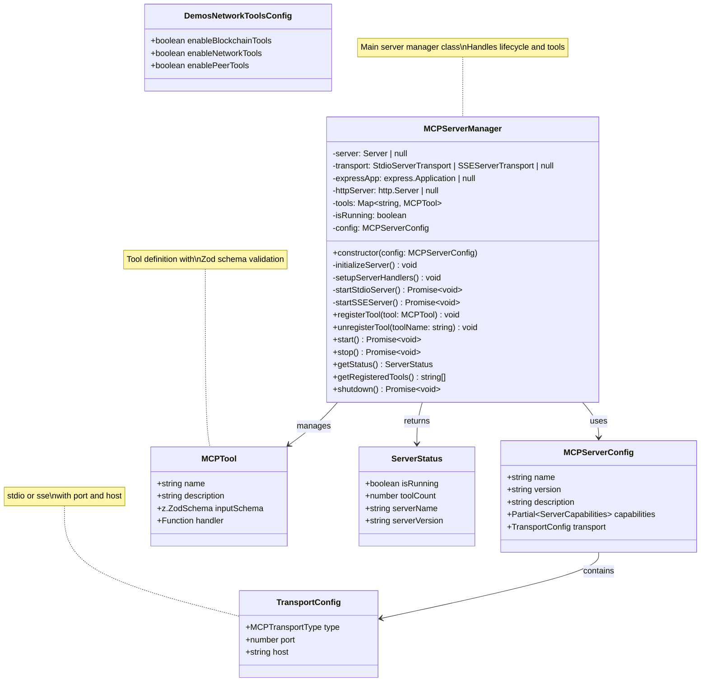
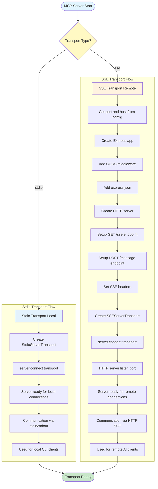
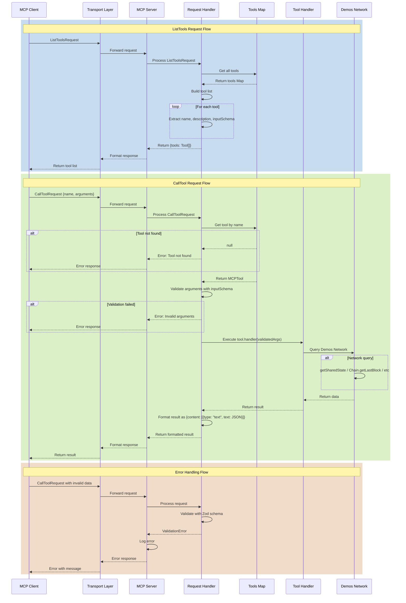
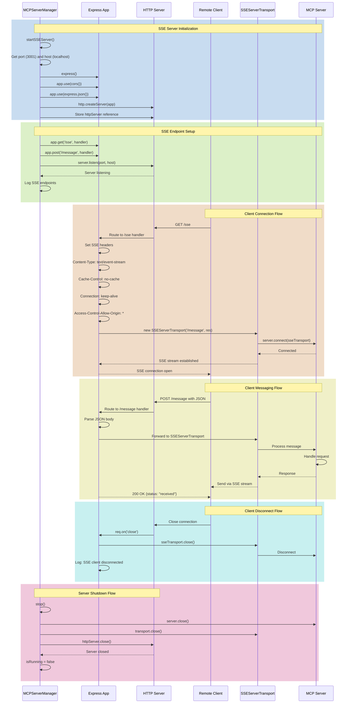
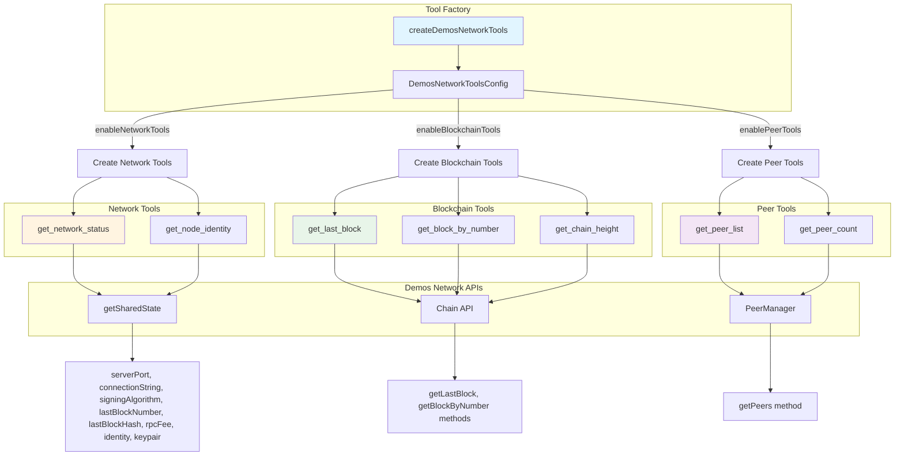
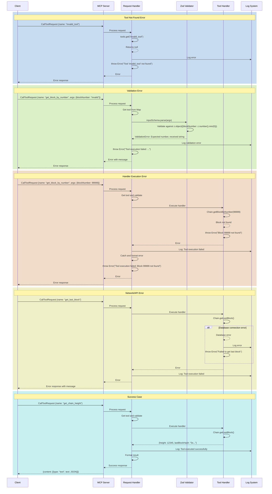

# MCP (Model Context Protocol) - Comprehensive Diagrams

This document provides comprehensive Mermaid diagrams for the MCP (Model Context Protocol) implementation in Demos blockchain, enabling AI assistants to interact with blockchain operations.

## Table of Contents
1. [MCP Architecture Overview](#1-mcp-architecture-overview)
2. [MCP Server Class Structure](#2-mcp-server-class-structure)
3. [Transport Layer (Stdio vs SSE)](#3-transport-layer-stdio-vs-sse)
4. [Tool Registration & Lifecycle](#4-tool-registration--lifecycle)
5. [Request Handling Flow](#5-request-handling-flow)
6. [SSE Server Setup](#6-sse-server-setup)
7. [Demos Network Tools](#7-demos-network-tools)
8. [Tool Execution Flow](#8-tool-execution-flow)
9. [Error Handling & Validation](#9-error-handling--validation)
10. [Complete MCP Lifecycle](#10-complete-mcp-lifecycle)

---

## 1. MCP Architecture Overview

```mermaid
graph TB
    subgraph "MCP Integration Layer"
        Factory[createDemosMCPServer Factory]
        Manager[MCPServerManager]
        Config[MCPServerConfig]
    end

    subgraph "MCP SDK"
        Server[@modelcontextprotocol/sdk Server]
        StdioTransport[StdioServerTransport]
        SSETransport[SSEServerTransport]
        Schemas[Request Schemas]
    end

    subgraph "Transport Options"
        Stdio[Stdio Transport Local]
        SSE[SSE Transport Remote]
    end

    subgraph "Express.js Layer"
        ExpressApp[Express Application]
        CORSMiddleware[CORS Middleware]
        HTTPServer[HTTP Server]
        SSEEndpoint[GET /sse]
        MessageEndpoint[POST /message]
    end

    subgraph "Tool System"
        ToolMap[Tools Map]
        ToolRegistry[Tool Registration]
        ToolHandlers[Tool Handlers]
    end

    subgraph "Demos Network Tools"
        NetworkTools[Network Tools]
        BlockchainTools[Blockchain Tools]
        PeerTools[Peer Tools]
    end

    subgraph "Demos Network Integration"
        SharedState[getSharedState]
        PeerManager[PeerManager]
        ChainAPI[Chain API]
    end

    Factory --> Manager
    Manager --> Config
    Manager --> Server
    Manager --> ToolMap

    Server --> StdioTransport
    Server --> SSETransport
    Server --> Schemas

    StdioTransport --> Stdio
    SSETransport --> SSE

    SSE --> ExpressApp
    ExpressApp --> CORSMiddleware
    ExpressApp --> HTTPServer
    ExpressApp --> SSEEndpoint
    ExpressApp --> MessageEndpoint

    Manager --> ToolRegistry
    ToolRegistry --> ToolHandlers
    ToolHandlers --> NetworkTools
    ToolHandlers --> BlockchainTools
    ToolHandlers --> PeerTools

    NetworkTools --> SharedState
    BlockchainTools --> ChainAPI
    PeerTools --> PeerManager

    style Manager fill:#e1f5ff
    style Server fill:#fff4e1
    style ExpressApp fill:#e8f5e9
    style ToolMap fill:#f3e5f5
```

---

## 2. MCP Server Class Structure



---

## 3. Transport Layer (Stdio vs SSE)



---

## 4. Tool Registration & Lifecycle

```mermaid
stateDiagram-v2
    [*] --> ServerCreated: new MCPServerManager(config)

    ServerCreated --> RegisterTools: Register tools

    state RegisterTools {
        [*] --> CheckRunning: registerTool(tool)
        CheckRunning --> Running: Server running?
        Running --> [*]: Error: Cannot register
        CheckRunning --> AddToMap: Server not running
        AddToMap --> LogRegistration: tools.set(name, tool)
        LogRegistration --> [*]: Tool registered
    }

    RegisterTools --> MoreTools: More tools to register?
    MoreTools --> RegisterTools: Yes
    MoreTools --> ServerNotInitialized: No, start server

    ServerNotInitialized --> InitializeServer: initializeServer()

    state InitializeServer {
        [*] --> CreateServer: new Server(name, version)
        CreateServer --> SetCapabilities: Set capabilities
        SetCapabilities --> SetupHandlers: setupServerHandlers()
        SetupHandlers --> ListToolsHandler: Handle ListToolsRequest
        SetupHandlers --> CallToolHandler: Handle CallToolRequest
        ListToolsHandler --> [*]
        CallToolHandler --> [*]
    }

    InitializeServer --> CreateTransport: Server initialized

    state CreateTransport {
        [*] --> TransportType: Determine transport
        TransportType --> StdioTransport: stdio
        TransportType --> SSETransport: sse
        StdioTransport --> ConnectStdio: Connect transport
        SSETransport --> StartExpress: Start Express server
        StartExpress --> ConnectSSE: Connect transport
        ConnectStdio --> [*]
        ConnectSSE --> [*]
    }

    CreateTransport --> ServerRunning: isRunning = true

    ServerRunning --> HandleRequests: Ready for requests

    state HandleRequests {
        [*] --> WaitRequest: Wait for client request
        WaitRequest --> ListTools: ListToolsRequest
        WaitRequest --> CallTool: CallToolRequest

        ListTools --> BuildToolList: Build tool list from Map
        BuildToolList --> ReturnTools: Return tools array
        ReturnTools --> WaitRequest

        CallTool --> ValidateTool: Check if tool exists
        ValidateTool --> ExecuteTool: tool.handler(args)
        ExecuteTool --> ReturnResult: Return result
        ReturnResult --> WaitRequest
    }

    HandleRequests --> StopServer: stop() called

    state StopServer {
        [*] --> CheckRunning2: Check if running
        CheckRunning2 --> CloseServer: server.close()
        CloseServer --> CloseTransport: transport.close()
        CloseTransport --> CloseHTTP: Close HTTP server if SSE
        CloseHTTP --> ClearState: isRunning = false
        ClearState --> [*]
    }

    StopServer --> ServerStopped: Server stopped

    ServerStopped --> [*]: Shutdown complete

    note right of ServerCreated
        Tools can only be registered
        before server starts
    end note

    note right of HandleRequests
        Server handles requests
        from MCP clients
    end note

    note right of StopServer
        Graceful shutdown
        with cleanup
    end note
```



---

## 5. Request Handling Flow



---

## 6. SSE Server Setup



---

## 7. Demos Network Tools



---

## 8. Tool Execution Flow

```mermaid
flowchart TD
    Start([Client calls tool]) --> ReceiveRequest[Receive CallToolRequest]
    ReceiveRequest --> ExtractParams[Extract name and arguments]
    ExtractParams --> LookupTool[tools.get name]

    LookupTool --> CheckExists{Tool exists?}
    CheckExists -->|No| ErrorNotFound[Error: Tool not found]
    ErrorNotFound --> ReturnError1([Return error response])

    CheckExists -->|Yes| GetTool[Get MCPTool from Map]
    GetTool --> ValidateInput[Validate with inputSchema.parse]

    ValidateInput --> CheckValidation{Validation passed?}
    CheckValidation -->|No| ErrorValidation[Zod ValidationError]
    ErrorValidation --> ReturnError2([Return validation error])

    CheckValidation -->|Yes| ExecuteHandler[Execute tool.handler]

    ExecuteHandler --> ToolType{Tool Type?}

    ToolType -->|Network Status| NetworkHandler[get_network_status handler]
    ToolType -->|Node Identity| IdentityHandler[get_node_identity handler]
    ToolType -->|Last Block| LastBlockHandler[get_last_block handler]
    ToolType -->|Block By Number| BlockNumberHandler[get_block_by_number handler]
    ToolType -->|Chain Height| ChainHeightHandler[get_chain_height handler]
    ToolType -->|Peer List| PeerListHandler[get_peer_list handler]
    ToolType -->|Peer Count| PeerCountHandler[get_peer_count handler]

    NetworkHandler --> GetSharedState1[getSharedState]
    GetSharedState1 --> ReturnNetworkData[Return serverPort, connectionString, etc.]

    IdentityHandler --> GetSharedState2[getSharedState.identity]
    GetSharedState2 --> ReturnIdentityData[Return publicKey, publicIP]

    LastBlockHandler --> ChainGetLast[Chain.getLastBlock]
    ChainGetLast --> ReturnLastBlock[Return block data]

    BlockNumberHandler --> ChainGetByNum[Chain.getBlockByNumber args.blockNumber]
    ChainGetByNum --> CheckBlockExists{Block exists?}
    CheckBlockExists -->|No| ErrorBlockNotFound[Error: Block not found]
    CheckBlockExists -->|Yes| ReturnBlock[Return block data]

    ChainHeightHandler --> ChainGetHeight[Chain.getLastBlock]
    ChainGetHeight --> ReturnHeight[Return height and hash]

    PeerListHandler --> PeerGetList[PeerManager.getInstance.getPeers]
    PeerGetList --> MapPeers[Map peers to response format]
    MapPeers --> ReturnPeerList[Return peerCount and peers array]

    PeerCountHandler --> PeerGetCount[PeerManager.getInstance.getPeers]
    PeerGetCount --> CountPeers[Count peers.length]
    CountPeers --> ReturnPeerCount[Return peerCount]

    ReturnNetworkData --> FormatResult[Format as JSON]
    ReturnIdentityData --> FormatResult
    ReturnLastBlock --> FormatResult
    ReturnBlock --> FormatResult
    ReturnHeight --> FormatResult
    ReturnPeerList --> FormatResult
    ReturnPeerCount --> FormatResult

    ErrorBlockNotFound --> CatchError[Catch error]
    CatchError --> LogError[Log error]
    LogError --> ThrowError[Throw formatted error]
    ThrowError --> ReturnError3([Return error response])

    FormatResult --> LogSuccess[Log: Tool executed successfully]
    LogSuccess --> WrapContent[Wrap in {content: [{type: "text", text: JSON}]}]
    WrapContent --> ReturnSuccess([Return success response])

    style Start fill:#e1f5ff
    style ReturnSuccess fill:#c8e6c9
    style ReturnError1 fill:#ffcdd2
    style ReturnError2 fill:#ffcdd2
    style ReturnError3 fill:#ffcdd2
    style CheckExists fill:#fff9c4
    style CheckValidation fill:#fff9c4
    style CheckBlockExists fill:#fff9c4
```

---

## 9. Error Handling & Validation



---

## 10. Complete MCP Lifecycle

```mermaid
stateDiagram-v2
    [*] --> ServerCreation: Initialize MCP System

    ServerCreation --> CreateManager: new MCPServerManager(config)
    CreateManager --> ConfigureServer: Set name, version, description

    ConfigureServer --> ToolRegistration: Register tools

    state ToolRegistration {
        [*] --> CreateNetworkTools: createDemosNetworkTools()
        CreateNetworkTools --> EnableNetwork: enableNetworkTools?
        CreateNetworkTools --> EnableBlockchain: enableBlockchainTools?
        CreateNetworkTools --> EnablePeer: enablePeerTools?

        EnableNetwork --> RegisterNetworkTools: Register network tools
        EnableBlockchain --> RegisterBlockchainTools: Register blockchain tools
        EnablePeer --> RegisterPeerTools: Register peer tools

        RegisterNetworkTools --> ToolMap
        RegisterBlockchainTools --> ToolMap
        RegisterPeerTools --> ToolMap

        ToolMap --> [*]: Tools registered
    }

    ToolRegistration --> StartServer: start() called

    state StartServer {
        [*] --> CheckInitialized: Server initialized?
        CheckInitialized --> InitializeNow: No
        CheckInitialized --> CreateTransport: Yes

        InitializeNow --> CreateMCPServer: new Server(name, version)
        CreateMCPServer --> SetupHandlers: setupServerHandlers()
        SetupHandlers --> ListHandler: setRequestHandler(ListToolsRequestSchema)
        SetupHandlers --> CallHandler: setRequestHandler(CallToolRequestSchema)
        ListHandler --> CreateTransport
        CallHandler --> CreateTransport

        CreateTransport --> TransportType: Check transport type
        TransportType --> StartStdio: stdio
        TransportType --> StartSSE: sse

        StartStdio --> ConnectStdio: new StdioServerTransport()
        ConnectStdio --> StdioReady: server.connect(transport)

        StartSSE --> CreateExpress: Create Express app
        CreateExpress --> SetupCORS: Add CORS middleware
        SetupCORS --> CreateHTTP: Create HTTP server
        CreateHTTP --> SetupEndpoints: Setup /sse and /message
        SetupEndpoints --> ListenHTTP: server.listen(port, host)
        ListenHTTP --> SSEReady: SSE server listening

        StdioReady --> SetRunning
        SSEReady --> SetRunning
        SetRunning --> [*]: isRunning = true
    }

    StartServer --> ServerRunning: Server started

    state ServerRunning {
        [*] --> WaitForClient: Waiting for connections
        WaitForClient --> ClientConnects: Client connects
        ClientConnects --> HandleRequest: Receive request

        HandleRequest --> RequestType: Determine type
        RequestType --> HandleList: ListToolsRequest
        RequestType --> HandleCall: CallToolRequest

        HandleList --> BuildToolList: Iterate tools Map
        BuildToolList --> ReturnTools: Return {tools: Tool[]}
        ReturnTools --> WaitForClient

        HandleCall --> LookupTool: tools.get(name)
        LookupTool --> ToolFound: Tool exists?
        ToolFound --> ValidateArgs: Validate with Zod schema
        ToolFound --> ErrorNotFound: Tool not found
        ValidateArgs --> ValidationOK: Valid?
        ValidationOK --> ExecuteTool: tool.handler(args)
        ValidationOK --> ErrorValidation: Invalid args

        ExecuteTool --> QueryDemos: Query Demos Network
        QueryDemos --> GetSharedState: getSharedState
        QueryDemos --> QueryChain: Chain.getLastBlock/getBlockByNumber
        QueryDemos --> QueryPeers: PeerManager.getPeers

        GetSharedState --> ReturnData
        QueryChain --> ReturnData
        QueryPeers --> ReturnData

        ReturnData --> FormatResult: Format as {content: [...]}
        FormatResult --> LogSuccess: Log success
        LogSuccess --> WaitForClient

        ErrorNotFound --> LogError
        ErrorValidation --> LogError
        LogError --> ReturnError
        ReturnError --> WaitForClient
    }

    ServerRunning --> StopRequested: stop() called

    state StopRequested {
        [*] --> CheckRunning: Server running?
        CheckRunning --> NotRunning: No
        NotRunning --> [*]: Log warning

        CheckRunning --> CloseServer: Yes
        CloseServer --> ServerClose: server.close()
        ServerClose --> TransportClose: transport.close()
        TransportClose --> CheckHTTP: HTTP server exists?
        CheckHTTP --> CloseHTTP: Yes, close
        CheckHTTP --> ClearState: No HTTP server
        CloseHTTP --> ClearState: httpServer.close()
        ClearState --> SetNotRunning: isRunning = false
        SetNotRunning --> [*]: Server stopped
    }

    StopRequested --> ServerStopped: Server stopped

    ServerStopped --> Restart: start() called again
    Restart --> StartServer: Restart server

    ServerStopped --> Shutdown: shutdown() called

    state Shutdown {
        [*] --> StopIfRunning: Check if running
        StopIfRunning --> StopServer: Stop server
        StopServer --> ClearTools: tools.clear()
        ClearTools --> LogShutdown: Log shutdown complete
        LogShutdown --> [*]
    }

    Shutdown --> [*]: Graceful shutdown complete

    note right of ServerCreation
        Initialize MCPServerManager
        with config (name, version, transport)
    end note

    note right of ToolRegistration
        Tools registered before start
        Cannot register while running
    end note

    note right of ServerRunning
        Handle ListTools and CallTool
        Execute handlers with Demos APIs
    end note

    note right of Shutdown
        Graceful cleanup
        Close all connections
        Clear tools Map
    end note
```



---

## Summary

These diagrams provide comprehensive coverage of the MCP (Model Context Protocol) implementation:

1. **Architecture Overview** - Complete system with MCPServerManager, MCP SDK, transport options, Express.js layer, tool system
2. **Class Structure** - MCPServerManager with tool management, MCPServerConfig, MCPTool, DemosNetworkToolsConfig
3. **Transport Layer** - Stdio (local stdin/stdout) vs SSE (remote HTTP with Express.js and SSE endpoints)
4. **Tool Registration & Lifecycle** - State machine from creation through registration, initialization, running, stopping
5. **Request Handling Flow** - Sequence diagram for ListToolsRequest and CallToolRequest with validation
6. **SSE Server Setup** - Complete Express.js setup with CORS, /sse endpoint, /message endpoint, client connect/disconnect
7. **Demos Network Tools** - 7 tools across 3 categories (network, blockchain, peer) with API integration
8. **Tool Execution Flow** - Detailed flowchart from request to response with all tool handlers
9. **Error Handling & Validation** - Tool not found, Zod validation errors, handler execution errors, network errors
10. **Complete Lifecycle** - End-to-end state machine from initialization through running to graceful shutdown

### Key Features Documented:
- **MCP SDK Integration**: @modelcontextprotocol/sdk with Server, StdioServerTransport, SSEServerTransport
- **Dual Transport**: stdio for local CLI clients, SSE for remote AI clients over HTTP
- **Tool System**: Dynamic tool registration with Zod schema validation and async handlers
- **Express.js SSE**: CORS-enabled HTTP server with GET /sse (SSE stream) and POST /message endpoints
- **Demos Network Tools**:
  - Network: get_network_status, get_node_identity
  - Blockchain: get_last_block, get_block_by_number, get_chain_height
  - Peer: get_peer_list, get_peer_count
- **Validation**: Zod schema validation for all tool inputs with detailed error messages
- **Error Handling**: Comprehensive error catching with logging throughout
- **Graceful Shutdown**: Proper cleanup of server, transport, HTTP server, and tools Map

### Files Referenced:
- `src/features/mcp/MCPServer.ts` - MCPServerManager class, factory function, transport management
- `src/features/mcp/index.ts` - Main exports for MCP integration
- `src/features/mcp/tools/demosTools.ts` - createDemosNetworkTools factory, 7 tool implementations

This documentation enables developers to understand the complete MCP protocol integration, from server initialization to tool execution to remote client access via SSE.
