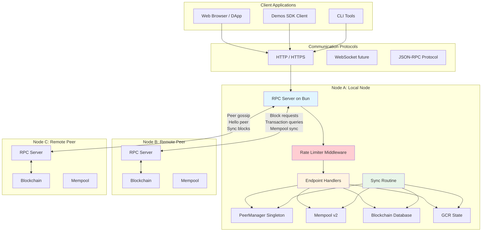
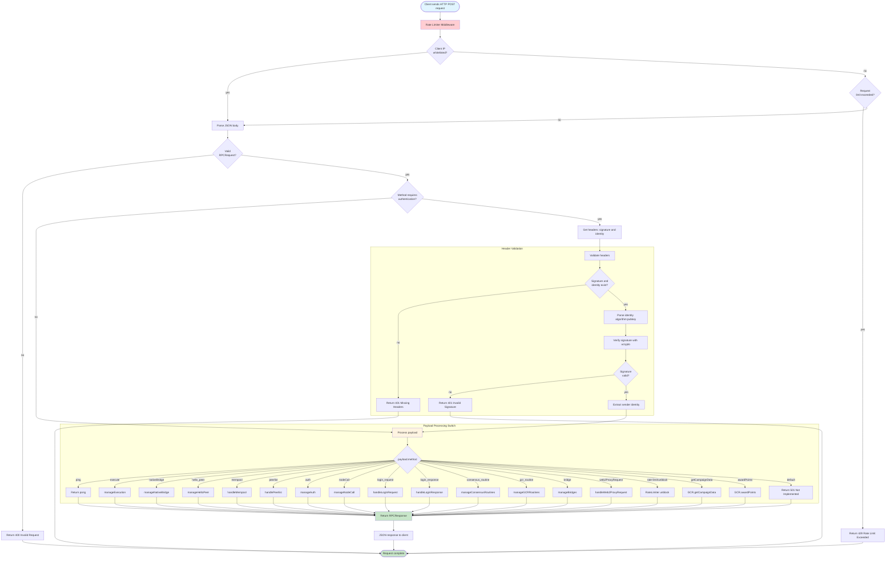
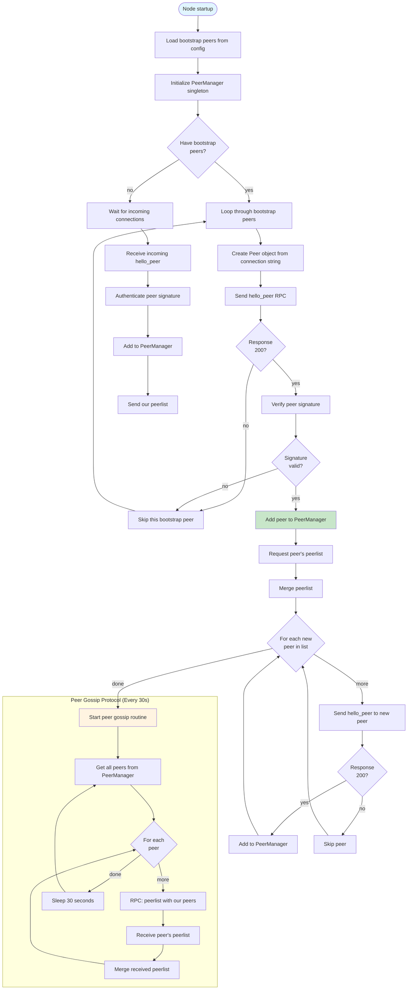
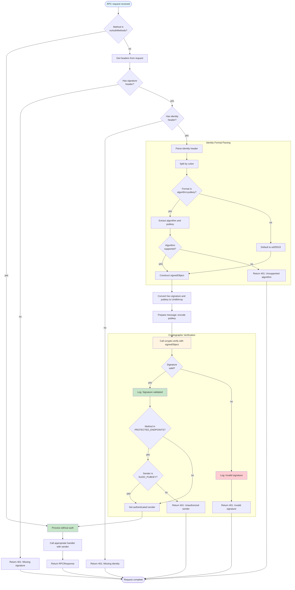
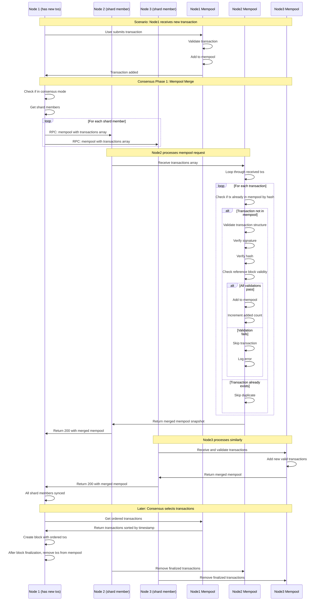
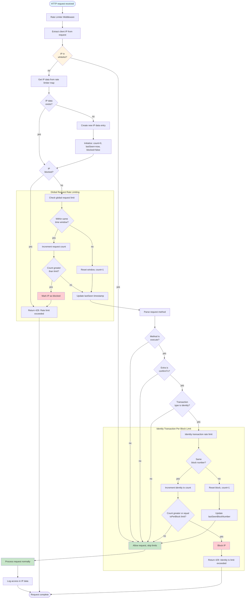

# P2P Network & Synchronization - Mermaid Diagrams

## Overview

Demos blockchain uses a peer-to-peer network architecture for block/transaction propagation, synchronization, and RPC communication. The system includes fast sync for catching up with the network, rate limiting for security, and comprehensive API endpoints for node queries.

**Key Features:**
- **Fast Sync**: Efficient blockchain synchronization from peers
- **RPC Server**: HTTP-based request/response using Bun
- **Signature Authentication**: Ed25519/ML-DSA/Falcon signature verification
- **Rate Limiting**: IP-based request throttling and identity tx limits
- **Node Call API**: Public endpoints for blockchain queries
- **Mempool Sync**: Peer-to-peer transaction pool synchronization
- **Peer Discovery**: Dynamic peer connection and gossip protocol

## 1. P2P Network Architecture Overview

## 2. Fast Sync Process & Block Downloading

```mermaid
sequenceDiagram
    participant LocalNode as Local Node Sync
    participant PeerMgr as PeerManager
    participant Peer1 as Peer 1
    participant Peer2 as Peer 2
    participant Chain as Local Blockchain
    participant GCR as Local GCR State

    Note over LocalNode,GCR: Fast Sync Initialization

    LocalNode->>Chain: Get our lastBlockNumber
    Chain->>LocalNode: Return localBlockNumber

    LocalNode->>PeerMgr: Get all peers
    PeerMgr->>LocalNode: Return peer list

    loop For each peer
        LocalNode->>Peer1: RPC: getLastBlockNumber
        Peer1->>LocalNode: Return peerBlockNumber
        LocalNode->>Peer2: RPC: getLastBlockNumber
        Peer2->>LocalNode: Return peerBlockNumber
    end

    LocalNode->>LocalNode: Find highest block peer
    LocalNode->>LocalNode: Calculate gap: peerMax minus localBlock

    alt Gap is 0
        LocalNode->>LocalNode: Already synced, exit
    else Gap greater than 0
        LocalNode->>LocalNode: Start sync process

        Note over LocalNode,GCR: Verify Genesis and Last Block Integrity

        LocalNode->>Peer1: RPC: getBlockByNumber 0
        Peer1->>LocalNode: Return genesis block
        LocalNode->>Chain: Get our genesis hash
        Chain->>LocalNode: Return ourGenesisHash
        LocalNode->>LocalNode: Compare genesis hashes

        alt Genesis mismatch
            LocalNode->>LocalNode: EXIT: Different network
        else Genesis match
            LocalNode->>Peer1: RPC: getBlockByNumber lastLocal
            Peer1->>LocalNode: Return block at lastLocal
            LocalNode->>Chain: Get our block hash at lastLocal
            Chain->>LocalNode: Return ourLastHash
            LocalNode->>LocalNode: Verify hash coherence
        end

        Note over LocalNode,GCR: Download Missing Blocks

        loop For each missing block from localBlock+1 to peerMax
            LocalNode->>Peer1: RPC: getBlockByNumber N
            Peer1->>LocalNode: Return block N

            alt Block not found or peer unreachable
                LocalNode->>LocalNode: Switch to next highest peer
                LocalNode->>Peer2: RPC: getBlockByNumber N
                Peer2->>LocalNode: Return block N
            end

            LocalNode->>LocalNode: Validate block structure
            LocalNode->>LocalNode: Verify previousHash matches
            LocalNode->>LocalNode: Verify block hash correct

            LocalNode->>Chain: Insert block into blockchain
            Chain->>LocalNode: Block inserted

            Note over LocalNode,GCR: Download Transactions for Block

            loop For each tx hash in block
                LocalNode->>Peer1: RPC: getTxByHash hash
                Peer1->>LocalNode: Return transaction
                LocalNode->>LocalNode: Validate tx signature
                LocalNode->>LocalNode: Validate tx hash
            end

            LocalNode->>GCR: Apply GCR edits from transactions
            GCR->>GCR: Update balances, nonces, identities
            GCR->>LocalNode: State updated

            LocalNode->>GCR: Calculate native_tables_hashes
            GCR->>LocalNode: Return calculated hashes
            LocalNode->>LocalNode: Compare with block hashes

            alt Hashes mismatch
                LocalNode->>LocalNode: State corruption, reject block
            else Hashes match
                LocalNode->>Chain: Save transactions to database
                LocalNode->>GCR: Save GCR state to database
                LocalNode->>LocalNode: Merge peerlist from block
                LocalNode->>LocalNode: Increment localBlockNumber
            end
        end

        LocalNode->>LocalNode: Sync complete, set syncStatus = true
    end
```

## 3. RPC Server Architecture & Request Processing

## 4. Block & Transaction Propagation

```mermaid
sequenceDiagram
    participant ProducerNode as Block Producer (Secretary)
    participant Shard as Shard Members
    participant Network as P2P Network
    participant ObserverNodes as Observer Nodes

    Note over ProducerNode,ObserverNodes: Block Creation Phase (Consensus Phase 5-7)

    ProducerNode->>ProducerNode: Create candidate block
    ProducerNode->>ProducerNode: Hash native tables
    ProducerNode->>ProducerNode: Calculate block hash
    ProducerNode->>ProducerNode: Sign block hash

    Note over ProducerNode,Shard: Phase 6: Vote on Block

    ProducerNode->>Shard: RPC: proposeBlockHash with hash and validation_data
    Shard->>Shard: Verify in same shard
    Shard->>Shard: Get our candidateBlock
    Shard->>Shard: Compare hashes

    alt Hash matches
        Shard->>Shard: Sign block hash
        Shard->>ProducerNode: Return 200 with signature
    else Hash mismatch
        Shard->>ProducerNode: Return error
    end

    ProducerNode->>ProducerNode: Collect signatures
    ProducerNode->>ProducerNode: Calculate vote percentage

    alt Greater or equal 67 percent
        ProducerNode->>ProducerNode: Block valid

        Note over ProducerNode,ObserverNodes: Phase 7: Finalize Block

        ProducerNode->>ProducerNode: Save GCR state
        ProducerNode->>ProducerNode: Save transactions
        ProducerNode->>ProducerNode: Save block to database
        ProducerNode->>ProducerNode: Update sharedState

        Note over ProducerNode,ObserverNodes: Block Propagation to Network

        ProducerNode->>Network: Broadcast block to all peers
        Network->>ObserverNodes: Forward block

        ObserverNodes->>ObserverNodes: Receive block notification
        ObserverNodes->>Network: RPC: getBlockByHash hash
        Network->>ObserverNodes: Return full block

        ObserverNodes->>ObserverNodes: Validate block structure
        ObserverNodes->>ObserverNodes: Verify previousHash
        ObserverNodes->>ObserverNodes: Verify signatures (67 percent check)

        loop For each tx hash in block
            ObserverNodes->>Network: RPC: getTxByHash hash
            Network->>ObserverNodes: Return transaction
            ObserverNodes->>ObserverNodes: Validate signature
        end

        ObserverNodes->>ObserverNodes: Apply GCR edits
        ObserverNodes->>ObserverNodes: Calculate native hashes
        ObserverNodes->>ObserverNodes: Compare hashes

        alt Hashes match
            ObserverNodes->>ObserverNodes: Save block and txs
            ObserverNodes->>ObserverNodes: Update lastBlockNumber
            ObserverNodes->>ObserverNodes: Set syncStatus = true
        else Hashes mismatch
            ObserverNodes->>ObserverNodes: Reject block, request again
        end
    else Less than 67 percent
        ProducerNode->>ProducerNode: Block invalid, rollback GCR
    end

    Note over ProducerNode,ObserverNodes: Transaction Propagation During Consensus

    ProducerNode->>ProducerNode: User submits transaction
    ProducerNode->>ProducerNode: Validate and add to mempool

    Note over ProducerNode,Shard: Consensus Phase 1: Merge Mempool

    ProducerNode->>Shard: RPC: mempool with transactions array
    Shard->>Shard: Receive transactions
    Shard->>Shard: Validate each transaction
    Shard->>Shard: Add valid txs to local mempool
    Shard->>ProducerNode: Return 200 with merged mempool
```

## 5. Peer Discovery & Connection Management

## 6. Request Authentication & Signature Validation

## 7. Node Call API & Public Endpoints

```mermaid
graph TB
    subgraph "Public GET Endpoints (No Auth)"
        ROOT["/"]
        INFO["/info"]
        VERSION["/version"]
        PUBKEY["/publickey"]
        CONNSTR["/connectionstring"]
        PEERLIST["/peerlist"]
        LOGS["/public_logs"]
        DIAG["/diagnostics"]
        MCP["/mcp"]
        GENESIS["/genesis"]
        RATELIMITSTATS["/rate-limit/stats"]
    end

    subgraph "Node Call Messages (POST / via nodeCall)"
        GETPEERINFO["getPeerInfo"]
        GETPEERLIST["getPeerlist"]
        GETPEERLISTHASH["getPeerlistHash"]
        GETLASTBLOCKNUM["getLastBlockNumber"]
        GETLASTBLOCK["getLastBlock"]
        GETLASTBLOCKHASH["getLastBlockHash"]
        GETBLOCKBYNUM["getBlockByNumber"]
        GETBLOCKBYHASH["getBlockByHash"]
        GETBLOCKS["getBlocks"]
        GETTXBYHASH["getTxByHash"]
        GETTXS["getTransactions"]
        GETMEMPOOL["getMempool"]
        GETADDRESSINFO["getAddressInfo"]
        GETADDRESSNONCE["getAddressNonce"]
        GETNATIVESTATUS["getNativeStatus"]
        GETNATIVEPROPS["getNativeProperties"]
        GETNATIVESUBNETS["getNativeSubnetsTxs"]
        GETTXHISTORY["getTransactionHistory"]
        GETTWEET["getTweet"]
        GETPEERTIME["getPeerTime"]
    end

    subgraph "Backend Services"
        CHAINSVC[Chain Service]
        GCRSVC[GCR Service]
        MEMPOOLSVC[Mempool Service]
        PEERSVC[PeerManager Service]
        STATESVC[SharedState Service]
        LOGSVC[Logger Service]
        IDENTITYSVC[Identity Services]
    end

    ROOT --> STATESVC
    INFO --> STATESVC
    VERSION --> STATESVC
    PUBKEY --> STATESVC
    CONNSTR --> STATESVC
    PEERLIST --> PEERSVC
    LOGS --> LOGSVC
    DIAG --> LOGSVC
    MCP --> STATESVC
    GENESIS --> CHAINSVC
    RATELIMITSTATS --> STATESVC

    GETPEERINFO --> STATESVC
    GETPEERLIST --> PEERSVC
    GETPEERLISTHASH --> PEERSVC
    GETLASTBLOCKNUM --> CHAINSVC
    GETLASTBLOCK --> CHAINSVC
    GETLASTBLOCKHASH --> CHAINSVC
    GETBLOCKBYNUM --> CHAINSVC
    GETBLOCKBYHASH --> CHAINSVC
    GETBLOCKS --> CHAINSVC
    GETTXBYHASH --> CHAINSVC
    GETTXS --> CHAINSVC
    GETMEMPOOL --> MEMPOOLSVC
    GETADDRESSINFO --> GCRSVC
    GETADDRESSNONCE --> GCRSVC
    GETNATIVESTATUS --> GCRSVC
    GETNATIVEPROPS --> GCRSVC
    GETNATIVESUBNETS --> GCRSVC
    GETTXHISTORY --> CHAINSVC
    GETTWEET --> IDENTITYSVC
    GETPEERTIME --> STATESVC

    style ROOT fill:#e3f2fd
    style INFO fill:#e3f2fd
    style VERSION fill:#e3f2fd
    style PUBKEY fill:#e3f2fd
    style CONNSTR fill:#e3f2fd
    style PEERLIST fill:#e3f2fd
    style LOGS fill:#e3f2fd
    style DIAG fill:#e3f2fd
    style MCP fill:#e3f2fd
    style GENESIS fill:#e3f2fd
    style RATELIMITSTATS fill:#e3f2fd

    style CHAINSVC fill:#c8e6c9
    style GCRSVC fill:#c8e6c9
    style MEMPOOLSVC fill:#c8e6c9
    style PEERSVC fill:#c8e6c9
```

## 8. Mempool Synchronization Between Peers

## 9. Rate Limiting & Security Middleware

## 10. Complete Network Communication Flow

```mermaid
stateDiagram-v2
    [*] --> NodeStartup: Boot node

    state "Node Startup" as NodeStartup {
        [*] --> LoadConfig
        LoadConfig: Load configuration
        LoadConfig --> InitRPCServer: Initialize RPC server
        InitRPCServer --> InitPeerManager: Initialize PeerManager
        InitPeerManager --> LoadBootstrap: Load bootstrap peers
        LoadBootstrap --> [*]: Ready
    }

    NodeStartup --> PeerDiscovery: Connect to network

    state "Peer Discovery" as PeerDiscovery {
        [*] --> HelloBootstrap
        HelloBootstrap: Send hello_peer to bootstrap
        HelloBootstrap --> VerifyBootstrap: Verify signatures
        VerifyBootstrap --> RequestPeerlist: Request peerlist
        RequestPeerlist --> MergePeers: Merge received peers
        MergePeers --> HelloNewPeers: Hello peer to new peers
        HelloNewPeers --> [*]: Peer discovery complete
    }

    PeerDiscovery --> Synchronization: Start sync

    state "Blockchain Synchronization" as Synchronization {
        [*] --> QueryPeers
        QueryPeers: Query peer block numbers
        QueryPeers --> CompareBlocks: Compare with local
        CompareBlocks --> CheckGap: Calculate block gap

        CheckGap --> Synced: Gap is 0
        CheckGap --> StartSync: Gap greater than 0

        StartSync --> VerifyIntegrity: Verify genesis and last block
        VerifyIntegrity --> DownloadBlocks: Download missing blocks
        DownloadBlocks --> DownloadTxs: Download transactions
        DownloadTxs --> ApplyGCR: Apply GCR edits
        ApplyGCR --> VerifyHashes: Verify native hashes
        VerifyHashes --> SaveBlock: Save block and txs
        SaveBlock --> CheckComplete: More blocks?

        CheckComplete --> DownloadBlocks: Yes
        CheckComplete --> Synced: No
    }

    Synchronization --> OperationalMode: Sync complete

    state "Operational Mode" as OperationalMode {
        [*] --> AcceptRequests
        AcceptRequests: RPC server accepting requests
        AcceptRequests --> ProcessAuth: Authenticate request
        ProcessAuth --> DispatchHandler: Dispatch to handler
        DispatchHandler --> ReturnResponse: Return response
        ReturnResponse --> AcceptRequests

        AcceptRequests --> ConsensusMode: Enter consensus
        ConsensusMode --> MergeMempool: Merge mempool with shard
        MergeMempool --> CreateBlock: Create block
        CreateBlock --> VoteBlock: Vote on block
        VoteBlock --> FinalizeBlock: Finalize valid block
        FinalizeBlock --> PropagateBlock: Propagate to network
        PropagateBlock --> AcceptRequests

        AcceptRequests --> PeerGossip: Periodic gossip
        PeerGossip --> UpdatePeerlist: Update peerlist
        UpdatePeerlist --> AcceptRequests
    }

    OperationalMode --> Synchronization: Detect out of sync
    OperationalMode --> [*]: Shutdown

    note right of PeerDiscovery
        Peer Discovery Features:
        - Hello peer handshake
        - Cryptographic verification
        - Peerlist merging
        - Recursive peer discovery
    end note

    note right of Synchronization
        Sync Features:
        - Fast sync from highest peer
        - Genesis verification
        - Integrity checks
        - GCR state rebuilding
        - Native hash verification
    end note

    note right of OperationalMode
        Operational Features:
        - RPC request handling
        - Consensus participation
        - Block propagation
        - Mempool synchronization
        - Peer gossip protocol
        - Rate limiting
    end note
```

---

## Key File References

### Synchronization Files
- **Sync**: `src/libs/blockchain/routines/Sync.ts` (545 lines - fast sync, block downloading, integrity verification)
- **Sync GCR Tables**: Sync.ts:432 (apply GCR edits during sync)
- **Ask Txs For Block**: Sync.ts:450 (download transactions for block)
- **Merge Peerlist**: Sync.ts:477 (merge peerlist from block)

### RPC Server Files
- **Server RPC**: `src/libs/network/server_rpc.ts` (520 lines - Bun HTTP server, request processing, authentication)
- **Validate Headers**: server_rpc.ts:80 (signature verification)
- **Process Payload**: server_rpc.ts:144 (method dispatch switch case)
- **Rate Limiter**: `src/libs/network/middleware/rateLimiter.ts` (rate limiting middleware)

### Endpoint Handler Files
- **Endpoint Handlers**: `src/libs/network/endpointHandlers.ts` (681 lines - transaction validation, execution, mempool, peerlist)
- **Handle Validate Transaction**: endpointHandlers.ts:80 (transaction validation workflow)
- **Handle Execute Transaction**: endpointHandlers.ts:169 (transaction execution workflow)
- **Handle Mempool**: endpointHandlers.ts:629 (mempool merge logic)
- **Handle Peerlist**: endpointHandlers.ts:659 (peerlist merge logic)

### Node Call API Files
- **Manage Node Call**: `src/libs/network/manageNodeCall.ts` (250+ lines - public API endpoints)
- **Node Call Interface**: manageNodeCall.ts:28 (NodeCall message structure)

### Network Client Files
- **Network Client**: `src/client/libs/network.ts` (30 lines - Socket.io RPC connection)

---

## P2P Network & Synchronization Principles

1. **Fast Sync Efficiency**: Download missing blocks sequentially from highest peer with integrity checks

2. **Genesis Verification**: Always verify genesis block matches before syncing from peer

3. **GCR State Rebuilding**: Apply GCR edits from transactions and verify native hashes

4. **Peer Switching**: If peer becomes unreachable during sync, switch to next highest peer

5. **Request Authentication**: All authenticated methods verify ed25519/ML-DSA/Falcon signatures

6. **Rate Limiting**: IP-based global limits and per-block identity transaction limits

7. **Mempool Synchronization**: Shard members merge mempools in consensus Phase 1

8. **Block Propagation**: Finalized blocks broadcast to network, observers download and verify

9. **Peer Gossip**: Periodic peerlist exchange (every 30s) for network discovery

10. **Public API**: Unauthenticated GET endpoints for blockchain queries and info
