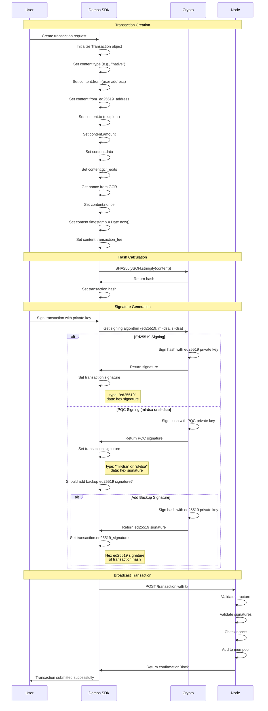
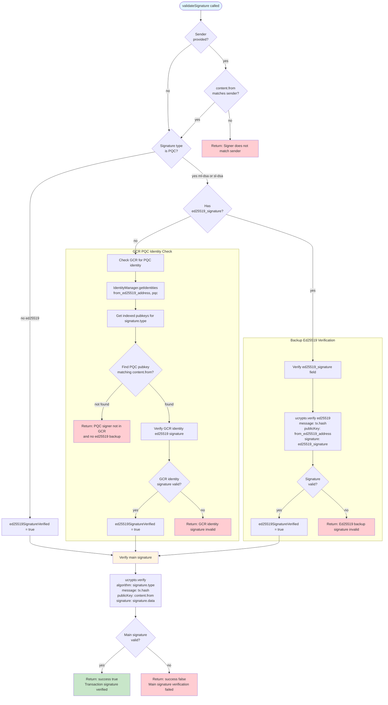
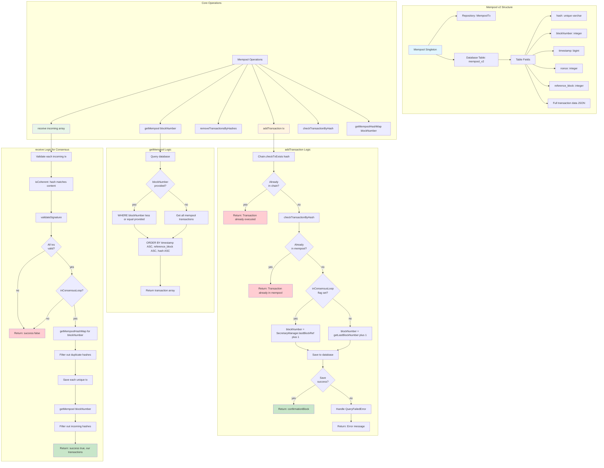
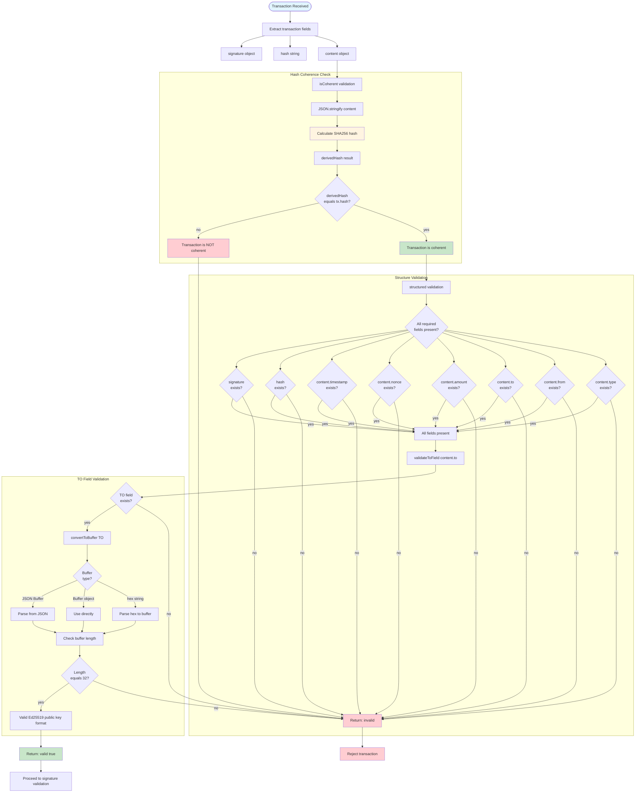
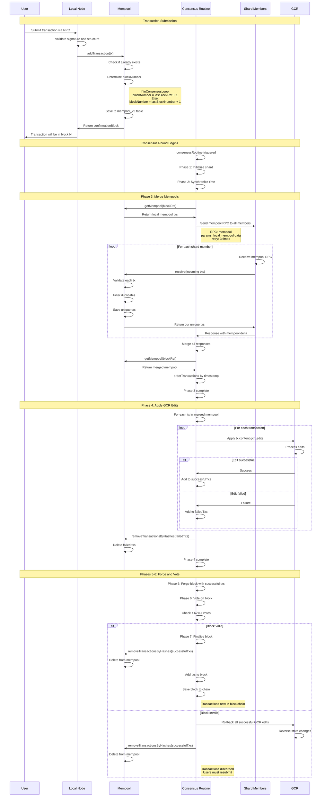
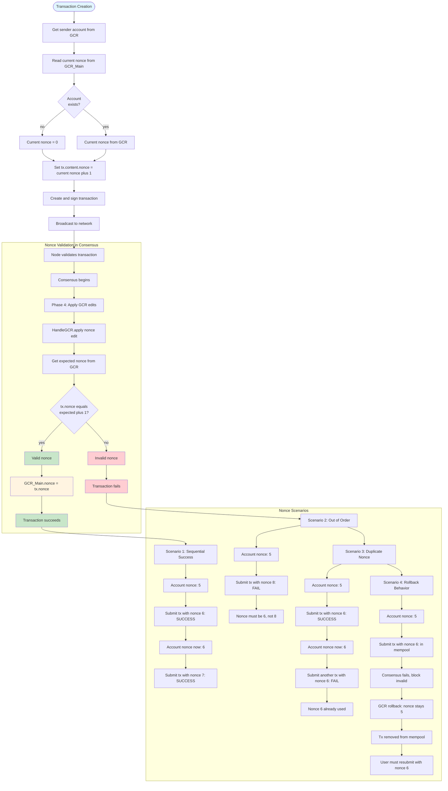
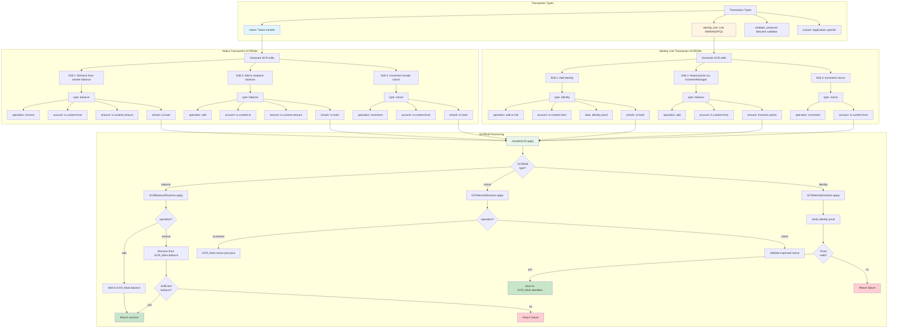
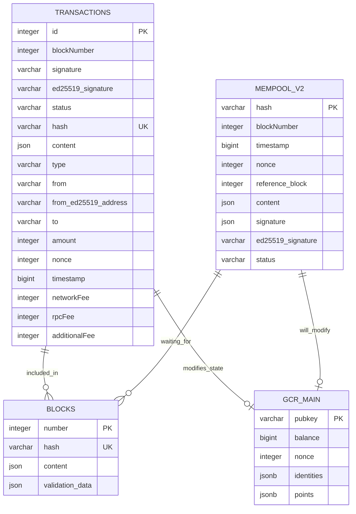
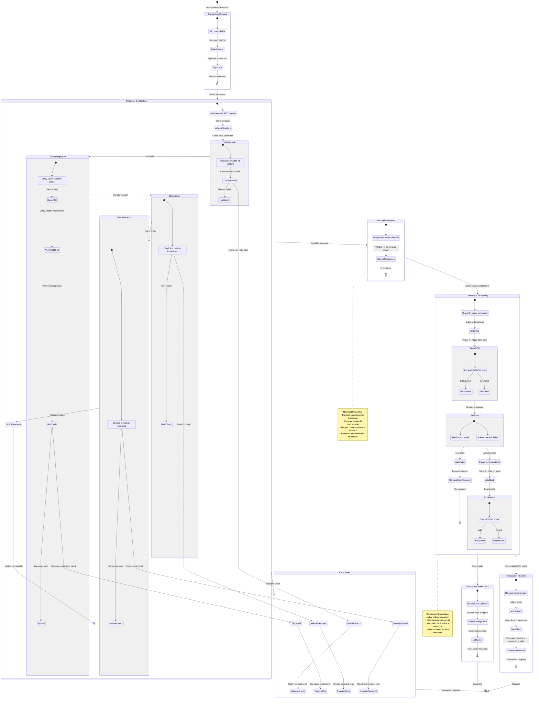

# Transaction Processing & Mempool - Mermaid Diagrams

## Overview

The Demos blockchain uses a sophisticated transaction processing system with a mempool (memory pool) for pending transactions. Transactions support multiple signing algorithms including post-quantum cryptography (PQC) and require rigorous validation before inclusion in blocks.

**Key Features:**
- **Multi-Algorithm Support**: Ed25519, ML-DSA (Dilithium), SL-DSA (Sphincs+)
- **Dual Signature System**: PQC transactions can include ed25519 backup signatures
- **GCR Integration**: Transactions modify global state through GCREdits
- **Mempool v2**: Block-aware transaction pool with ordering
- **Signature Verification**: Cryptographic validation before execution
- **Nonce Management**: Sequential nonce requirement per account
- **Hash Integrity**: SHA256 content hash validation

## 1. Transaction Structure & Lifecycle

```mermaid
graph TB
    subgraph "Transaction Structure"
        TX[Transaction Object]
        TX --> CONTENT[content: TransactionContent]
        TX --> SIGNATURE[signature: ISignature]
        TX --> HASH[hash: string SHA256]
        TX --> STATUS[status: string]
        TX --> BLOCKNUM[blockNumber: number]
        TX --> ED25519SIG[ed25519_signature: optional]

        CONTENT --> TYPE[type: string]
        CONTENT --> FROM[from: PQC or ed25519 address]
        CONTENT --> FROMED25519[from_ed25519_address: ed25519 address]
        CONTENT --> TO[to: recipient address]
        CONTENT --> AMOUNT[amount: bigint]
        CONTENT --> DATA[data: array of 2 elements]
        CONTENT --> GCREDITS[gcr_edits: GCREdit array]
        CONTENT --> NONCE[nonce: number]
        CONTENT --> TIMESTAMP[timestamp: number]
        CONTENT --> FEES[transaction_fee: network, rpc, additional]
    end

    subgraph "Transaction Lifecycle"
        CREATE[1. Create Transaction]
        CREATE --> FILLCONTENT[2. Fill content fields]
        FILLCONTENT --> HASHCONTENT[3. Hash content with SHA256]
        HASHCONTENT --> SIGN[4. Sign hash with private key]

        SIGN --> SIGNTYPE{Signature<br/>algorithm?}
        SIGNTYPE -->|ed25519| SINGLEALGO[Single signature]
        SIGNTYPE -->|PQC| DUALALGO[PQC signature plus optional ed25519]

        SINGLEALGO --> BROADCAST
        DUALALGO --> ADDBACKUP[Add ed25519_signature field]
        ADDBACKUP --> BROADCAST[5. Broadcast to network]

        BROADCAST --> RECEIVE[6. Received by node]
        RECEIVE --> VALIDATE[7. Validate signature and structure]

        VALIDATE --> VALIDRESULT{Valid?}
        VALIDRESULT -->|no| REJECT[Reject transaction]
        VALIDRESULT -->|yes| ADDMEMPOOL[8. Add to mempool]

        ADDMEMPOOL --> CONSENSUS[9. Wait for consensus round]
        CONSENSUS --> INCLUDED{Included<br/>in block?}

        INCLUDED -->|yes| EXECUTE[10. Execute GCR edits]
        INCLUDED -->|no| RETRY[11. Retry next block]

        EXECUTE --> EXECRESULT{Execution<br/>success?}
        EXECRESULT -->|yes| FINALIZE[12. Finalize in block]
        EXECRESULT -->|no| ROLLBACK[13. Rollback and remove]

        FINALIZE --> REMOVE[14. Remove from mempool]
        ROLLBACK --> REMOVE

        REMOVE --> STORED[15. Store in transactions table]
    end

    style CREATE fill:#e1f5ff
    style HASHCONTENT fill:#fff4e1
    style SIGN fill:#e8f5e9
    style ADDMEMPOOL fill:#c8e6c9
    style FINALIZE fill:#c8e6c9
    style REJECT fill:#ffcdd2
    style ROLLBACK fill:#ffcdd2
```



## 2. Transaction Creation & Signing



## 3. Signature Validation Process



## 4. Mempool Architecture & Operations



## 5. Transaction Hash & Coherence Validation



## 6. Mempool Integration with Consensus



## 7. Nonce Management & Validation



## 8. Transaction Types & GCREdit Generation



## 9. Transaction Database Schema & Indexing



**Database Indexes:**
- **TRANSACTIONS table indexes:** idx_transactions_hash, idx_transactions_blockNumber, idx_transactions_from_ed25519_address, idx_transactions_to
- **MEMPOOL_V2 table indexes:** idx_mempool_hash, idx_mempool_blockNumber, idx_mempool_timestamp

```

## 10. Complete Transaction Flow with Error Handling



---

## Key File References

### Transaction Processing Files
- **Transaction**: `src/libs/blockchain/transaction.ts` (400+ lines - transaction creation, signing, validation)
- **Transactions Entity**: `src/model/entities/Transactions.ts` (61 lines - database schema)

### Mempool Management Files
- **Mempool v2**: `src/libs/blockchain/mempool_v2.ts` (209 lines - mempool operations)
- **Mempool Entity**: `src/model/entities/Mempool.ts` (database schema for mempool_v2)

### Related Files
- **GCR Handler**: `src/libs/blockchain/gcr/handleGCR.ts` (GCREdit processing)
- **Identity Manager**: `src/libs/blockchain/gcr/gcr_routines/identityManager.ts` (PQC identity verification)
- **Consensus Integration**: `src/libs/consensus/v2/PoRBFT.ts` (mempool merge in Phase 3)

---

## Transaction & Mempool Principles

1. **Multi-Algorithm Support**: Ed25519, ML-DSA (Dilithium), SL-DSA (Sphincs+) with dual signature option

2. **Hash Integrity**: SHA256 of content must match tx.hash for coherence

3. **Signature Verification**: Two-step process - ed25519 verification then main algorithm verification

4. **Nonce Sequencing**: Each account has sequential nonce, must increment by 1

5. **Block Assignment**: Transactions assigned to blockNumber based on consensus state

6. **Mempool Merging**: During consensus Phase 3, all shard members merge mempools

7. **GCREdit Execution**: Phase 4 applies state changes, failed transactions removed

8. **Timestamp Ordering**: Transactions ordered by timestamp within mempool

9. **Duplicate Prevention**: Hash uniqueness checked in both chain and mempool

10. **Rollback Support**: Failed blocks trigger automatic GCR rollback and mempool cleanup
