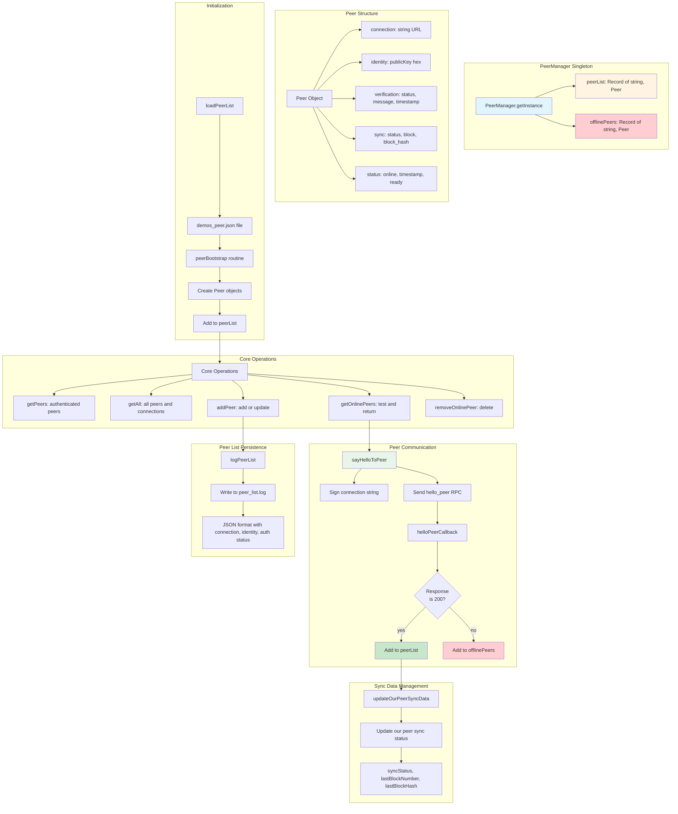
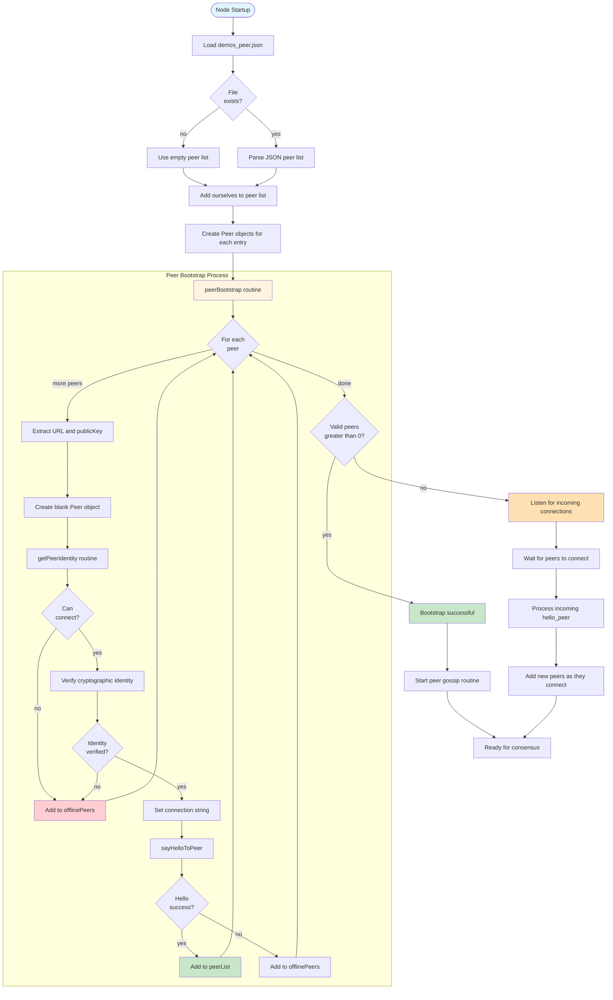
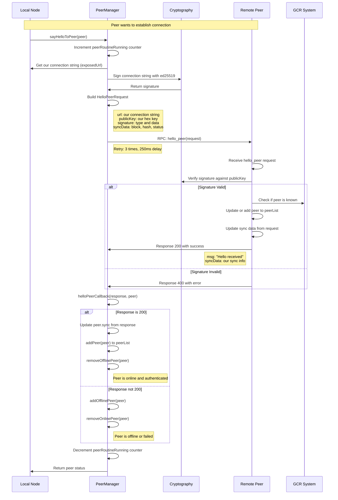
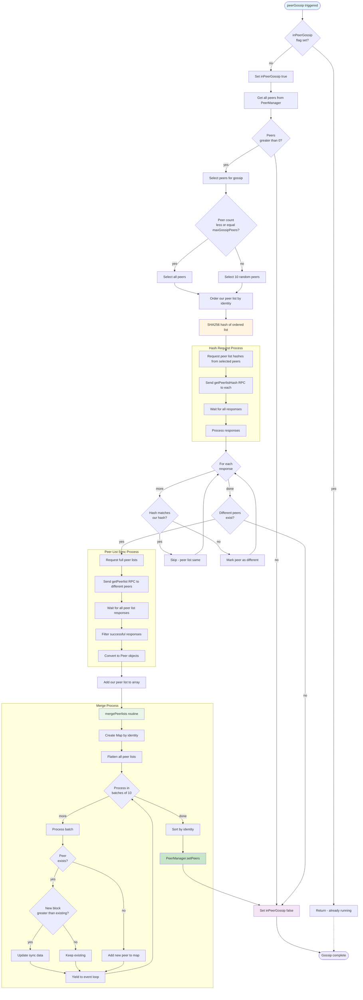
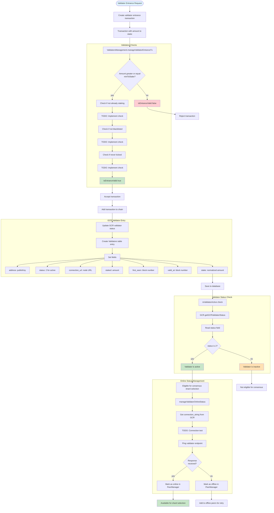
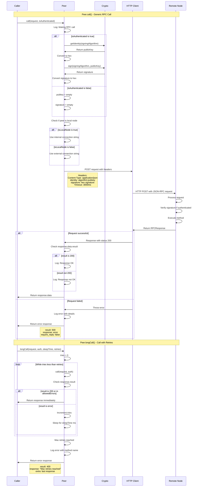
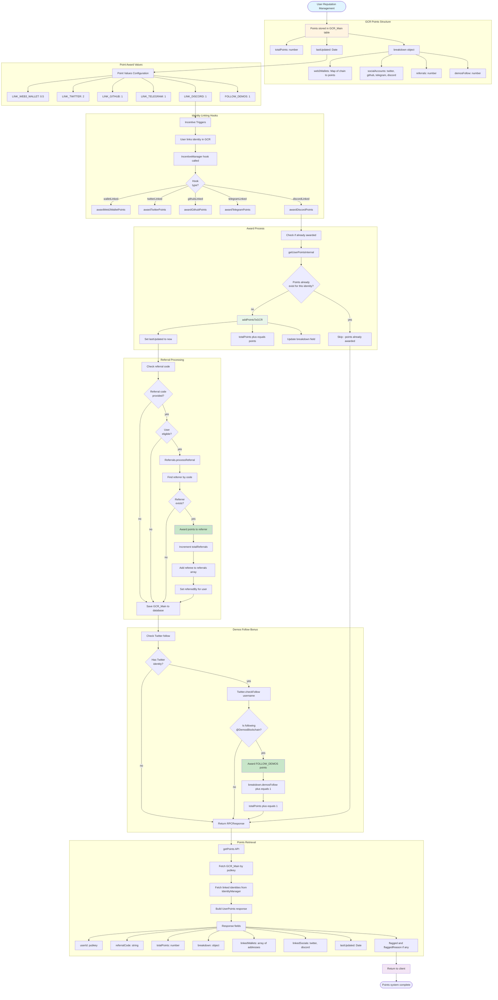

# Peer & Validator Management - Mermaid Diagrams

## Overview

The Demos blockchain uses a peer-to-peer network architecture where validators are a subset of online, synced peers. The system manages peer discovery, authentication, synchronization status, and validator selection.

**Key Features:**
- **PeerManager Singleton** for centralized peer management
- **Peer Gossip Protocol** for decentralized peer list synchronization
- **Hello Peer Handshake** with cryptographic verification
- **Sync Status Tracking** for blockchain state synchronization
- **Online/Offline Detection** with retry logic
- **Validator Selection** based on sync status and stake
- **Point/Reputation System** stored in GCR for incentives

## 1. PeerManager Architecture Overview

## 2. Peer Lifecycle & Bootstrap Process

## 3. Hello Peer Handshake Protocol

## 4. Peer Gossip Protocol

## 5. Validator Entrance & Management

### ⚠️ Implementation Status: 📋 PLANNED (Incomplete)

**NOTE**: The validator entrance feature is **partially implemented** with several critical components marked as TODO in the codebase:

**✅ Implemented**:
- Minimum stake validation (10^25 tokens)
- Basic transaction structure for entrance
- GCR validators table schema
- Validator status field (status: 2 for active)

**❌ NOT Implemented** (TODO in code):
- Blacklist check for banned validators
- Duplicate staking prevention (checking if already staking)
- Kicked validator check (prevent re-entry after being kicked)
- Connection URL validation
- Online status monitoring and pinging

See `src/libs/blockchain/routines/validatorsManagement.ts:19-26` for TODO comments.

---

## 6. Peer Connection & RPC System

## 7. Online/Offline Status Management

```mermaid
stateDiagram-v2
    [*] --> Unknown: Peer discovered

    state "Unknown Status" as Unknown {
        [*] --> NotTested
        NotTested: Peer in demos_peer.json
        NotTested: No connection attempted yet
    }

    Unknown --> Testing: peerBootstrap or sayHelloToPeer

    state "Connection Testing" as Testing {
        [*] --> SendPing
        SendPing: Send hello_peer RPC
        SendPing --> WaitResponse: Wait for response (3 retries, 250ms)
        WaitResponse --> CheckSignature: Verify cryptographic signature

        state CheckSignature {
            [*] --> ValidSignature
            [*] --> InvalidSignature

            ValidSignature: Signature matches publicKey
            InvalidSignature: Signature verification failed
        }
    }

    Testing --> Online: Signature valid and response 200
    Testing --> Offline: No response or invalid signature

    state "Online" as Online {
        [*] --> InPeerList
        InPeerList: Added to peerList
        InPeerList --> UpdateSync: Periodically update sync data
        UpdateSync --> CheckReady: Check if ready for consensus

        state CheckReady {
            [*] --> Ready
            [*] --> NotReady

            Ready: synced and verified and online
            NotReady: missing one or more requirements
        }

        CheckReady --> InPeerList
    }

    state "Offline" as Offline {
        [*] --> InOfflineList
        InOfflineList: Added to offlinePeers
        InOfflineList --> ScheduleRetry: Add to retry queue
        ScheduleRetry --> WaitRetry: Wait for retry interval
        WaitRetry --> [*]: Will retry later
    }

    Online --> Offline: Timeout in consensus or RPC failure
    Offline --> Testing: Retry connection after interval

    state "Consensus Timeout Detection" as ConsensusTimeout {
        [*] --> SecretaryWait
        SecretaryWait: Secretary waits for member phase
        SecretaryWait --> Timeout: 15s timeout expires
        Timeout --> PingMember: Secretary pings member
        PingMember --> NoResponse: Member does not respond
        NoResponse --> RemoveFromShard: Remove from current shard
        RemoveFromShard --> [*]: Mark as offline
    }

    state "Gossip Update" as GossipUpdate {
        [*] --> ReceivePeerList
        ReceivePeerList: Peer list received from gossip
        ReceivePeerList --> ComparePeer: Check peer in our list

        state ComparePeer {
            [*] --> NewerSync
            [*] --> OlderSync

            NewerSync: Received peer has higher block
            OlderSync: Our peer has higher block
        }

        ComparePeer --> UpdateOrKeep: Update or keep existing
    }

    Online --> ConsensusTimeout: Consensus routine running
    ConsensusTimeout --> Offline

    Online --> GossipUpdate: Peer gossip running
    Offline --> GossipUpdate: Peer gossip running
    GossipUpdate --> Online: Peer reported as online
    GossipUpdate --> Offline: Peer reported as offline

    note right of Online
        Online peers are:
        - In peerList
        - Authenticated (verified signature)
        - Have sync data
        - Can participate in consensus
    end note

    note right of Offline
        Offline peers are:
        - In offlinePeers
        - Failed connection or signature
        - Scheduled for retry
        - Cannot participate in consensus
    end note
```

## 8. Sync Status Tracking

```mermaid
flowchart TD
    START([Sync Status Management])

    START --> OURNODE[Our Node Sync Data]

    subgraph "Our Sync Data"
        OURNODE --> SHAREDSTATE[getSharedState]
        SHAREDSTATE --> SYNCSTATUS[syncStatus: boolean]
        SHAREDSTATE --> LASTBLOCK[lastBlockNumber: number]
        SHAREDSTATE --> LASTHASH[lastBlockHash: string]
    end

    LASTHASH --> UPDATE[updateOurPeerSyncData]

    subgraph "Update Our Peer Entry"
        UPDATE --> GETOURPEER[Get our peer from peerList]
        GETOURPEER --> SETFIELDS[Set sync fields]

        SETFIELDS --> SETSTATUS[peer.sync.status = syncStatus]
        SETFIELDS --> SETBLOCK[peer.sync.block = lastBlockNumber]
        SETFIELDS --> SETHASH[peer.sync.block_hash = lastBlockHash]
    end

    SETHASH --> BROADCAST[Broadcast in hello_peer]

    subgraph "Sending Sync Data"
        BROADCAST --> BUILDREQUEST[Build HelloPeerRequest]
        BUILDREQUEST --> ADDSYNC[Add syncData field]

        ADDSYNC --> SYNCOBJ["syncData:<br/>block, block_hash, status"]
        SYNCOBJ --> SENDTOPEERS[Send to all peers in hello_peer]
    end

    SENDTOPEERS --> RECEIVE[Receive sync data from peers]

    subgraph "Receiving Sync Data"
        RECEIVE --> HELLOCALLBACK[helloPeerCallback]
        HELLOCALLBACK --> EXTRACTSYNC[Extract response.extra.syncData]

        EXTRACTSYNC --> UPDATESYNC{syncData<br/>present?}
        UPDATESYNC -->|yes| SETPEER[peer.sync = response syncData]
        UPDATESYNC -->|no| SKIPSYNC[Keep existing sync data]

        SETPEER --> ADDPEER[addPeer to peerList]
    end

    ADDPEER --> MERGE[Merge from peer gossip]

    subgraph "Gossip Sync Merge"
        MERGE --> COMPARESYNC{Received peer<br/>block greater?}

        COMPARESYNC -->|yes| UPDATEFROMGOSSIP[Update sync fields]
        COMPARESYNC -->|no| KEEPEXISTING[Keep our data]

        UPDATEFROMGOSSIP --> SETGOSSIPFIELDS[Set block, block_hash, status]
    end

    SETGOSSIPFIELDS --> CONSENSUS[Use in consensus]
    KEEPEXISTING --> CONSENSUS

    subgraph "Consensus Shard Selection"
        CONSENSUS --> GETONLINE[getOnlinePeers]
        GETONLINE --> FILTER[Filter by sync.status is true]

        FILTER --> SYNCED[Synced peers only]
        SYNCED --> SHARD[Eligible for shard selection]

        SHARD --> CVSA[Used in CVSA algorithm]
        CVSA --> SELECTED[Deterministic shard members]
    end

    SELECTED --> MONITOR[Monitor during consensus]

    subgraph "Sync Monitoring"
        MONITOR --> CHECKLAG{Peer falls<br/>behind?}

        CHECKLAG -->|yes| PHASE[Phase-based catch-up]
        CHECKLAG -->|no| CONTINUE[Continue in shard]

        PHASE --> IMMEDIATE[Secretary releases immediately]
        IMMEDIATE --> CATCHUP[Member catches up to current phase]
        CATCHUP --> REJOIN[Rejoins at current phase]
    end

    REJOIN --> END([Sync tracking complete])

    style START fill:#e1f5ff
    style UPDATE fill:#fff4e1
    style FILTER fill:#e8f5e9
    style SELECTED fill:#c8e6c9
    style IMMEDIATE fill:#ffe0b2
```

## 9. Point/Reputation System

## 10. Complete Peer-to-Validator Flow

```mermaid
flowchart TD
    START([New Node Joins Network])

    START --> GENESIS[Load genesis block]
    GENESIS --> KEYPAIR[Generate or load ed25519 keypair]
    KEYPAIR --> PUBLICKEY[Derive publicKey hex]

    PUBLICKEY --> LOADPEERS[Load demos_peer.json]
    LOADPEERS --> BOOTSTRAP[Run peerBootstrap]

    subgraph "Peer Discovery"
        BOOTSTRAP --> TESTPEERS[Test each peer connection]
        TESTPEERS --> VERIFYPEERS[Verify cryptographic identities]
        VERIFYPEERS --> HELLOS[Send hello_peer to all]
        HELLOS --> AUTHENTICATED[Build authenticated peer list]
    end

    AUTHENTICATED --> STARTGOSSIP[Start peer gossip routine]

    subgraph "Peer Synchronization"
        STARTGOSSIP --> GOSSIPHASH[Hash our peer list]
        GOSSIPHASH --> SENDHASHREQUESTS[Send hash to 10 random peers]
        SENDHASHREQUESTS --> COMPAREHASHES[Compare hashes]
        COMPAREHASHES --> REQUESTLISTS[Request full lists from different peers]
        REQUESTLISTS --> MERGELISTS[Merge all peer lists]
        MERGELISTS --> UPDATEPEERLIST[Update local peer list]
    end

    UPDATEPEERLIST --> STARTSYNC[Start blockchain sync]

    subgraph "Blockchain Synchronization"
        STARTSYNC --> GETLASTBLOCK[Get our last block number]
        GETLASTBLOCK --> QUERYPEERS[Query peers for their last block]
        QUERYPEERS --> FINDHIGHEST[Find peer with highest block]
        FINDHIGHEST --> REQUESTBLOCKS[Request missing blocks]
        REQUESTBLOCKS --> VALIDATEBLOCKS[Validate and add blocks]
        VALIDATEBLOCKS --> UPDATESYNCSTATUS[Update sync.status true]
    end

    UPDATESYNCSTATUS --> BROADCASTSYNC[Broadcast sync status in hello_peer]
    BROADCASTSYNC --> ELIGIBLE[Eligible for consensus]

    ELIGIBLE --> STAKEDECISION{Want to become<br/>validator?}

    STAKEDECISION -->|no| PARTICIPATEP2P[Participate as peer only]
    STAKEDECISION -->|yes| CREATESTAKETX[Create validator entrance tx]

    subgraph "Validator Entrance"
        CREATESTAKETX --> SETAMOUNT[Set amount greater or equal minToStake]
        SETAMOUNT --> SIGNTX[Sign transaction]
        SIGNTX --> BROADCASTTX[Broadcast to network]
        BROADCASTTX --> VALIDATETX[ValidatorsManagement.manageValidatorEntranceTx]

        VALIDATETX --> CHECKS{All checks<br/>pass?}
        CHECKS -->|no| REJECTTX[Transaction rejected]
        CHECKS -->|yes| ACCEPTTX[Transaction accepted]

        ACCEPTTX --> ADDTOCHAIN[Add to blockchain]
        ADDTOCHAIN --> UPDATEGCR[Update GCR validators table]
        UPDATEGCR --> SETSTATUS[Set status to 2 for active]
    end

    SETSTATUS --> NOWVALIDATOR[Now a validator]

    subgraph "Consensus Participation"
        NOWVALIDATOR --> CONSENSUSROUND[Wait for consensus round]
        CONSENSUSROUND --> GETLASTBLOCKNUM[Get lastBlockNumber]
        GETLASTBLOCKNUM --> CVSA[Calculate CVSA seed]

        CVSA --> GETONLINEPEERS[Get online synced peers]
        GETONLINEPEERS --> FILTERSYNCED[Filter by sync.status true]
        FILTERSYNCED --> SHARDSELECT[Deterministic shard selection]

        SHARDSELECT --> INSHARD{Are we in<br/>shard?}

        INSHARD -->|no| WAITNEXTBLOCK[Wait for next block]
        INSHARD -->|yes| PARTICIPATECONSENSUS[Participate in PoRBFT]

        PARTICIPATECONSENSUS --> PHASES[Execute 7 validation phases]
        PHASES --> VOTE[Vote on block]
        VOTE --> BLOCKRESULT{Block<br/>valid?}

        BLOCKRESULT -->|yes| FINALIZE[Finalize block]
        BLOCKRESULT -->|no| ROLLBACK[Rollback GCR edits]

        FINALIZE --> UPDATEOURPOINTS[Earn reputation points]
        UPDATEOURPOINTS --> WAITNEXTROUND

        ROLLBACK --> WAITNEXTROUND[Wait for next consensus round]
        WAITNEXTBLOCK --> WAITNEXTROUND
    end

    WAITNEXTROUND --> CONSENSUSROUND

    PARTICIPATEP2P --> RELAY[Relay transactions and blocks]
    RELAY --> HELLOPEER[Respond to hello_peer]
    HELLOPEER --> GOSSIPPART[Participate in gossip]
    GOSSIPPART --> SYNCHELP[Help new peers sync]

    REJECTTX --> PARTICIPATEP2P

    style START fill:#e1f5ff
    style AUTHENTICATED fill:#fff4e1
    style UPDATESYNCSTATUS fill:#e8f5e9
    style SETSTATUS fill:#c8e6c9
    style PARTICIPATECONSENSUS fill:#c8e6c9
    style FINALIZE fill:#c8e6c9
    style ROLLBACK fill:#ffcdd2
```

---

## Key File References

### Peer Management Files
- **PeerManager**: `src/libs/peer/PeerManager.ts` (424 lines - singleton peer manager)
- **Peer**: `src/libs/peer/Peer.ts` (347 lines - peer connection and RPC methods)
- **Peer Bootstrap**: `src/libs/peer/routines/peerBootstrap.ts` (104 lines - peer verification on startup)
- **Peer Gossip**: `src/libs/peer/routines/peerGossip.ts` (285 lines - gossip protocol implementation)

### Validator Management Files
- **Validators Management**: `src/libs/blockchain/routines/validatorsManagement.ts` (43 lines - validator entrance validation)
  - ⚠️ **STATUS**: 📋 **PLANNED** - Core entrance logic has TODO comments
  - Currently implements: minimum stake validation
  - NOT implemented: blacklist check, kicked check, duplicate staking check
- **Validators Entity**: `src/model/entities/Validators.ts` (26 lines - database schema)

### Point/Reputation System Files
- **Point System**: `src/features/incentive/PointSystem.ts` (983 lines - comprehensive point management)
- **Incentive Manager**: `src/libs/blockchain/gcr/gcr_routines/IncentiveManager.ts` (138 lines - hooks for identity linking)

### Related Files
- **GCR Main Entity**: `src/model/entities/GCRv2/GCR_Main.ts` (points stored in GCR)
- **Referrals**: `src/features/incentive/referrals.ts` (referral code management)

---

## Peer & Validator Management Principles

1. **Decentralized Peer Discovery**: Gossip protocol ensures all nodes have consistent peer lists

2. **Cryptographic Authentication**: All peers verified with ed25519 signatures before trust

3. **Sync-Based Eligibility**: Only synced peers (sync.status = true) can participate in consensus

4. **Online/Offline Resilience**: Automatic retry logic for offline peers, timeout detection during consensus

5. **Deterministic Validator Selection**: CVSA algorithm ensures all nodes select same shard members

6. **Reputation-Based Incentives**: Points awarded for identity linking, stored in GCR, encourage network participation

7. **Minimal Stake Requirement**: 10^25 minimum stake to become validator (configurable in genesis)

8. **Peer List Persistence**: Peer list saved to demos_peerlist.json and peer_list.log for recovery

9. **RPC-Based Communication**: All peer communication via JSON-RPC with timeout and retry logic

10. **Separation of Concerns**: Peers handle networking, validators handle consensus, GCR handles state
