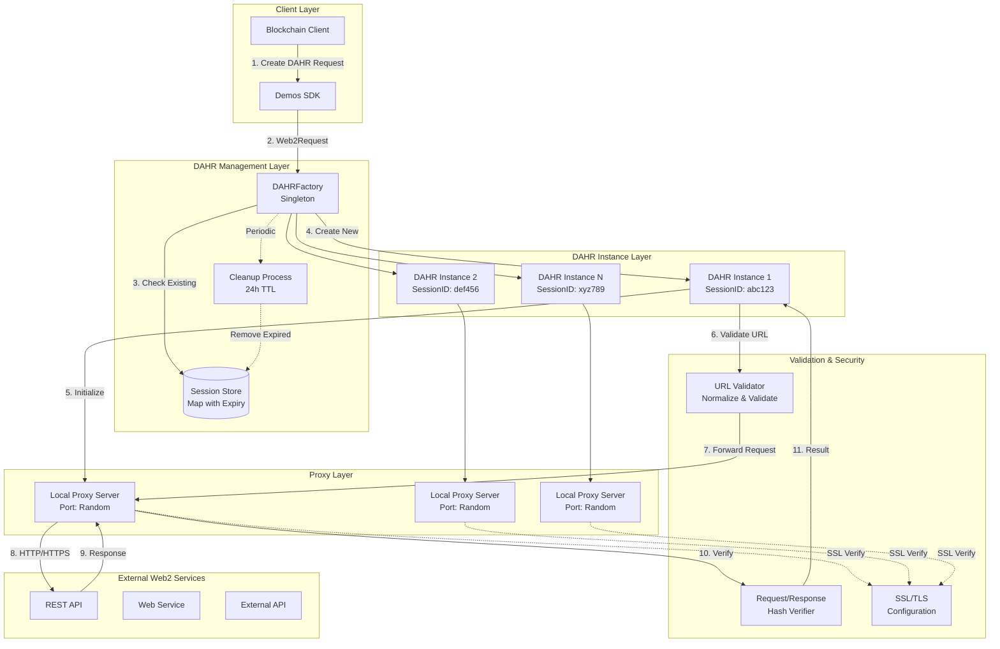
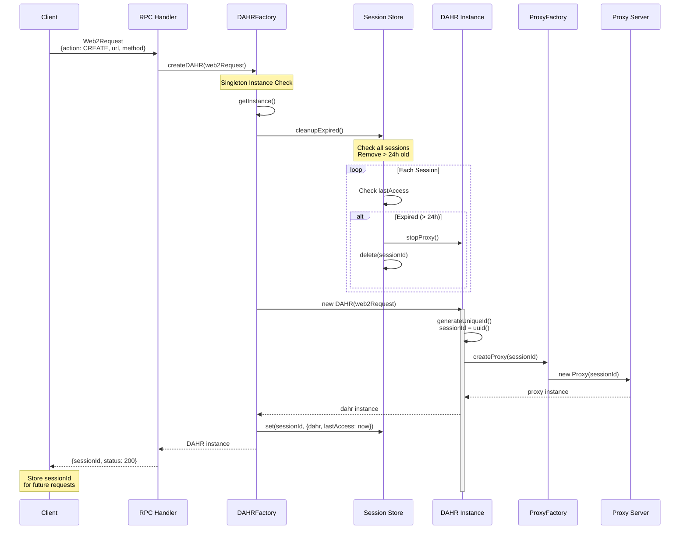
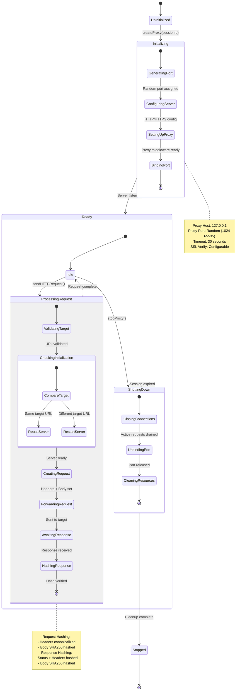
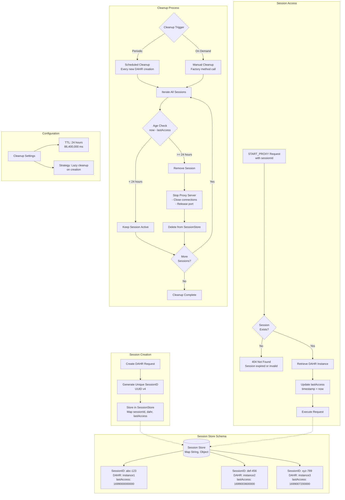
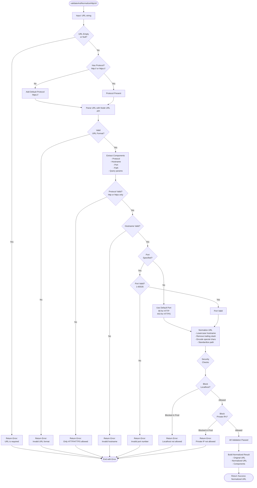
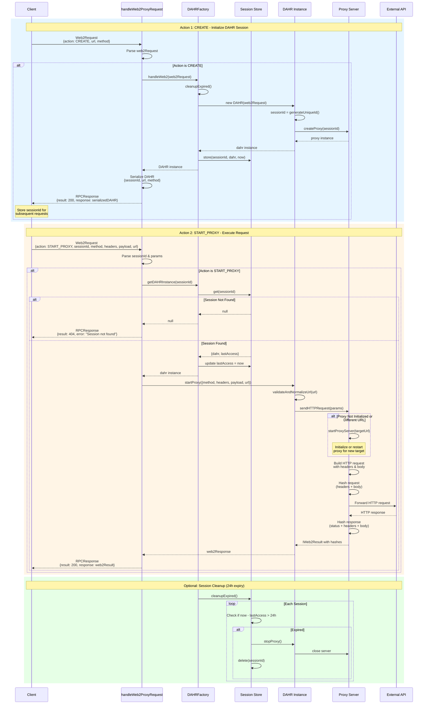
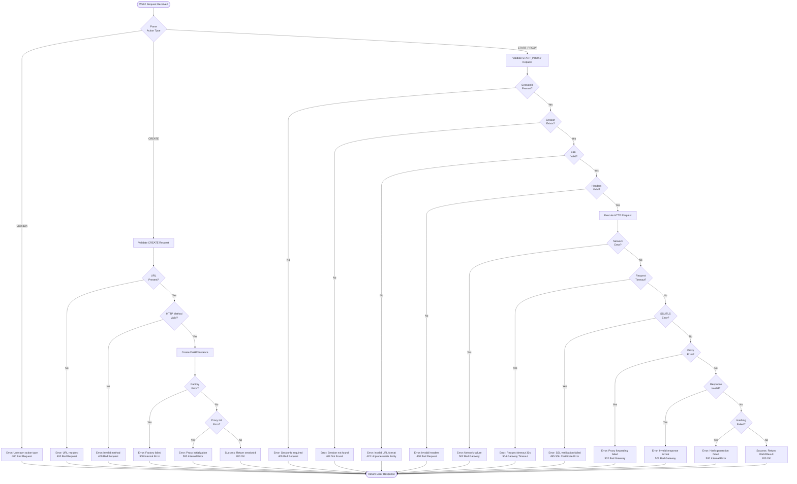

# Web2 Integration & DAHR (Data Agnostic HTTPS Relay)

## Overview

The Web2 Integration system enables Demos blockchain to interact with traditional Web2 HTTP/HTTPS services through the DAHR (Data Agnostic HTTPS Relay) pattern. This allows blockchain applications to make authenticated, verified requests to external web services while maintaining cryptographic integrity.

---

## Diagram 1: DAHR Architecture Overview



**Description**: Complete DAHR architecture showing the factory pattern for managing multiple DAHR instances, each with its own proxy server for forwarding requests to external Web2 services with cryptographic verification.

---

## Diagram 2: DAHR Creation & Factory Pattern



**Description**: Detailed sequence showing DAHR instance creation through the factory pattern, including session management, cleanup of expired sessions, and proxy server initialization.

---

## Diagram 3: Proxy Server Initialization & Lifecycle



**Description**: State machine showing the complete lifecycle of a proxy server instance, from initialization through request processing to graceful shutdown, including port management and request/response hashing.

---

## Diagram 4: HTTP Request Flow & Forwarding

```mermaid
flowchart TD
    Start([DAHR.startProxy Called]) --> ParseParams[Parse Parameters<br/>method, headers, payload, url]

    ParseParams --> ValidateURL{URL Validation}

    ValidateURL -->|Invalid| ErrorInvalidURL[Return Error:<br/>Invalid URL format]
    ErrorInvalidURL --> End([End])

    ValidateURL -->|Valid| NormalizeURL[Normalize URL<br/>- Add protocol if missing<br/>- Validate hostname<br/>- Check port]

    NormalizeURL --> CheckProxy{Proxy<br/>Initialized?}

    CheckProxy -->|No| InitProxy[Initialize Proxy Server<br/>- Assign random port<br/>- Configure SSL<br/>- Start listening]

    CheckProxy -->|Yes, Same URL| ReuseProxy[Reuse Existing Proxy]
    CheckProxy -->|Yes, Different URL| RestartProxy[Restart Proxy<br/>with new target]

    InitProxy --> ProxyReady[Proxy Ready]
    ReuseProxy --> ProxyReady
    RestartProxy --> ProxyReady

    ProxyReady --> BuildRequest[Build HTTP Request<br/>- Method: GET/POST/PUT/DELETE<br/>- Headers: canonicalized<br/>- Body: payload if present]

    BuildRequest --> HashRequest[Hash Request<br/>- Headers hash: SHA256<br/>- Body hash: SHA256]

    HashRequest --> SendRequest[Send Request to Proxy<br/>localhost:proxyPort]

    SendRequest --> ProxyForward[Proxy Forwards<br/>to Target URL]

    ProxyForward --> AwaitResponse{Response<br/>Received?}

    AwaitResponse -->|Timeout 30s| ErrorTimeout[Return Error:<br/>Request timeout]
    ErrorTimeout --> End

    AwaitResponse -->|Error| ErrorNetwork[Return Error:<br/>Network/Connection issue]
    ErrorNetwork --> End

    AwaitResponse -->|Success| ReceiveResponse[Receive Response<br/>- Status code<br/>- Headers<br/>- Body]

    ReceiveResponse --> HashResponse[Hash Response<br/>- Headers hash: SHA256<br/>- Body hash: SHA256]

    HashResponse --> BuildResult[Build IWeb2Result<br/>- requestHash<br/>- responseHash<br/>- responseHeadersHash<br/>- statusCode<br/>- data]

    BuildResult --> UpdateSession[Update Session<br/>lastAccess = now

    UpdateSession --> Success([Return Success Web2Result])

```

**Description**: Complete flowchart showing the end-to-end HTTP request flow from parameter parsing through URL validation, proxy initialization, request forwarding, response handling, and cryptographic hashing for integrity verification.

---

## Diagram 5: Session Management & Cleanup



**Description**: Comprehensive view of session lifecycle management including creation with unique IDs, access pattern with timestamp updates, and automatic cleanup of expired sessions after 24 hours of inactivity.

---

## Diagram 6: URL Validation & Normalization



**Description**: Detailed URL validation and normalization process ensuring only valid, secure HTTP/HTTPS URLs are processed, with protocol inference, component extraction, and security checks against localhost and private IPs in production.

---

## Diagram 7: Request/Response Hashing for Integrity

```mermaid
flowchart LR
    subgraph "Request Hashing"
        direction TB
        ReqStart[HTTP Request] --> ReqHeaders[Headers Map]
        ReqStart --> ReqBody[Request Body<br/>JSON/String/Binary]

        ReqHeaders --> CanonHeaders[Canonicalize Headers<br/>- Sort by key alphabetically<br/>- Lowercase keys<br/>- Trim values<br/>- Remove auth headers]

        CanonHeaders --> HeadersJSON[Convert to JSON String<br/>Deterministic order]
        HeadersJSON --> HashHeaders[SHA256 Hash Headers<br/>→ headersHash]

        ReqBody --> ConvertBuffer[Convert to Buffer<br/>UTF-8 encoding]
        ConvertBuffer --> HashBody[SHA256 Hash Body<br/>→ bodyHash]

        HashHeaders --> CombineReqHash[Combine Hashes<br/>requestHash = hash<br/>headers + body]
        HashBody --> CombineReqHash

        CombineReqHash --> ReqHashResult[Request Hash<br/>32-byte SHA256]
    end

    subgraph "Response Hashing"
        direction TB
        RespStart[HTTP Response] --> RespStatus[Status Code]
        RespStart --> RespHeaders[Response Headers]
        RespStart --> RespBody[Response Body]

        RespHeaders --> CanonRespHeaders[Canonicalize Headers<br/>Same process as request]
        CanonRespHeaders --> RespHeadersJSON[Convert to JSON String]
        RespHeadersJSON --> HashRespHeaders[SHA256 Hash Headers<br/>→ responseHeadersHash]

        RespBody --> RespBuffer[Convert to Buffer<br/>UTF-8 encoding]
        RespBuffer --> HashRespBody[SHA256 Hash Body<br/>→ responseBodyHash]

        RespStatus --> CombineRespHash[Combine Hashes<br/>responseHash = hash<br/>status + headers + body]
        HashRespHeaders --> CombineRespHash
        HashRespBody --> CombineRespHash

        CombineRespHash --> RespHashResult[Response Hash<br/>32-byte SHA256]
    end

    subgraph "Hash Verification"
        direction TB
        ReqHashResult --> StoreReq[(Store Request Hash<br/>in Web2Result)]
        RespHashResult --> StoreResp[(Store Response Hashes<br/>in Web2Result)]

        StoreReq --> BuildResult[Build IWeb2Result]
        StoreResp --> BuildResult

        BuildResult --> ResultObject{Web2Result Object}
        ResultObject --> Field1[requestHash: string]
        ResultObject --> Field2[responseHash: string]
        ResultObject --> Field3[responseHeadersHash: string]
        ResultObject --> Field4[statusCode: number]
        ResultObject --> Field5[data: string]

        Field1 --> Client[Return to Client]
        Field2 --> Client
        Field3 --> Client
        Field4 --> Client
        Field5 --> Client

        Client --> ClientVerify[Client Can Verify<br/>- Recalculate hashes<br/>- Compare with received<br/>- Detect tampering]
    end

```



**Description**: Complete request/response integrity hashing system showing header canonicalization, deterministic hashing with SHA256, and how clients can verify data integrity by recalculating and comparing hashes.

---

## Diagram 8: Action Routing (CREATE vs START_PROXY)



**Description**: Side-by-side comparison of the two-action workflow: CREATE action initializes a DAHR session with proxy server, START_PROXY executes the actual HTTP request, with session management and cleanup.

---

## Diagram 9: Error Handling & Validation



**Description**: Comprehensive error handling flowchart covering all validation points and potential failure modes including action validation, session management errors, network failures, timeouts, SSL errors, and response integrity issues.

---

## Diagram 10: Complete DAHR Lifecycle State Machine

```mermaid
stateDiagram-v2
    [*] --> Idle: System Start

    state "DAHR Lifecycle" as Lifecycle {
        Idle --> RequestReceived: CREATE action

        state RequestReceived {
            [*] --> ValidatingRequest
            ValidatingRequest --> RequestValid: Validation passed
            ValidatingRequest --> RequestInvalid: Validation failed
            RequestInvalid --> [*]
        }

        RequestReceived --> CreatingInstance: Request valid

        state CreatingInstance {
            [*] --> GeneratingSessionId
            GeneratingSessionId --> InitializingProxy: SessionId created
            InitializingProxy --> AssigningPort: Proxy configured
            AssigningPort --> StartingServer: Port bound
            StartingServer --> InstanceReady: Server listening
            StartingServer --> CreationFailed: Error occurred
            CreationFailed --> [*]
        }

        CreatingInstance --> Active: Instance ready

        state Active {
            [*] --> AwaitingRequest

            AwaitingRequest --> ValidatingSession: START_PROXY received

            state ValidatingSession {
                [*] --> CheckingSessionId
                CheckingSessionId --> SessionFound: Session exists
                CheckingSessionId --> SessionNotFound: Session missing/expired
                SessionNotFound --> [*]
            }

            ValidatingSession --> ProcessingRequest: Session valid

            state ProcessingRequest {
                [*] --> ValidatingURL
                ValidatingURL --> NormalizingURL: URL valid
                NormalizingURL --> CheckingProxyState: URL normalized

                state CheckingProxyState {
                    [*] --> ComparingTarget
                    ComparingTarget --> ProxyReady: Same target
                    ComparingTarget --> RestartingProxy: Different target
                    RestartingProxy --> ProxyReady: Restarted
                }

                CheckingProxyState --> BuildingRequest: Proxy ready
                BuildingRequest --> HashingRequest: Request built
                HashingRequest --> ForwardingRequest: Request hashed
                ForwardingRequest --> AwaitingResponse: Sent to target

                state AwaitingResponse {
                    [*] --> WaitingForResponse
                    WaitingForResponse --> ResponseReceived: Success
                    WaitingForResponse --> TimeoutOccurred: 30s timeout
                    WaitingForResponse --> NetworkError: Connection failed
                    TimeoutOccurred --> [*]
                    NetworkError --> [*]
                }

                AwaitingResponse --> HashingResponse: Response received
                HashingResponse --> BuildingResult: Response hashed
                BuildingResult --> [*]: Result ready
            }

            ProcessingRequest --> UpdatingSession: Request complete
            UpdatingSession --> AwaitingRequest: Session updated
        }

        Active --> Expiring: 24h since lastAccess
        Active --> Stopping: Manual stop

        state Expiring {
            [*] --> CleanupTriggered
            CleanupTriggered --> CheckingAge: Cleanup running
            CheckingAge --> AgeExceeded: > 24 hours
            CheckingAge --> AgeValid: < 24 hours
            AgeValid --> [*]
            AgeExceeded --> InitiatingShutdown: Session expired
        }

        state Stopping {
            [*] --> StoppingProxy
            StoppingProxy --> ClosingConnections: Proxy stopping
            ClosingConnections --> ReleasingPort: Connections closed
            ReleasingPort --> CleaningResources: Port released
            CleaningResources --> [*]: Cleanup complete
        }

        Expiring --> Stopped: Shutdown complete
        Stopping --> Stopped: Shutdown complete
    }

    Stopped --> [*]: Session removed

    note right of RequestReceived
        Validates:
        - Action type
        - URL format
        - HTTP method
        - Required fields
    end note

    note right of Active
        Session Properties:
        - sessionId (UUID)
        - DAHR instance
        - lastAccess timestamp
        - Proxy server reference
    end note

    note right of ProcessingRequest
        Request Execution:
        - URL validation
        - Proxy initialization
        - Request building
        - SHA256 hashing
        - HTTP forwarding
        - Response hashing
        - Result assembly
    end note

    note right of Expiring
        Cleanup Strategy:
        - Lazy cleanup on CREATE
        - 24-hour TTL
        - Graceful shutdown
        - Resource release
    end note
```



**Description**: Complete state machine covering the entire DAHR lifecycle from creation through active request processing, session management, expiry handling, and graceful shutdown, showing all state transitions and validation points.

---

## Summary

The Web2 Integration system provides a robust, secure gateway for Demos blockchain applications to interact with traditional web services. Key features include:

1. **Factory Pattern**: Singleton DAHRFactory manages multiple DAHR instances with automatic cleanup
2. **Session Management**: UUID-based sessions with 24-hour TTL and lazy cleanup
3. **Proxy Architecture**: Local proxy servers forward requests to external APIs with configurable SSL
4. **Cryptographic Integrity**: SHA256 hashing of requests and responses for tamper detection
5. **URL Validation**: Comprehensive validation and normalization with security checks
6. **Two-Action Workflow**: CREATE initializes sessions, START_PROXY executes requests
7. **Error Handling**: Comprehensive validation at every layer with detailed error responses
8. **Resource Management**: Automatic port assignment, connection pooling, graceful shutdown

### Related Documentation

- **Blockchain Core**: Block structure and chain management
- **Transaction Processing**: Transaction validation and mempool
- **RPC Server**: Network communication layer
- **Cryptography Systems**: FHE, ZK, and PQC integration
